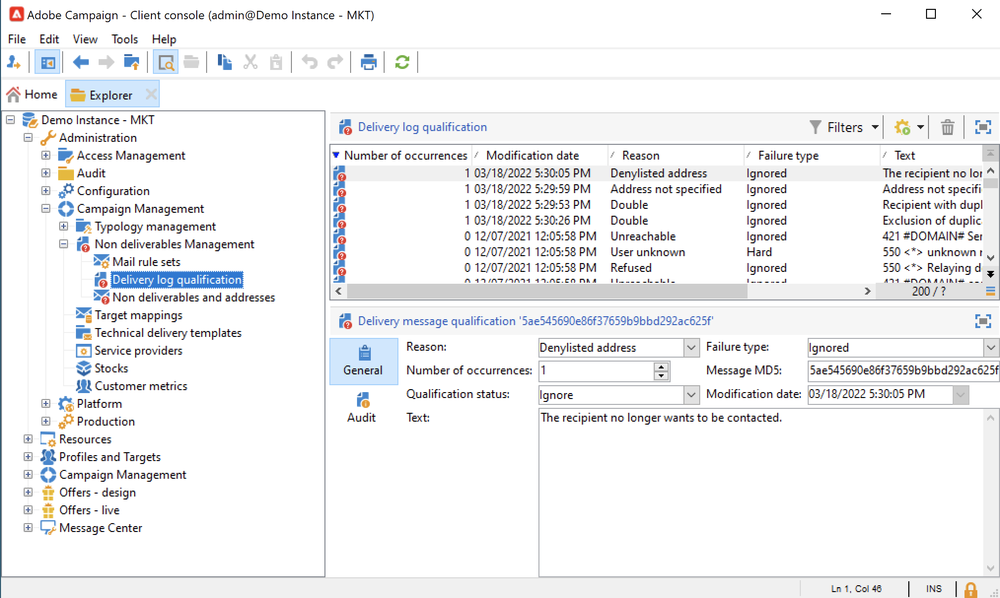

# Förstå leveransfel {#delivery-failures}

Satser är resultatet av ett leveransförsök och fel där Internet-leverantören tillhandahåller meddelanden om misslyckanden. Hantering av studsar är en viktig del av listhygienen. När ett visst e-postmeddelande har studsat flera gånger i rad flaggas det för undertryckning i den här processen.

Den här processen förhindrar att system fortsätter att skicka ogiltiga e-postadresser. Satser är en av de viktigaste data som internetleverantörer använder för att fastställa IP-anseendet. Det är viktigt att hålla ett öga på denna mätmetod. &quot;Levererat&quot; jämfört med &quot;studsat&quot; är förmodligen det vanligaste sättet att mäta leveransen av marknadsföringsmeddelanden: Ju högre procenttal som levereras, desto bättre.

Om ett meddelande inte kan skickas till en profil skickar fjärrservern automatiskt ett felmeddelande till Adobe Campaign. Det här felet är kvalificerat för att avgöra om e-postadressen, telefonnumret eller enheten ska sättas i karantän. Se [E-posthantering](#bounce-mail-qualification).

När ett meddelande har skickats kan du visa leveransstatus för varje profil och tillhörande feltyp och orsak i leveransloggarna.

När en e-postadress sätts i karantän, eller om en profil finns på blockeringslista, utesluts mottagaren vid leveransförberedelsesteget. Exkluderade meddelanden visas på kontrollpanelen för leverans.

## Varför misslyckades meddelandeleveransen {#delivery-failure-reasons}

Det finns två typer av fel när ett meddelande misslyckas. Varje typ av leveransfel avgör om en adress skickas till [karantän](quarantines.md#quarantine-reason) eller inte.

* **Hårda studsar**
Hårda studsar är permanenta fel som genereras efter att en Internet-leverantör har fastställt att ett postförsök till en prenumerantadress inte kan levereras. Inom Adobe Campaign läggs hårda gränser som kategoriseras som olevererbara till i karantänlistan, vilket innebär att de inte kommer att försökas igen. Det finns vissa fall där ett hårt studsande skulle ignoreras om orsaken till felet är okänd.

   Här är några vanliga exempel på hårda studsar: Adressen finns inte, kontot är inaktiverat, Felaktig syntax, Felaktig domän

* **Mjuka studsar**
Mjuka studsar är tillfälliga fel som internetleverantörer genererar när de har svårt att leverera e-post. Mjuka fel [försök igen](#retries) flera gånger (med olika variationer beroende på hur anpassade leveransinställningar eller leveransinställningar som är klara) för att försöka leverera korrekt. Adresser som kontinuerligt mjuka studsar kommer inte att läggas till i karantän förrän det maximala antalet försök har gjorts (som återigen varierar beroende på inställningarna).

   Några vanliga orsaker till mjuka studsar är: Postlådan är full, e-postservern tas emot, avsändaren får anseende

The  **Ignorerad** typen av fel är temporär, t.ex.&quot;Frånvarande&quot;, eller ett tekniskt fel, t.ex. om avsändartypen är&quot;postmaster&quot;.

Feedback-slingan fungerar som studsmeddelanden: När en användare kvalificerar ett e-postmeddelande som skräppost kan du konfigurera e-postregler i Adobe Campaign så att alla leveranser till den här användaren blockeras. Adresserna till dessa användare är blocklist trots att de inte klickade på länken för att ta bort prenumerationen. Adresser läggs till i (**NmsAddress**) karantänregister och inte till (**NmsRecipient**) mottagartabell med **[!UICONTROL Denylisted]** status. Läs mer om feedbackloopmekanismen i [Guide för bästa praxis för Adobe-leverans](https://experienceleague.adobe.com/docs/deliverability-learn/deliverability-best-practice-guide/transition-process/infrastructure.html#feedback-loops).

## Synkrona och asynkrona fel {#synchronous-and-asynchronous-errors}

En meddelandeleverans kan misslyckas omedelbart, i så fall kvalificerar vi det som ett synkront fel. Om meddelandet inte kan skickas eller senare, efter att det har skickats, är felet asynkront.

Följande typer av fel hanteras:

* **Synkront fel**: fjärrservern som kontaktas av Adobe Campaign leveransserver returnerar omedelbart ett felmeddelande. Leveransen får inte skickas till profilens server. MTA (Mail Transfer Agent) bestämmer studstypen och kvalificerar felet och skickar tillbaka informationen till Campaign för att avgöra om e-postadresserna ska placeras i karantän. Se [Kvalifikation av studsmeddelanden](#bounce-mail-qualification).

* **Asynkront fel**: ett studsmeddelande eller en SR skickas senare av den mottagande servern. Det här felet är kvalificerat med en etikett som är relaterad till felet. Asynkrona fel kan uppstå upp till en vecka efter att en leverans har skickats.

>[!NOTE]
>
>Som Managed Services-användare konfigureras studspostlådan av Adobe.

## Kvalifikation av studsmeddelanden {#bounce-mail-qualification}

<!--NO LONGER WITH MOMENTUM - Rules used by Campaign to qualify delivery failures are listed in the **[!UICONTROL Administration > Campaign Management > Non deliverables Management > Delivery log qualification]** node. It is non-exhaustive, and is regularly updated by Adobe Campaign and can also be managed by the user.

-->

Hur studseffekter hanteras i Adobe Campaign beror på feltypen:

* **Synkrona fel**: MTA avgör studstyp och kvalifikationer och skickar tillbaka informationen till Campaign. Studentkvalifikationer i **[!UICONTROL Delivery log qualification]** tabellen används inte för **synkron** felmeddelanden vid leveransfel.

* **Asynkrona fel**: Regler som används av Campaign för att kvalificera asynkrona leveransfel visas i **[!UICONTROL Administration > Campaign Management > Non deliverables Management > Delivery log qualification]** nod. Asynkrona studsar kvalificeras av inMail-processen via **[!UICONTROL Inbound email]** regler. Mer information finns i [Adobe Campaign Classic v7-dokumentation](https://experienceleague.adobe.com/docs/campaign-classic/using/sending-messages/monitoring-deliveries/understanding-delivery-failures.html#bounce-mail-qualification){target=&quot;_blank&quot;}.

<!--NO LONGER WITH MOMENTUM - The message returned by the remote server on the first occurrence of this error type is displayed in the **[!UICONTROL First text]** column of the **[!UICONTROL Audit]** tab.


Adobe Campaign filters this message to delete the variable content (such as IDs, dates, email addresses, phone numbers, etc.) and displays the filtered result in the **[!UICONTROL Text]** column. The variables are replaced with **`#xxx#`**, except addresses that are replaced with **`*`**.

This process allows to bring together all failures of the same type and avoid multiple entries for similar errors in the Delivery log qualification table.
  
>[!NOTE]
>
>The **[!UICONTROL Number of occurrences]** field displays the number of occurrences of the message in the list. It is limited to 100 000 occurrences. You can edit the field, if you want, for example, to reset it.

Bounce mails can have the following qualification status:

* **[!UICONTROL To qualify]** : the bounce mail could not be qualified. Qualification must be assigned to the Deliverability team to guarantee efficient platform deliverability. As long as it is not qualified, the bounce mail is not used to enrich the list of email management rules.
* **[!UICONTROL Keep]** : the bounce mail was qualified and will be used by the **Refresh for deliverability** workflow to be compared to existing email management rules and enrich the list.
* **[!UICONTROL Ignore]** : the bounce mail is ignored, meaning that this bounce will never cause the recipient's address to be quarantined. It will not be used by the **Refresh for deliverability** workflow and it will not be sent to client instances.


>[!NOTE]
>
>In case of an outage of an ISP, emails sent through Campaign will be wrongly marked as bounces. To correct this, you need to update bounce qualification.-->


## Återförsökshantering {#retries}

Om meddelandeleveransen misslyckas efter ett tillfälligt fel (**Mjuk** eller **Ignorerad**) skickas kampanjåterförsök. Dessa återförsök kan utföras till slutet av leveransens varaktighet.

MTA avgör vilken typ av avhoppssvar som skickas tillbaka från meddelandets e-postdomän och hur lång tid det tar mellan dem.

>[!NOTE]
>
>Inställningarna för nya försök i leveransegenskaperna används inte av Campaign.

## Giltighetsperiod

Giltighetsperioden i kampanjleveranserna är begränsad till **3,5 dagar eller mindre**. Om du definierar ett värde som är högre än 3,5 dagar för en leverans i Campaign beaktas det inte.

Om giltighetsperioden till exempel är inställd på standardvärdet 5 dagar i Campaign, kommer meddelanden med mjuk studsning att hamna i MTA-återförsökskön och provas igen i upp till 3,5 dagar från den dag då meddelandet nådde MTA. I så fall används inte det värde som angetts i Campaign.

När ett meddelande har varit i MTA-kön i 3,5 dagar och inte kunnat levereras, kommer det att löpa ut och status uppdateras från **[!UICONTROL Sent]** till **[!UICONTROL Failed]** i leveransloggarna.

Mer information om giltighetsperioden finns i [Adobe Campaign Classic v7-dokumentation](https://experienceleague.adobe.com/docs/campaign-classic/using/sending-messages/key-steps-when-creating-a-delivery/steps-sending-the-delivery.html#defining-validity-period){target=&quot;_blank&quot;}.


## E-postfeltyper {#email-error-types}

För e-postkanalen anges möjliga orsaker till leveransfel nedan.

<table> 
 <tbody> 
  <tr> 
   <td> Feletikett </td> 
   <td> Feltyp </td> 
   <td> Tekniskt värde </td> 
   <td> Beskrivning </td> 
  </tr> 
  <tr> 
   <td> Kontot är inaktiverat </td> 
   <td> Mjuk/hård </td> 
   <td> 4 </td> 
   <td> Kontot som är länkat till adressen är inte längre aktivt. När IAP (Internet Access Provider) upptäcker en lång inaktivitetsperiod kan den stänga användarens konto. Det går då inte att skicka till användarens adress. Om kontot är tillfälligt inaktiverat på grund av sex månaders inaktivitet och fortfarande kan aktiveras, tilldelas statusen Med fel och kontot provas igen tills felräknaren når 5. Om felmeddelandet talar om att kontot är permanent inaktiverat ställs det in direkt på Karantän.<br /> </td> 
  </tr> 
  <tr> 
   <td> Adress i karantän </td> 
   <td> Hård </td> 
   <td> 9 </td> 
   <td> Adressen placerades i karantän.<br /> </td> 
  </tr> 
  <tr> 
   <td> Adressen har inte angetts </td> 
   <td> Hård </td> 
   <td> 7 </td> 
   <td> Ingen adress har angetts för mottagaren.<br /> </td> 
  </tr> 
  <tr> 
   <td> Felaktig adress </td> 
   <td> Ignorerad </td> 
   <td> 14 </td> 
   <td> Kvalitetsklassificeringen för den här adressen är för låg.<br /> </td> 
  </tr> 
  <tr> 
   <td> Blocklist adress </td> 
   <td> Hård </td> 
   <td> 8 </td> 
   <td> Adressen lades till i blockeringslista vid tidpunkten för sändningen. Den här statusen används för att importera data från externa listor och externa system till listan över Adobe Campaign-karantän.<br /> </td> 
  </tr> 
  <tr> 
   <td> Kontrolladress </td> 
   <td> Ignorerad </td> 
   <td> 127 </td> 
   <td> Mottagarens adress är en del av kontrollgruppen.<br /> </td> 
  </tr> 
  <tr> 
   <td> Dubbel </td> 
   <td> Ignorerad </td> 
   <td> 10 </td> 
   <td> Mottagarens adress fanns redan i den här leveransen.<br /> </td> 
  </tr> 
  <tr> 
   <td> Felet ignorerades </td> 
   <td> Ignorerad </td> 
   <td> 25 </td> 
   <td> Adressen är på tillåtelselista. Felet ignoreras därför och ett e-postmeddelande skickas.<br /> </td> 
  </tr> 
  <tr> 
   <td> Uteslutet efter skiljedom </td> 
   <td> Ignorerad </td> 
   <td> 12 </td> 
   <td> Mottagaren uteslöts av en kampanjtypologiregel av typen"medling".<br /> </td> 
  </tr> 
  <tr> 
   <td> Exkluderad av en SQL-regel </td> 
   <td> Ignorerad </td> 
   <td> 11 </td> 
   <td> Mottagaren uteslöts av en kampanjtypologiregel av typen SQL.<br /> </td> 
  </tr> 
  <tr> 
   <td> Ogiltig domän </td> 
   <td> Mjuk </td> 
   <td> 2 </td> 
   <td> Domänen för e-postadressen är felaktig eller finns inte längre. Den här profilen används igen tills felantalet är 5. Därefter sätts postens status till Karantän och inga nya försök görs.<br /> </td> 
  </tr> 
  <tr> 
   <td> Postlådan är full </td> 
   <td> Mjuk </td> 
   <td> 5 </td> 
   <td> Den här användarens postlåda är full och kan inte ta emot fler meddelanden. Den här profilen används igen tills felantalet är 5. Därefter sätts postens status till Karantän och inga nya försök görs.<br /> Den här typen av fel hanteras av en rensningsprocess. Adressen har en giltig status efter 30 dagar.<br /> Varning: För att adressen ska tas bort automatiskt från listan över adresser i karantän måste det tekniska arbetsflödet för databasrensning startas.<br /> </td> 
  </tr> 
  <tr> 
   <td> Inte ansluten </td> 
   <td> Ignorerad </td> 
   <td> 6 </td> 
   <td> Mottagarens mobiltelefon är avstängd eller inte ansluten till nätverket när meddelandet skickas.<br /> </td> 
  </tr> 
  <tr> 
   <td> Ej definierad </td> 
   <td> Ej definierad </td> 
   <td> 0 </td> 
   <td> Adressen kvalificerar sig eftersom felet ännu inte har ökats. Den här typen av fel inträffar när ett nytt felmeddelande skickas av servern: Det kan vara ett isolerat fel, men om det inträffar igen ökar felräknaren, som varnar de tekniska teamen. De kan sedan göra en meddelandeanalys och kvalificera felet via <span class="uicontrol">Administration</span> / <span class="uicontrol">Campaign Management</span> / <span class="uicontrol">Hantering av ej slutprodukter</span> i trädstrukturen.<br /> </td> 
  </tr> 
  <tr> 
   <td> Ej berättigade till erbjudandena </td> 
   <td> Ignorerad </td> 
   <td> 16 </td> 
   <td> Mottagaren var inte berättigad till erbjudandena i leveransen.<br /> </td> 
  </tr> 
  <tr> 
   <td> Avvisad </td> 
   <td> Mjuk/hård </td> 
   <td> 20 </td> 
   <td> Adressen har placerats i karantän på grund av säkerhetsfeedback som en skräppostrapport. Enligt felet görs ett nytt försök att ange adressen tills felräknaren når 5 eller skickas direkt till karantän.<br /> </td> 
  </tr> 
  <tr> 
   <td> Målet är begränsat </td> 
   <td> Ignorerad </td> 
   <td> 17 </td> 
   <td> Den maximala leveransstorleken har uppnåtts för mottagaren.<br /> </td> 
  </tr> 
  <tr> 
   <td> Okvalificerad adress </td> 
   <td> Ignorerad </td> 
   <td> 15 </td> 
   <td> Postadressen har inte kvalificerats.<br /> </td> 
  </tr> 
  <tr> 
   <td> Onåbar </td> 
   <td> Mjuk/hård </td> 
   <td> 3 </td> 
   <td> Ett fel har uppstått i meddelandeleveranskedjan. Det kan vara en incident på SMTP-relä, en domän som inte går att nå för tillfället, osv. Enligt felet görs ett nytt försök att ange adressen tills felräknaren når 5 eller skickas direkt till karantän.<br /> </td> 
  </tr> 
  <tr> 
   <td> Okänd användare </td> 
   <td> Hård </td> 
   <td> 1 </td> 
   <td> Adressen finns inte. Inga fler leveransförsök kommer att göras för den här profilen.<br /> </td> 
  </tr> 
 </tbody> 
</table>


## Feltyper för push-meddelanden {#push-error-types}

För mobilappskanalen anges möjliga orsaker till leveransfel nedan.

### iOS karantän {#ios-quarantine}

HTTP/V2-protokollet tillåter direkt feedback och status för varje push-leverans. Om HTTP/V2-protokollkopplingen används anropas inte längre feedbacktjänsten av **[!UICONTROL mobileAppOptOutMgt]** arbetsflöde. En token betraktas som oregistrerad när ett mobilprogram avinstalleras eller installeras om.

Synkront, om APN:er returnerar status &quot;unregistered&quot; för ett meddelande, sätts måltoken omedelbart i karantän.

<table> 
 <tbody> 
  <tr> 
   <td> <strong>Scenario</strong><br /> </td> 
   <td> <strong>Status</strong><br /> </td> 
   <td> <strong>Felmeddelande</strong><br /> </td> 
   <td> <strong>Feltyp</strong><br /> </td> 
   <td> <strong>Felorsak</strong><br /> </td> 
   <td> <strong>Försök igen</strong><br /> </td> 
  </tr> 
  <tr> 
   <td> Målenhet aktiverad<br /> </td> 
   <td> OK<br /> </td> 
   <td> </td> 
   <td> </td> 
   <td> </td> 
   <td> </td> 
  </tr> 
  <tr> 
   <td> Målenhet avstängd<br /> </td> 
   <td> OK<br /> </td> 
   <td> </td> 
   <td> </td> 
   <td> </td> 
   <td> </td> 
  </tr> 
  <tr> 
   <td> Användaren inaktiverar meddelanden för programmet<br /> </td> 
   <td> OK<br /> </td> 
   <td> </td> 
   <td> </td> 
   <td> </td> 
   <td> </td> 
  </tr> 
  <tr> 
   <td> Skapande/analys av meddelande - nyttolasten är för stor<br /> </td> 
   <td> Fel<br /> </td> 
   <td> Nyttolasten är för lång<br /> </td> 
   <td> Mjuk<br /> </td> 
   <td> Avvisad<br /> </td> 
   <td> Nej<br /> </td> 
  </tr> 
  <tr> 
   <td> Fas för att skapa/analysera meddelanden - oväntat problem med innehållsformat<br /> </td> 
   <td> Fel<br /> </td> 
   <td> Olika felmeddelanden enligt felet<br /> </td> 
   <td> Mjuk<br /> </td> 
   <td> Odefinierad<br /> </td> 
   <td> Nej<br /> </td> 
  </tr> 
  <tr> 
   <td> Certifikatproblem (lösenord, fel osv.) och testa anslutningen till APN-problemet<br /> </td> 
   <td> Fel<br /> </td> 
   <td> Olika felmeddelanden enligt felet<br /> </td> 
   <td> Mjuk<br /> </td> 
   <td> Avvisad<br /> </td> 
   <td> Nej<br /> </td> 
  </tr> 
  <tr> 
   <td> Nätverksanslutningen bröts under sändning<br /> </td> 
   <td> Fel<br /> </td> 
   <td> Anslutningsfel<br /> </td> 
   <td> Odefinierad<br /> </td> 
   <td> Onåbar<br /> </td> 
   <td> Ja<br /> </td> 
  </tr> 
  <tr> 
   <td> Avvisning av APN-meddelande: Avregistrering<br /> användaren har tagit bort programmet eller token har gått ut<br /> </td> 
   <td> Fel<br /> </td> 
   <td> Oregistrerad<br /> </td> 
   <td> Hård<br /> </td> 
   <td> Okänd användare<br /> </td> 
   <td> Nej<br /> </td> 
  </tr> 
  <tr> 
   <td> Avvisning av APN-meddelande: alla andra fel<br /> </td> 
   <td> Fel<br /> </td> 
   <td> Felavvisande orsak kommer att finnas i felmeddelandet<br /> </td> 
   <td> Mjuk<br /> </td> 
   <td> Avvisad<br /> </td> 
   <td> Nej<br /> </td> 
  </tr> 
 </tbody> 
</table>

### Android-karantän {#android-quarantine}

**För Android V1**

För varje meddelande får Adobe Campaign synkrona fel direkt från FCM-servern. Adobe Campaign hanterar dem i farten och genererar hårda eller mjuka fel beroende på hur allvarligt felet är, och nya försök kan utföras:

* Nyttolastlängden har överskridits, anslutningsproblem, problem med tjänsttillgänglighet: återförsök utförd, mjukt fel, felorsak **[!UICONTROL Refused]**.
* Enhetskvoten har överskridits: inget nytt försök, mjukt fel, felorsak: **[!UICONTROL Refused]**.
* Ogiltig eller oregistrerad token, oväntat fel, problem med avsändarkontot: inget nytt försök, hårt fel, felorsaken är **[!UICONTROL Refused]**.

The **[!UICONTROL mobileAppOptOutMgt]** arbetsflödet körs var 6:e timme för att uppdatera **AppSubscriptionRcp** tabell. Fältet för tokens som har deklarerats som oregistrerade eller inte längre giltiga **Handikappade** är inställd på **True** och prenumerationen som är länkad till denna enhetstoken exkluderas automatiskt från framtida leveranser.

Under leveransanalysen läggs alla enheter som är undantagna från målet automatiskt till i **excludeLogAppSubRcp** tabell.

>[!NOTE]
>
>Här är olika typer av fel för kunder som använder Baidu-kontakten:
>
>* Anslutningsproblem i början av leveransen: feltyp **[!UICONTROL Undefined]**, felorsak **[!UICONTROL Unreachable]**, återförsök utförs.
>* Förlorad anslutning under leverans: mjukt fel, felorsak **[!UICONTROL Refused]**, återförsök utförs.
>* Synkront fel returnerades av Baidu under sändning: allvarligt fel, felorsak **[!UICONTROL Refused]**, inga nya försök utförs.
>
>Adobe Campaign kontaktar Baidu-servern var 10:e minut för att hämta det skickade meddelandets status och uppdaterar sändningarna. Om ett meddelande deklareras som skickat anges meddelandets status i utsändningsloggarna till **[!UICONTROL Received]**. Om Baidu deklarerar ett fel ställs statusen in på **[!UICONTROL Failed]**.

**För Android V2**

Android V2-karantänmekanismen använder samma process som Android V1, samma gäller för prenumerations- och exkluderingsuppdateringen. Mer information finns i [Android V1](#android-quarantine) -avsnitt.

<table> 
 <tbody> 
  <tr> 
   <td> <strong>Scenario</strong><br /> </td> 
   <td> <strong>Status</strong><br /> </td> 
   <td> <strong>Felmeddelande</strong><br /> </td> 
   <td> <strong>Feltyp</strong><br /> </td> 
   <td> <strong>Felorsak</strong><br /> </td> 
   <td> <strong>Försök igen</strong><br /> </td> 
  </tr> 
  <tr> 
   <td> Fas för skapande/analys av meddelanden: ogiltiga nyckelord som används i anpassade fält<br /> </td> 
   <td> Fel<br /> </td> 
   <td> Följande nyckelord kan inte användas: {1}<br /> </td> 
   <td> Mjuk<br /> </td> 
   <td> </td> 
   <td> Nej<br /> </td> 
  </tr> 
  <tr> 
   <td> Fas för skapande/analys av meddelanden: nyttolasten är för stor<br /> </td> 
   <td> Fel<br /> </td> 
   <td> Meddelandet är för stort: {1} bitar, medan endast {2} är behöriga<br /> </td> 
   <td> Mjuk<br /> </td> 
   <td> Avvisad<br /> </td> 
   <td> Nej<br /> </td> 
  </tr> 
  <tr> 
   <td> Nätverksanslutningen bröts under sändning<br /> </td> 
   <td> Fel<br /> </td> 
   <td> Inget svar från tjänsten Firebase Cloud Messaging på adressen: {1}<br /> </td> 
   <td> Mjuk<br /> </td> 
   <td> Onåbar<br /> </td> 
   <td> Ja<br /> </td> 
  </tr> 
  <tr> 
   <td> Avvisning av FCM-meddelande: FCM-servern är inte tillgänglig för tillfället (till exempel med timeout). <br /> </td> 
   <td> Fel<br /> </td> 
   <td> Tjänsten Firebase Cloud Messaging är inte tillgänglig för tillfället<br /> </td> 
   <td> Mjuk<br /> </td> 
   <td> Onåbar<br /> </td> 
   <td> Ja<br /> </td> 
  </tr> 
  <tr> 
   <td> Avvisning av FCM-meddelande: Fel vid autentisering av avsändarkontot<br /> </td> 
   <td> Fel<br /> </td> 
   <td> Det gick inte att identifiera utvecklarkontot. Kontrollera ditt ID och lösenord<br /> </td> 
   <td> Mjuk<br /> </td> 
   <td> Avvisad<br /> </td> 
   <td> Nej<br /> </td> 
  </tr> 
  <tr> 
   <td> Avvisning av FCM-meddelande: Enhetskvoten har överskridits<br /> </td> 
   <td> Fel<br /> </td> 
   <td> </td> 
   <td> Mjuk<br /> </td> 
   <td> Avvisad<br /> </td> 
   <td> Ja<br /> </td> 
  </tr> 
  <tr> 
   <td> Avvisning av FCM-meddelande: Ogiltig registrering/är inte registrerad<br /> </td> 
   <td> Fel<br /> </td> 
   <td> </td> 
   <td> Hård<br /> </td> 
   <td> Okänd användare<br /> </td> 
   <td> Nej<br /> </td> 
  </tr> 
  <tr> 
   <td> Avvisning av FCM-meddelande: Alla andra fel<br /> </td> 
   <td> Fel<br /> </td> 
   <td> Felkoden har returnerats från Firebase Cloud Messaging-servern: {1} </td> 
   <td> </td> 
   <td> Avvisad<br /> </td> 
   <td> Nej<br /> </td> 
  </tr> 
    <tr> 
   <td> Avvisning av FCM-meddelande: Ogiltigt argument<br /> </td> 
   <td> Fel<br /> </td> 
   <td> INVALID_ARGUMENT </td> 
   <td> Ignorerad</td> 
   <td> Odefinierad<br /> </td> 
   <td> Nej<br /> </td> 
  </tr>
    <tr> 
   <td> Avvisning av FCM-meddelande: Autentiseringsfel från tredje part<br /> </td> 
   <td> Fel<br /> </td> 
   <td> THIRD_PARTY_AUTH_ERROR </td> 
   <td> Ignorerad</td>
   <td> Avvisad<br /> </td> 
   <td> Ja<br /> </td> 
  </tr>
    <tr> 
   <td> Avvisning av FCM-meddelande: Avsändarens ID matchar inte<br /> </td> 
   <td> Fel<br /> </td> 
   <td> SENDER_ID_MISMATCH </td> 
   <td> Mjuk</td>
   <td> Okänd användare<br /> </td> 
   <td> Nej<br /> </td> 
  </tr>
    <tr> 
   <td> Avvisning av FCM-meddelande: Oregistrerad<br /> </td> 
   <td> Fel<br /> </td>
   <td> OREGISTRERAD </td> 
   <td> Hård</td> 
   <td> Okänd användare<br /> </td> 
   <td> Nej<br /> </td> 
  </tr>
    <tr> 
   <td> Avvisning av FCM-meddelande: Intern<br /> </td> 
   <td> Fel<br /> </td> 
   <td> INTERN </td> 
   <td> Ignorerad</td> 
   <td> Avvisad<br /> </td> 
   <td> Ja<br /> </td> 
  </tr>
    <tr> 
   <td> Avvisning av FCM-meddelande: Otillgänglig<br /> </td> 
   <td> Fel<br /> </td> 
   <td> OTILLGÄNGLIG</td> 
   <td> Ignorerad</td> 
   <td> Avvisad<br /> </td> 
   <td> Ja<br /> </td> 
  </tr>
    <tr> 
   <td> Avvisning av FCM-meddelande: oväntad felkod<br /> </td> 
   <td> Fel<br /> </td> 
   <td> oväntad felkod</td> 
   <td> Ignorerad</td> 
   <td> Avvisad<br /> </td> 
   <td> Nej<br /> </td> 
  </tr>
  <tr> 
   <td> Autentisering: Anslutningsproblem<br /> </td> 
   <td> Fel<br /> </td> 
   <td> Det går inte att ansluta till autentiseringsservern </td> 
   <td> Ignorerad</td>
   <td> Avvisad<br /> </td> 
   <td> Ja<br /> </td> 
  </tr>
    <tr> 
   <td> Autentisering: Oauktoriserad klient eller omfång i begäran.<br /> </td> 
   <td> Fel<br /> </td> 
   <td> unauthorized_client </td> 
   <td> Ignorerad</td>
   <td> Avvisad<br /> </td> 
   <td> Nej<br /> </td> 
  </tr>
    <tr> 
   <td> Autentisering: Klienten är inte behörig att hämta åtkomsttoken med den här metoden, eller så är klienten inte auktoriserad för något av de begärda scopen.<br /> </td> 
   <td> Fel<br /> </td> 
   <td> unauthorized_client </td> 
   <td> Ignorerad</td>
   <td> Avvisad<br /> </td> 
   <td> Nej<br /> </td> 
  </tr>
    <tr> 
   <td> Autentisering: Åtkomst nekad<br /> </td> 
   <td> Fel<br /> </td>
   <td> access_deny</td> 
   <td> Ignorerad</td>
   <td> Avvisad<br /> </td> 
   <td> Nej<br /> </td> 
  </tr>
    <tr> 
   <td> Autentisering: Ogiltig e-postadress<br /> </td> 
   <td> Fel<br /> </td> 
   <td> invalid_grant </td> 
   <td> Ignorerad</td> 
   <td> Avvisad<br /> </td> 
   <td> Nej<br /> </td> 
  </tr>
    <tr> 
   <td> Autentisering: Ogiltig JWT<br /> </td> 
   <td> Fel<br /> </td> 
   <td> invalid_grant </td> 
   <td> Ignorerad</td> 
   <td> Avvisad<br /> </td> 
   <td> Nej<br /> </td> 
  </tr>
    <tr> 
   <td> Autentisering: Ogiltig JWT-signatur<br /> </td> 
   <td> Fel<br /> </td> 
   <td> invalid_grant </td> 
   <td> Ignorerad</td> 
   <td> Avvisad<br /> </td> 
   <td> Nej<br /> </td> 
  </tr>
    <tr> 
   <td> Autentisering: Ogiltig publik för OAuth-scope eller ID-token har angetts<br /> </td> 
   <td> Fel<br /> </td> 
   <td> unauthorized_client</td> 
   <td> Ignorerad</td> 
   <td> Avvisad<br /> </td> 
   <td> Nej<br /> </td> 
  </tr>
    <tr> 
   <td> Autentisering: OAuth-klient inaktiverad<br /> </td> 
   <td> Fel<br /> </td> 
   <td> disabled_client</td> 
   <td> Ignorerad</td> 
   <td> Avvisad<br /> </td> 
   <td> Nej<br /> </td> 
  </tr>
 </tbody> 
</table>

## SMS-karantän {#sms-quarantines}

**För standardanslutningar**

Specifikationerna för SMS-kanalen anges nedan.

>[!NOTE]
>
>The **[!UICONTROL Delivery log qualification]** tabellen gäller inte för **Utökad allmän SMPP** koppling.

<table> 
 <tbody> 
  <tr> 
   <td> <strong>Scenario</strong><br /> </td> 
   <td> <strong>Status</strong><br /> </td> 
   <td> <strong>Felmeddelande</strong><br /> </td> 
   <td> <strong>Feltyp</strong><br /> </td> 
   <td> <strong>Felorsak</strong><br /> </td> 
  </tr> 
  <tr> 
   <td> Skickat till providern<br /> </td> 
   <td> Skickat<br /> </td> 
   <td> </td> 
   <td> </td> 
   <td> </td> 
  </tr> 
  <tr> 
   <td> Mottaget på mobilen<br /> </td> 
   <td> Mottaget<br /> </td> 
   <td> </td> 
   <td> </td> 
   <td> </td> 
  </tr> 
  <tr> 
   <td> Ett fel returnerades av providern<br /> </td> 
   <td> Fel<br /> </td> 
   <td> Fel vid mottagning av data (SR eller MO)<br /> </td> 
   <td> Mjuk<br /> </td> 
   <td> Onåbar<br /> </td> 
  </tr> 
  <tr> 
   <td> Ogiltig MT-bekräftelse<br /> </td> 
   <td> Fel<br /> </td> 
   <td> Felet {1} uppstod när bekräftelseramen för sändningsfrågan bearbetades<br /> </td> 
   <td> Mjuk<br /> </td> 
   <td> Onåbar<br /> </td> 
  </tr> 
  <tr> 
   <td> Fel när MT skickades<br /> </td> 
   <td> Fel<br /> </td> 
   <td> Fel när meddelanden skickades<br /> </td> 
   <td> Mjuk<br /> </td> 
   <td> Onåbar<br /> </td> 
  </tr> 
 </tbody> 
</table>

**För den utökade generiska SMPP-anslutningen**

När SMPP-protokollet används för att skicka SMS-meddelanden hanteras felhanteringen på ett annat sätt.

SMPP-kopplingen hämtar data från SR-meddelandet (statusrapport) som returneras med reguljära uttryck (regex) för att filtrera innehållet. Dessa data matchas sedan mot informationen i **[!UICONTROL Delivery log qualification]** tabell (tillgänglig via **[!UICONTROL Administration]** > **[!UICONTROL Campaign Management]** > **[!UICONTROL Non deliverables Management]** meny).

Innan en ny typ av fel har kvalificerats anges felorsaken alltid till **Avvisad** som standard.

>[!NOTE]
>
>Feltyperna och orsakerna till felet är desamma som för e-postmeddelanden.
>
>Be leverantören om en lista över status- och felkoder för att ange korrekta feltyper och orsaker till felet i tabellen för leveransloggens kvalificeringsregister.

Exempel på ett genererat meddelande:

```
SR Generic DELIVRD 000|#MESSAGE#
```

* Alla felmeddelanden börjar med **SR** för att skilja mellan SMS-felkoder och e-postfelkoder.
* Andra delen (**Allmän** i det här exemplet) refererar felmeddelandet till namnet på SMSC-implementeringen som definieras i **[!UICONTROL SMSC implementation name]** fält för SMS-externt konto.

   Eftersom samma felkod kan ha olika innebörd för varje provider kan du med det här fältet veta vilken provider som genererade felkoden. Du kan sedan hitta felet i den aktuella providerns dokumentation.

* Den tredje delen (**LEVERERA** i det här exemplet) motsvarar felmeddelandet statuskoden som hämtats från SR med statusextraheringsregex som definierats i det externa SMS-kontot.

   Denna region anges i **[!UICONTROL SMSC specificities]** fliken för det externa kontot.
Regexen extraherar som standard **stat:** fält enligt definitionen i **Tillägg B** i **Specifikation för SMPP 3.4**.

* Fjärde delen (**000** i det här exemplet) motsvarar felmeddelandet den felkod som extraheras från SR med den felkodsextraheringsregex som definieras i det externa SMS-kontot.

   Denna region anges i **[!UICONTROL SMSC specificities]** fliken för det externa kontot.

   Regexen extraherar som standard **err:** fält enligt definitionen i **Tillägg B** i **Specifikation för SMPP 3.4**.

* Allt som kommer efter rörlighetssymbolen (|) visas bara i **[!UICONTROL First text]** kolumn i **[!UICONTROL Delivery log qualification]** tabell. Det här innehållet ersätts alltid av **#MESSAGE#** när meddelandet har normaliserats. Med den här processen undviker du att ha flera poster för liknande fel och den är samma som för e-postmeddelanden.

Den utökade generiska SMPP-anslutningen använder en heuristisk metod för att hitta rimliga standardvärden: om statusen börjar med **DELIV** anses det vara en framgång eftersom det matchar de vanliga statusvärdena **LEVERERA** eller **LEVERERAD** används av de flesta leverantörer. All annan status leder till ett allvarligt fel.
