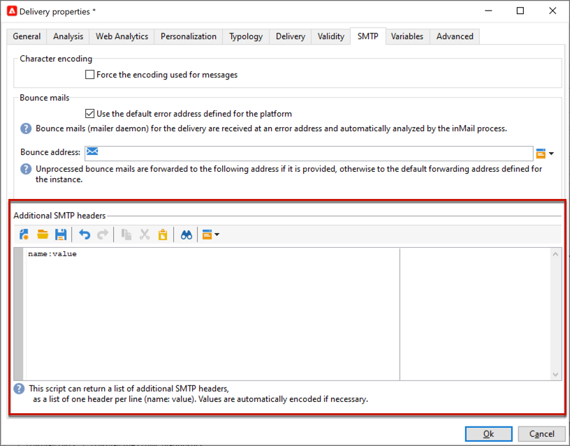

# E-postparametrar {#email-parameters}

I det här avsnittet visas de alternativ och parametrar som är tillgängliga från leveransegenskaperna som är specifika för e-postleverans.

## Använd e-postkopia {#email-bcc}

Du kan konfigurera Adobe Campaign att behålla en kopia av e-postmeddelanden som skickas från din plattform. Det här alternativet beskrivs på [den här sidan](email-bcc.md).

## Välj meddelandeformat {#selecting-message-formats}

Du kan ändra formatet för skickade e-postmeddelanden. Om du vill göra det redigerar du leveransegenskaperna och klickar på fliken **[!UICONTROL Delivery]**.

Välj formatet för e-postmeddelandet i fönstrets nedre del:

* **[!UICONTROL Use recipient preferences]** (standardläge)

  Meddelandeformatet definieras enligt data som lagras i mottagarprofilen och lagras som standard i fältet **[!UICONTROL email format]** (@emailFormat). Om en mottagare vill ta emot meddelanden i ett visst format är detta det format som skickas. Om fältet inte är ifyllt skickas ett multipart-alternativt meddelande (se nedan).

* **[!UICONTROL Let recipient mail client choose the most appropriate format]**

  Meddelandet innehåller båda formaten: text och HTML. Formatet som visas vid mottagning beror på konfigurationen av mottagarens e-postprogramvara (multipart-option).

  >[!IMPORTANT]
  >
  >Det här alternativet inkluderar båda versionerna av dokumentet. Det minskar därför leveransflödet eftersom meddelandestorleken är större.

* **[!UICONTROL Send all messages in text format]**

  Meddelandet skickas i textformat. HTML-formatet skickas inte, utan används endast för spegelsidan när mottagaren klickar på meddelandet.

<!--
>[!NOTE]
>
>For more on defining the email content, see [this section]().-->

## Ange teckenkodning {#character-encoding}

På fliken **[!UICONTROL SMTP]** i leveransparametrarna kan du ange en specifik kodning i avsnittet **[!UICONTROL Character encoding]**.

Standardkodningen är UTF-8. Om vissa av mottagarnas e-postleverantörer inte har stöd för UTF-8-standardkodning kanske du vill ställa in en specifik kodning så att specialtecknen visas korrekt för mottagarna av e-postmeddelanden.

Du vill till exempel skicka ett e-postmeddelande som innehåller japanska tecken. Om du vill vara säker på att alla tecken visas korrekt för mottagarna i Japan kan du använda en kodning som stöder de japanska tecknen i stället för standard UTF-8.

Det gör du genom att välja alternativet **[!UICONTROL Force the encoding used for messages]** i avsnittet **[!UICONTROL Character encoding]** och välja en kodning i listrutan som visas.

## Hantera studsmeddelanden {#managing-bounce-emails}

På fliken **[!UICONTROL SMTP]** i leveransegenskaperna kan du även konfigurera hanteringen av studsmeddelanden.

* **[!UICONTROL Errors-to-address]**: Som standard tas studsade e-postmeddelanden emot i standardfelrutan för plattformen, men du kan definiera en specifik feladress för en leverans.

* **[!UICONTROL Bounce address]**: Du kan också definiera en annan adress dit obearbetade studsade e-postmeddelanden vidarebefordras. Med den här adressen kan du undersöka orsaken till att studsa när e-postmeddelanden inte automatiskt kunde kvalificeras av programmet.

Vart och ett av dessa fält kan anpassas med den dedikerade ikonen. Läs mer om anpassningsfält i [det här avsnittet](personalization-fields.md).

Mer information om hantering av studsade e-postmeddelanden finns i [det här avsnittet](delivery-failures.md#bounce-mail-management).

## Aktivera en klickning för att avbryta prenumeration {#one-click-list-unsubscribe}

URL:en för att avbryta en prenumeration med ett klick är en länk eller knapp som visas bredvid e-postavsändarinformationen, vilket gör att mottagarna kan avanmäla sig från e-postlistorna med ett enda klick. <!--[Learn more](https://experienceleague.adobe.com/docs/deliverability-learn/deliverability-best-practice-guide/additional-resources/campaign/acc-technical-recommendations.html#list-unsubscribe){target="_blank"}-->

Den visas som en **Unsubscribe** -länk i Internet-leverantörernas e-postgränssnitt. Exempel:

Det är obligatoriskt att lägga till ett SMTP-huvud med namnet List-Unsubscribe för att säkerställa optimal leveranshantering, och det kan användas som ett alternativ till ikonen Report as SPAM. Om du använder den här funktionen blir antalet klagomål färre och ditt rykte kan skyddas.

>[!IMPORTANT]
>
>Om du vill visa URL:en för att avsluta prenumerationen med ett klick i e-posthuvudet måste mottagarens e-postklient ha stöd för den här funktionen.

Om du vill aktivera den här funktionen väljer du alternativet **[!UICONTROL Addition of One-click List-Unsubscription Header]** på fliken **[!UICONTROL SMTP]** i leveransegenskaperna.

>[!NOTE]
>
>Det här alternativet är aktiverat som standard.

<!--
>[!WARNING]
>
>If you uncheck this option in the delivery template, it will still be enabled by default in the deliveries created from this template. You need to enable the option again at the delivery level.-->

Beroende på e-postklienten och vilken metod de använder för att göra en avanmälan kan du få följande effekter om du klickar på länken **Avbeställ** i e-posthuvudet:

* Om e-postklienten använder metoden **Ett-klick** för att avbryta prenumerationen, avanmäts mottagaren direkt.

  >[!NOTE]
  >
  >Större Internet-leverantörer som Google och Yahoo! kräver att avsändare följer **One-Click List-Unsubscribe**.

* Om e-postklienten inte har stöd för One-Click List-Unsubscribe kan de fortfarande använda metoden **&quot;mailto&quot;** List-Unsubscribe, som skickar ett förifyllt e-postmeddelande till den adress för att avbryta prenumerationen som anges i e-posthuvudet.

  Du kan ange adressen explicit i huvudet eller använda en dynamisk adress (t.ex. med &lt;%=errorAddress%> eller alternativet NmsEmail_DefaultErrorAddr) som kan anges via distributionsguiden.

>[!NOTE]
>
>Du kan också ange metoderna [One-Click List-Unsubscribe](https://experienceleague.adobe.com/en/docs/deliverability-learn/deliverability-best-practice-guide/additional-resources/campaign/acc-technical-recommendations?lang=en#one-click-list-unsubscribe){target="_blank"} och [&quot;mailto&quot; List-Unsubscribe](https://experienceleague.adobe.com/en/docs/deliverability-learn/deliverability-best-practice-guide/additional-resources/campaign/acc-technical-recommendations?lang=en#mailto-list-unsubscribe){target="_blank"} manuellt. De detaljerade stegen beskrivs i Experience Cloud [Bästa praxis för slutprodukt](https://experienceleague.adobe.com/docs/deliverability-learn/deliverability-best-practice-guide/additional-resources/campaign/acc-technical-recommendations.html#list-unsubscribe){target="_blank"}.

## Lägg till SMTP-rubriker {#adding-smtp-headers}

Det går att lägga till SMTP-huvuden i leveranserna. Det gör du genom att använda relevant avsnitt på fliken **[!UICONTROL SMTP]** i leveransen.

Skriptet som anges i det här fönstret måste referera till en rubrik per rad i följande format: **name:value**.

Värden kodas automatiskt om det behövs.

>[!IMPORTANT]
>
>Att lägga till ett skript för att infoga ytterligare SMTP-rubriker är reserverat för avancerade användare.
>
>Syntaxen för det här skriptet måste uppfylla kraven för den här innehållstypen: Inget oanvänt utrymme, ingen tom rad, o.s.v.

## Generera spegelsida {#generating-mirror-page}

Spegelsidan är en HTML-sida som är tillgänglig online via en webbläsare. Innehållet är identiskt med e-postmeddelandet. Det kan vara användbart om dina mottagare får problem med återgivningen eller om det uppstår problem med brutna bilder när de försöker visa e-postmeddelandet i sin inkorg.

Lär dig hur du infogar en länk till spegelsidan i [det här avsnittet](mirror-page.md)
