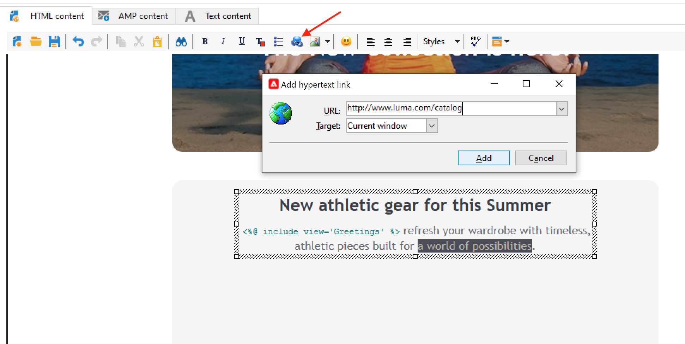

# Designa och skicka e-post

Med e-postleveranser kan du skicka personaliserade e-postmeddelanden till målpopulationen. [Läs mer](../send/send.md)

## Skapa din första e-postleverans

Skapa personaliserade och sammanhangsberoende e-postmeddelanden som överensstämmer med resten av kundupplevelsen.

I följande exempel får du lära dig hur du utformar en e-postleverans i Adobe Campaign som innehåller personaliserade data, länkar till en extern URL och en länk till spegelsidan.

1. **Skapa leveransen**

   Om du vill skapa en ny leverans går du till fliken **Kampanjer**, klickar på **Leveranser** och klickar på knappen **Skapa** ovanför listan över befintliga leveranser.

   

1. **Välj mallen**

   Välj en leveransmall och ge sedan leveransen ett namn. Det här namnet visas endast för användare av Adobe Campaign-konsolen och inte för dina mottagare, men den här rubriken visas i din lista över leveranser. Klicka på **[!UICONTROL Continue]**.

   

1. **Importera ditt innehåll**

   Klicka på fliken **Source** om du vill klistra in ditt HTML-innehåll.

   

   >[!NOTE]
   >
   >För att undvika prestandaproblem får bilderna i e-postmeddelanden inte överstiga 100 kB.

1. **Anpassa meddelandet**

   * Lägg till förnamn och efternamn för mottagarna

     Om du vill infoga för- och efternamnen på målprofilerna i innehållet i meddelandet placerar du markören där du vill infoga dem och klickar på den sista ikonen i verktygsfältet, klickar på **[!UICONTROL Include]** och väljer **[!UICONTROL Greetings]**.

     

     Bläddra till fliken Förhandsgranska för att kontrollera personaliseringen genom att välja en mottagare.

     

     Läs mer om personaliseringsalternativ i [det här avsnittet](personalize.md).

   * Infoga en spårad länk

     Om du vill dirigera leveransmottagare till en extern adress via en bild eller text markerar du den och klickar på ikonen **[!UICONTROL Add a link]** i verktygsfältet.

     Ange URL-adressen för länken i fältet **URL** med följande format: **https://www.myURL.com** och bekräfta sedan.

     

   * Lägga till en spegelsida

     Om du vill att mottagarna ska kunna visa ditt leveransinnehåll i en webbläsare lägger du till en länk på meddelandets [spegelsida](mirror-page.md).

     Placera markören där du vill infoga länken, klicka på den sista ikonen i verktygsfältet, klicka på **[!UICONTROL Include]** och välj **[!UICONTROL link to mirror page]**.

     Läs mer om hur du hanterar spegelsidan i [det här avsnittet](mirror-page.md#link-to-mirror-page).

1. Du kan definiera ytterligare parametrar för e-postmeddelandet, till exempel skicka en kopia av meddelandena till en BBC-adress, ändra meddelandeformatet, ange en viss kodning osv. Läs mer i [det här avsnittet](email-parameters.md).

1. När innehållet är klart klickar du på **Spara**: det visas nu i listan över leveranser på fliken **[!UICONTROL Campaigns > Deliveries]** .

Din första e-postleverans är klar. Nu måste ni definiera målgruppen, validera leveransen och skicka den.

Lär dig hur du importerar ett e-postinnehåll i det här [användningsfallet](https://experienceleague.adobe.com/docs/campaign/automation/workflows/use-cases/deliveries/load-delivery-content.html){target="_blank"}.

Läs mer i följande avsnitt:

<!--[Design an email in Campaign]-->
* [Skapa och använda en e-postmall](../send/create-templates.md)
* [Välj publik för ditt e-postmeddelande](../audiences/gs-audiences.md)
* [Validera en leverans och skicka korrektur](preview-and-proof.md)
* [Konfigurera och skicka leveransen](configure-and-send.md)

## Testa och validera dina e-postmeddelanden

Campaign erbjuder flera sätt att testa och validera dina e-postmeddelanden innan de skickas till era målgrupper. Lär dig hur du förhandsgranskar och testar ditt e-postinnehåll i [det här avsnittet](../send/preview-and-proof.md).

Du kan:

* [Skicka korrektur](preview-and-proof.md)
* [Lägg till dirigerade adresser](../audiences/test-profiles.md)
* [Kontrollera leveransanalysloggar](delivery-analysis.md)

