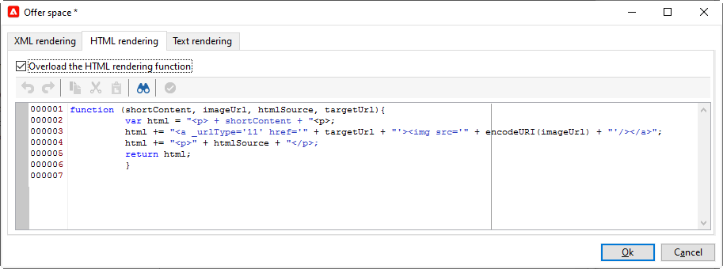

# Skapa erbjudandeplatser{#creating-offer-spaces}

Innehållet i erbjudandekatalogen är konfigurerat i erbjudandemellanslag. Som standard kan innehållet innehålla följande fält: **[!UICONTROL Title]**, **[!UICONTROL Destination URL]**, **[!UICONTROL Image URL]**, **[!UICONTROL HTML content]** och **[!UICONTROL Text content]**. Fältsekvensen är konfigurerad i erbjudandeutrymmet.

Som **teknisk administratör** kan du skapa erbjudandemellanslag i designmiljön. Du måste ha tillgång till undermappen för erbjudandeutrymmet. När erbjudandet har skapats dupliceras dessa erbjudanden automatiskt till Live-miljön när erbjudandet godkänns.

HTML-återgivningen skapas via en återgivningsfunktion. Sekvensen för fälten som definieras i återgivningsfunktionen måste vara identisk med sekvensen som konfigurerats i innehållet.


Följ stegen nedan för att skapa ett nytt erbjudandeutrymme:

1. Klicka på **[!UICONTROL New]** i listan med erbjudanden.

   

1. Markera den kanal som du vill använda och ändra etiketten för erbjudandeutrymmet.

   

1. Markera alternativet **[!UICONTROL Enable unitary mode]**

1. Gå till fönstret **[!UICONTROL Content field]** och klicka på **[!UICONTROL Add]**.

   

1. Gå till noden **[!UICONTROL Content]** och markera fälten i följande ordning: **[!UICONTROL Title]**, **[!UICONTROL Image URL]**, **[!UICONTROL HTML content]** och sedan **[!UICONTROL Destination URL]**.

   

1. Markera alternativet **[!UICONTROL Required]** för att göra varje fält obligatoriskt.

   >[!NOTE]
   >
   >Det här alternativet används vid förhandsgranskningen och gör att erbjudandemellanslag blir ogiltiga vid publicering om ett av de obligatoriska fälten saknas i erbjudandet. Om ett erbjudande redan finns på en plats där erbjudandet ska erbjudas beaktas dock inte dessa kriterier.

   

1. Klicka på **[!UICONTROL Edit functions]** för att skapa en återgivningsfunktion.

   Dessa funktioner används för att generera offertrepresentationer på ett visst utrymme. Det finns flera möjliga format: HTML eller text.

   **Obs** ! XML-formatet är begränsat till inkommande interaktioner som är tillfälligt otillgängliga. [Läs mer](../start/capability-matrix.md#gs-unavailable-features)

   _

1. Gå till fliken **[!UICONTROL HTML rendering]** och välj **[!UICONTROL Overload the HTML rendering function]**.
1. Infoga återgivningsfunktionen.

   

## Erbjud förslagsstatus {#offer-proposition-statuses}

Status för erbjudandeförslag varierar beroende på interaktionen med målpopulationen. Campaign Interaction Module innehåller en uppsättning värden som kan tillämpas på erbjudandet under hela dess livscykel. Du måste konfigurera plattformen så att statusen ändras när erbjudandeförslaget skapas och godkänns.

>[!NOTE]
>
>Statusuppdatering är en asynkron process. Den utförs av spårningsarbetsflödet som aktiveras varje timme.

### Statuslista för erbjudande {#status-list}

Erbjudandestatus:

* **[!UICONTROL Accepted]**
* **[!UICONTROL Scheduled]**
* **[!UICONTROL Generated]**
* **[!UICONTROL Interested]**
* **[!UICONTROL Presented]**
* **[!UICONTROL Rejected]**

Dessa värden används inte som standard: måste konfigureras.

>[!NOTE]
>
>Status för ett erbjudande ändras automatiskt till Presenterat om erbjudandet är kopplat till en leverans med statusen Skickat.

### Erbjudandestatus när erbjudandet skapas {#configuring-the-status-when-the-proposition-is-created}

När ett erbjudande är **skapat** uppdateras dess status.

I **[!UICONTROL Design]**-miljön, för varje erbjudandeutrymme, konfigurerar du den status som ska gälla när ett förslag skapas, beroende på vilken information du vill visa i erbjudanderapporten.

Följ stegen nedan för att göra detta:

1. Gå till fliken **[!UICONTROL Storage]** för det önskade utrymmet.
1. Välj den status som ska användas för förslaget när det skapas.

   

### Erbjudandestatus när erbjudandet godkänns {#configuring-the-status-when-the-proposition-is-accepted}

När ett offertförslag har **accepterats** ska du använda ett av de värden som anges som standard för att konfigurera förslagets nya status. Uppdateringen tillämpas när en mottagare klickar på en länk i erbjudandet.

Följ stegen nedan för att göra detta:

1. Gå till fliken **[!UICONTROL Storage]** för det önskade utrymmet.
1. Välj den status som du vill tillämpa på förslaget när det godkänns.

   

<!--
**Inbound interaction**

The **[!UICONTROL Storage]** tab lets you define statuses for **proposed** and **accepted** offer propositions only. For inbound interaction, the status of offer propositions should be specified directly in the URL for calling the offer engine, rather than through the interface. This way, you will be able to specify which status to apply in other cases, for example if an offer proposition is rejected.

```
<BASE_URL>?a=UpdateStatus&p=<PRIMARY_KEY_OF_THE_PROPOSITION>&st=<NEW_STATUS_OF_THE_PROPOSITION>&r=<REDIRECT_URL>
```

For instance, the proposition (identifier **40004**) that matches the **Home insurance** offer displayed on the **Neobank** site contains the following URL:

```
<BASE_URL>?a=UpdateStatus&p=<40004>&st=<3>&r=<"http://www.neobank.com/insurance/subscribe.html">
```

As soon as a visitor clicks the offer, and therefore the URL, the **[!UICONTROL Accepted]** status (value **3**) is applied to the proposition and the visitor is redirected to a new page of the **Neobank** site to take out the insurance contract.

>[!NOTE]
>
>If you want to specify another status in the url (for example if an offer proposition is rejected), use the value corresponding to the desired status. Example: **[!UICONTROL Rejected]** = "5", **[!UICONTROL Presented]** = "1" and so on.
>
>Statuses and their values can be retrieved in the **[!UICONTROL Offer propositions (nms)]** data schema. For more on this, refer to [this page](../../configuration/using/data-schemas.md).

**Outbound interaction**
-->

Du kan automatiskt tillämpa **[!UICONTROL Interested]**-statusen på ett erbjudande när leveransen innehåller en länk. Lägg bara till **_urlType=&quot;11&quot;**-värdet till länken:

```
<a _urlType="11" href="<DEST_URL>">Link inserted into the delivery</a>
```

## Förhandsgranska per blanksteg {#offer-preview-per-space}

På fliken **[!UICONTROL Preview]** kan du visa de erbjudanden som mottagaren är berättigad till via en vald metod. I exemplet nedan är mottagaren berättigad till tre offerter via post.


Om en mottagare inte är berättigad till något erbjudande visas detta i förhandsgranskningen.


<!--
The preview can ignore contexts when they are restricted to a space. This is the case when the interaction schema has been extended to add fields referenced in a space using an inbound channel (for more on this, refer to Extension example.
-->
