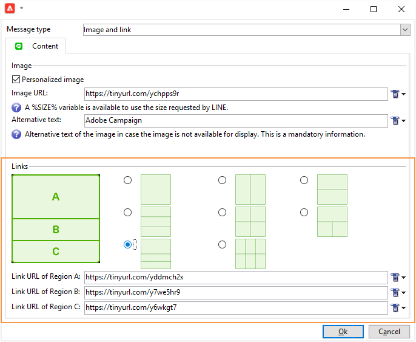

# Skapa radleveranser

LINE är ett program för kostnadsfria snabbmeddelanden, röst- och videosamtal som finns på alla mobila enheter och på datorn. Du kan använda Adobe Campaign för att skicka LINE-meddelanden.

[!DNL LINE] kan också kombineras med transaktionsmeddelandemodulen för att skicka realtidsmeddelanden till appen [!DNL LINE] som är installerad på konsumentmobilenheter. Mer information finns på [sidan](https://experienceleague.adobe.com/sv/docs/campaign-classic/using/transactional-messaging/configure-transactional-messaging/transactional-messaging-architecture#transactional-messaging-and-line) i Campaign Classic v7-dokumentationen.

Stegen för att använda kanalen [!DNL LINE] är:

1. [Konfigurera LINE-kanal](#setting-up-line-channel)
1. [Skapa en leverans](#creating-the-delivery)
1. [Konfigurera innehållstypen](#defining-the-content)
1. [Övervaka leveransen (spårning, karantän, rapporter osv.)](#accessing-reports)

## Konfigurera LINE-kanal {#setting-up-line-channel}

Innan du skapar ett [!DNL LINE]-konto och ett externt konto måste LINE-paketet installeras på din instans. Kontakta Adobe.

Du måste först skapa ett [!DNL LINE]-konto så att du kan länka det till Adobe Campaign. Sedan kan du skicka [!DNL LINE] meddelanden till de användare som har lagt till ditt [!DNL LINE]-konto i mobilprogrammet. Externa konton och [!DNL LINE]-kontot kan bara hanteras av plattformens funktionsadministratör.

Mer information om hur du skapar och konfigurerar ett [!DNL LINE]-konto finns i [LINE-utvecklardokumentation](https://developers.line.me/).

### Skapa och konfigurera LINE-tjänsten {#configure-line-service}

Så här skapar du din [!DNL LINE]-tjänst:

1. På Adobe Campaign Classic hemsida väljer du fliken **[!UICONTROL Profiles and Targets]**.

1. Välj **[!UICONTROL Services and Subscriptions]** på den vänstra menyn och klicka på **[!UICONTROL Create]**.

   

1. Lägg till en **[!UICONTROL Label]** och **[!UICONTROL Internal name]** i den nya tjänsten.

1. Välj **[!UICONTROL LINE]** i listrutan **[!UICONTROL Type]**.

   

1. Klicka på **[!UICONTROL Save]**.

Mer information om prenumerationer och tjänster finns i [Hantera prenumerationer](../../start/subscriptions.md).

### Konfigurera externt LINE-konto {#configure-line-external}

När du har skapat din [!DNL LINE]-tjänst måste du konfigurera det externa [!DNL LINE]-kontot på Adobe Campaign:

1. Klicka på fliken **[!UICONTROL Administration]** i trädstrukturen **[!UICONTROL Platform]** > **[!UICONTROL External Accounts]**.

1. Välj det inbyggda **[!UICONTROL LINE V2 routing]**-externa kontot.

   

1. Klicka på fliken **[!UICONTROL LINE]** från ditt externa konto för att börja konfigurera ditt externa konto. Fyll i följande fält:

   

   * **[!UICONTROL Channel Alias]**: tillhandahålls via ditt [!DNL LINE]-konto på fliken **[!UICONTROL Channels]** > **[!UICONTROL Technical configuration]**.
   * **[!UICONTROL Channel ID]**: tillhandahålls via ditt [!DNL LINE]-konto på fliken **[!UICONTROL Channels]** > **[!UICONTROL Basic Information panel]**.
   * **[!UICONTROL Channel secret key]**: tillhandahålls via ditt [!DNL LINE]-konto på fliken **[!UICONTROL Channels]** > **[!UICONTROL Basic Information panel]**.
   * **[!UICONTROL Access token]**: tillhandahålls via ditt [!DNL LINE]-konto i utvecklarportalen eller genom att klicka på knappen **[!UICONTROL Get access token]**.
   * **[!UICONTROL Access token expiration date]**: gör att du kan ange förfallodatum för åtkomsttoken.
   * **[!UICONTROL LINE subscription service]**: gör att du kan ange vilka tjänster som användarna ska prenumerera på.

1. När konfigurationen är klar klickar du på **[!UICONTROL Save]**.

1. I **[!UICONTROL Explorer]** väljer du **[!UICONTROL Administration]** > **[!UICONTROL Production]** > **[!UICONTROL Technical workflows]** > **[!UICONTROL LINE workflows]** för att kontrollera om arbetsflödena **[!UICONTROL LINE V2 access token update (updateLineAccessToken)]** och **[!UICONTROL Delete blocked LINE users (deleteBlockedLineUsers)]** har startats.

[!DNL LINE] är nu konfigurerat i Adobe Campaign. Du kan börja skapa och skicka LINE-leveranser till prenumeranter.

## Skapa radleverans {#creating-the-delivery}

>[!NOTE]
>
>När du skickar en [!DNL LINE]-leverans till en ny mottagare för första gången måste du lägga till det officiella LINE-meddelandet om användningsvillkoren och samtycke i leveransen. Det officiella meddelandet finns på [följande länk](https://terms.line.me/OA_privacy/).

Om du vill skapa en [!DNL LINE]-leverans måste du följa dessa steg:

1. Välj **[!UICONTROL Campaigns]** på fliken **[!UICONTROL Deliveries]** och klicka sedan på knappen **[!UICONTROL Create]**.

   

1. Välj **[!UICONTROL LINE V2 delivery]** leveransmall.

   

1. Identifiera leveransen med en **[!UICONTROL Label]**, **[!UICONTROL Delivery code]** och **[!UICONTROL Description]**. Mer information om detta finns i [det här avsnittet](../../start/create-message.md#create-the-delivery).

1. Klicka på **[!UICONTROL Continue]** för att skapa leveransen.

1. I leveransredigeraren väljer du **[!UICONTROL To]** för att ange mottagare för din [!DNL LINE]-leverans som mål. Målinriktning utförs på **[!UICONTROL Visitor subscriptions (nms:visitorSub)]**.

   För mer information om detta hittar du i [det här avsnittet](../../audiences/target-mappings.md).

   

1. Klicka på **[!UICONTROL Add]** för att välja din **[!UICONTROL Delivery target population]**.

   

1. Välj om du vill ange [!DNL LINE] prenumeranter som mål direkt eller om du vill ange användare som mål beroende på deras [!DNL LINE]-prenumeration och klicka på **[!UICONTROL Next]**. I det här exemplet har vi valt **[!UICONTROL By LINE V2 subscription]**.

1. Välj **[!UICONTROL Line-V2]** i listrutan **[!UICONTROL Folder]** och sedan din [!DNL LINE]-tjänst. Klicka på **[!UICONTROL Finish]** och sedan på **[!UICONTROL Ok]** för att börja anpassa leveransen.

   

1. Klicka på **[!UICONTROL Add]** i leveransredigeraren för att lägga till ett eller flera meddelanden och markera **[!UICONTROL Content type]**.

   Mer information om olika **[!UICONTROL Content type]** finns i [Definiera innehållstypen](#defining-the-content).

   

1. När leveransen har skapats och konfigurerats på rätt sätt kan du skicka den till det mål som definierades tidigare.

   Mer information om hur du skickar en leverans finns i [Skicka meddelanden](../configure-and-send.md).

1. När du har skickat meddelandet kan du visa rapporten och mäta hur effektiv leveransen är.

   Mer information om [!DNL LINE]-rapporter finns i [Åtkomstrapporter](#accessing-reports).

## Definiera innehållstypen {#defining-the-content}

Om du vill definiera innehållet i en [!DNL LINE]-leverans måste du först lägga till meddelandetypen till leveransen. Varje [!DNL LINE]-leverans kan innehålla upp till 5 meddelanden.

Du kan välja mellan tre meddelandetyper:

* [Textmeddelande](#configuring-a-text-message-delivery)
* [Bild och länk](#configuring-an-image-and-link-delivery)
* [Videomeddelande](#configuring-a-video-message-delivery)

### Konfigurera leverans av textmeddelande {#configuring-a-text-message-delivery}

>[!NOTE]
>
>Med syntaxen `<%@ include option='NmsServer_URL' %>/webApp/APP3?id=<%=escapeUrl(cryptString(visitor.id))%>` kan du inkludera en länk till ett webbprogram i ett LINE-meddelande.

En **[!UICONTROL Text message]** [!DNL LINE]-leverans är ett meddelande som skickas till mottagare i textformulär.

Konfigurationen för den här meddelandetypen liknar konfigurationen för **[!UICONTROL Text]** i ett e-postmeddelande. Mer information finns på [sidan](../defining-the-email-content.md#message-content).

### Konfigurera en bild- och länkleverans {#configuring-an-image-and-link-delivery}

En **[!UICONTROL Image and link]** [!DNL LINE]-leverans är ett meddelande som skickas till mottagarna i form av en bild som kan innehålla en eller flera URL:er.

Du kan använda

* en **[!UICONTROL Personalized image]**,

  >[!NOTE]
  >
  >Du kan använda variabeln **%SIZE%** för att optimera bildvisningen enligt skärmstorleken för mottagarens mobila enhet.

  

* en skärmstorlek på **[!UICONTROL Image URL]** per enhet,

  

  Med alternativet **[!UICONTROL Define images per device screen size]** kan du använda olika bildupplösningar för att optimera synligheten för leverans på mobila enheter. Endast bilder med samma höjd och bredd stöds.

  Bilder kan definieras enligt skärmstorleken:

   * 1040px
   * 700px
   * 460px
   * 300px
   * 240px

  >[!CAUTION]
  >
  >Storleken 1 040 × 1 040 px är obligatorisk för varje LINE-bild med länk.

  Sedan måste du lägga till alternativ text som visas på mottagarens mobila enhet.

* och **[!UICONTROL Links]**.

  I avsnittet **[!UICONTROL Links]** kan du välja mellan olika layouter som delar upp bilden i flera klickbara områden. Du kan sedan tilldela var och en av dem en dedikerad **[!UICONTROL Link URL]**.

  

### Konfigurera leverans av videomeddelanden {#configuring-a-video-message-delivery}

En **[!UICONTROL Video message]** [!DNL LINE]-leverans är ett meddelande som skickas till mottagare i form av en video som kan innehålla en URL.

I fältet **[!UICONTROL Preview Image URL]** kan du lägga till URL:en för en förhandsvisningsbild med en teckengräns på 1 000. JPEG och PNG stöds med en filstorleksgräns på 1 MB.

I fältet **[!UICONTROL Video Image URL]** kan du lägga till URL-adressen för videofilen med en teckengräns på 1 000. Endast mp4-format stöds med en filstorleksgräns på 200 MB.

Observera att breda eller höga videor kan beskäras när de spelas upp på vissa enheter.

## Åtkomst till rapporter {#accessing-reports}

När du har skickat leveransen kan du visa dina [!DNL LINE]-rapporter via menyn **[!UICONTROL Campaign Management]** > **[!UICONTROL Deliveries]** från **[!UICONTROL Explorer]**.

>[!NOTE]
>
>Spårningsrapporterna visar klickfrekvensen. [!DNL LINE] tar inte hänsyn till den öppna tariffen.

Gå till menyn [!DNL LINE] > **[!UICONTROL Profiles and Targets]** > **[!UICONTROL Services and Subscriptions]** på fliken **[!UICONTROL LINE-V2]** för **[!UICONTROL Explorer]**-tjänstrapporter. Klicka sedan på ikonen **[!UICONTROL Reports]** i tjänsten [!DNL LINE].

## Exempel: skapa och skicka ett personligt LINE-meddelande {#example--create-and-send-a-personalized-line-message}

I det här exemplet ska vi skapa och konfigurera ett textmeddelande och en bild som innehåller data som ska anpassas efter mottagaren.

1. Skapa din [!DNL LINE]-leverans genom att klicka på knappen **[!UICONTROL Create]** på fliken **[!UICONTROL Campaign]**.

   

1. Välj leveransmallen **[!UICONTROL LINE V2 delivery]** och ge leveransen ett namn.

   

1. Välj målpopulation i konfigurationsfönstret för leveransen.

   Mer information finns i [Identifiera målpopulationer](../../start/create-message.md#target-population).

   

1. Klicka på **[!UICONTROL Add]** för att skapa meddelandet och välj **[!UICONTROL Content type]**.

   Här vill vi först skapa en **[!UICONTROL Text message]**.

   

1. Placera markören där du vill infoga den anpassade texten och klicka på listruteikonen och välj sedan **[!UICONTROL Visitor]** > **[!UICONTROL First name]**.

   

1. Följ samma procedur för att lägga till en bild och välj **[!UICONTROL Image and links]** i listrutan **[!UICONTROL Message type]**.

   Lägg till din **[!UICONTROL Image URL]**.

   

1. I avsnittet **[!UICONTROL Links]** väljer du den layout som ska dela upp bilden i flera klickbara områden.

1. Tilldela en URL till varje område i bilden.

   

1. Spara leveransen och klicka sedan på **[!UICONTROL Send]** för att analysera och skicka den till målet.

   Leveransen skickas till målet.

   

