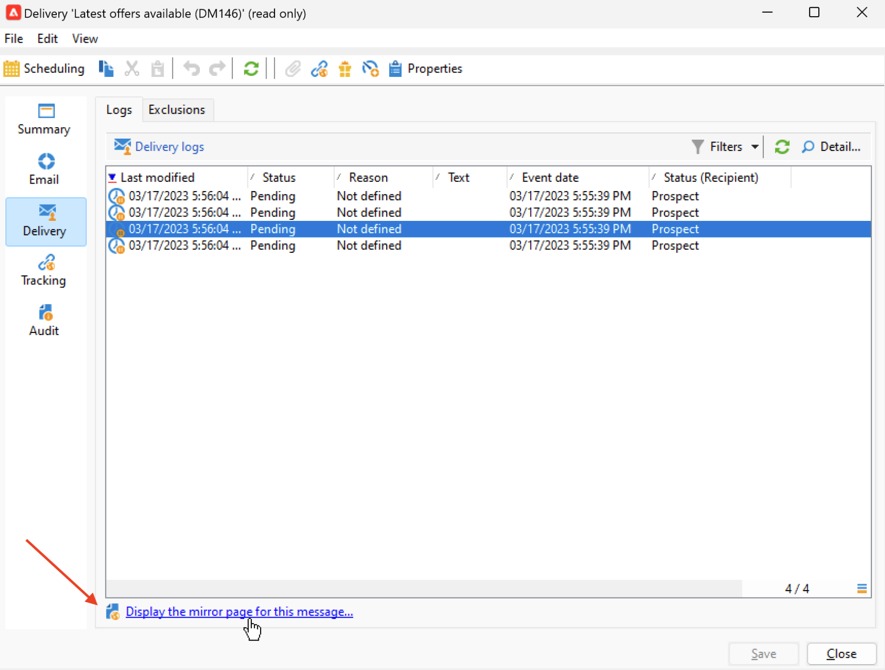

# Länka till spegelsidan {#mirror-page}

## Om spegelsidan {#about-mirror-page}

Spegelsidan är en onlineversion av ditt e-postmeddelande.

De flesta e-postklienter återger bilder utan problem, men vissa förinställningar kan undvika att visa bilder av säkerhetsskäl. Användare kan bläddra till den spegelsida som finns i ett e-postmeddelande, t.ex. om de får problem med återgivningen eller om det finns skadade bilder när de försöker visa dem i sin inkorg. Vi rekommenderar även att du tillhandahåller en onlineversion av tillgänglighetsskäl eller för att uppmuntra social delning.

Spegelsidan som genererats av Adobe Campaign innehåller alla personaliseringsdata.

{width="600" align="left"}

## Lägg till en länk till spegelsidan {#link-to-mirror-page}

Det är bra att infoga en länk till spegelsidan. Den här länken kan till exempel vara Visa det här e-postmeddelandet i webbläsaren eller Läs det här online. Den finns ofta i e-postmeddelandets sidhuvud eller sidfot.

I Adobe Campaign kan du infoga en länk till spegelsidan i e-postinnehållet med den dedikerade **personaliseringsblock**. Den inbyggda **Länk till spegelsida** anpassningsblocket infogar följande kod i ditt e-postinnehåll: `<%@ include view='MirrorPage' %>`.

{width="800" align="left"}

Mer information om hur du infogar innehållsblock för personalisering finns i [Personaliseringsblock](personalization-blocks.md).

## Hantera generering av spegelsidor {#mirror-page-generation}

Som standard genereras spegelsidan automatiskt av Adobe Campaign om e-postinnehållet inte är tomt, och om det innehåller en länk till spegelsidan (även Spegellänk).

Du kan styra genereringsläget för e-postspeglingssidan. Alternativ finns i leveransegenskaperna. Så här öppnar du de här alternativen:

1. Bläddra till **[!UICONTROL Validity]** -fliken i e-postegenskaperna.
1. I **Hantering av spegelsidor** -avsnittet, kontrollera **[!UICONTROL Mode]** nedrullningsbar lista.

{width="800" align="left"}

Förutom standardläget finns följande alternativ:

* **[!UICONTROL Force the generation of the mirror page]**: Använd det här läget för att generera spegelsidan även om ingen länk till spegelsidan infogas i leveransen.
* **[!UICONTROL Do not generate the mirror page]**: Använd det här läget för att undvika att en spegelsida genereras, även om länken finns i leveransen.
* **[!UICONTROL Generates a mirror page accessible using only the message identifier]**: När spegelsidans länk inte finns i e-postinnehållet, använder du det här alternativet för att aktivera åtkomst till spegelsidans innehåll i leveransloggfönstret, enligt beskrivningen nedan.

## Kontrollera spegelsidan för en mottagare {#mirror-page-access}

Du kan komma åt innehållet på spegelsidan för en viss mottagare av en leverans, med personaliseringsdata.

Så här kommer du åt den här spegelsidan:

1. När leveransen är klar öppnar du den och bläddrar till den **[!UICONTROL Delivery]** -fliken.

1. Välj en mottagare och klicka på **[!UICONTROL Display the mirror page for this message...]** länk.

   {width="800" align="left"}

   Spegelsidan visas på en dedikerad skärm med personaliseringsdata för den valda mottagaren.
