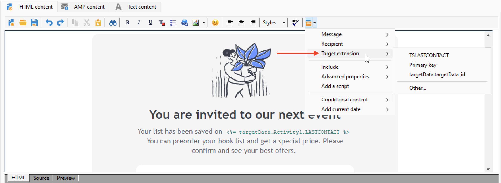

# Personalization datakällor{#personalization-data}

Personalization-data kan hämtas från olika typer av källor: Kampanjdatabasens datakälla, extern fildatakälla eller extern databasdatakälla.

## Kampanjdatabasdatakälla

I det vanligaste fallet lagras personaliseringsdata i databasen. Till exempel är &quot;fält för mottagaranpassning&quot; alla fält som definieras i mottagartabellen, standardfält (vanligtvis: efternamn, förnamn, adress, ort, födelsedatum osv.) eller anpassade fält.

## Extern fildatakälla

Du kan använda en extern fil som innehåller alla fält som är definierade i kolumner. Den här filen används som indata under en meddelandeleveransdefinition. Du kan välja att infoga dessa profiler i databasen eller inte.

Om du vill välja vilken fil som ska användas som datakälla bläddrar du till länken Till i meddelandefönstret och väljer alternativet **Definierad i en extern fil**. När filen har lästs in kan du få åtkomst till mottagardata i anpassningsalternativen från **fälten från posten för filen**.

## FDA-datakälla

Personalization-data kan hämtas från en extern tabell via [Federated Data Access](../connect/fda.md).  Om du vill utföra personalisering i leveranser med data från den externa databasen, samlar du in data som ska användas i ett arbetsflöde för att göra dem tillgängliga i en tillfällig tabell.

För att kunna utföra detta lägger du till en **Query**-aktivitet i målarbetsflödet och använder länken **Lägg till data..** för att välja den externa databasen. Den detaljerade processen är tillgänglig i [det här avsnittet](../../automation/workflow/query.md#adding-data).

Använd sedan data från den tillfälliga tabellen för att anpassa leveransen. När frågeaktiviteten har konfigurerats kan du komma åt externa data i anpassningsalternativen från posten **Måltillägg**.

När du använder externa data som används i FDA bör du förbearbeta meddelandepersonalisering i ett dedikerat arbetsflöde med hjälp av alternativet **Förbered personaliseringsdata med ett arbetsflöde** enligt beskrivningen nedan.

### Optimera personalisering {#optimize-personalization}

Du kan optimera personalisering med ett dedikerat alternativ: **[!UICONTROL Prepare the personalization data with a workflow]**, som finns på fliken **[!UICONTROL Analysis]** i leveransegenskaperna.

Under leveransanalysen skapar och kör det här alternativet automatiskt ett arbetsflöde som lagrar alla data som är länkade till målet i en tillfällig tabell, inklusive data från tabeller som är länkade i FDA.

Om du markerar det här alternativet kan leveransanalysens prestanda förbättras avsevärt när mycket data bearbetas, särskilt om personaliseringsdata kommer från en extern tabell via FDA. [Läs mer](../connect/fda.md).

Följ stegen nedan om du vill använda det här alternativet:

1. Skapa en kampanj.
1. Lägg till en **[!UICONTROL Targeting and workflows]** Query **-aktivitet i arbetsflödet på fliken** i kampanjen.
1. Lägg till en **[!UICONTROL Email delivery]**-aktivitet i arbetsflödet och öppna den.
1. Gå till fliken **[!UICONTROL Analysis]** i **[!UICONTROL Delivery properties]** och välj alternativet **[!UICONTROL Prepare the personalization data with a workflow]**.
1. Konfigurera leveransen och starta arbetsflödet för att starta analysen.

När analysen är klar lagras personaliseringsdata i ett temporärt register via ett tillfälligt tekniskt arbetsflöde som skapas direkt under analysen.

Det här arbetsflödet visas inte i Adobe Campaign gränssnitt. Det är bara tänkt att vara ett tekniskt sätt att snabbt lagra och hantera personaliseringsdata.

När analysen är klar går du till arbetsflödet **[!UICONTROL Properties]** och väljer fliken **[!UICONTROL Variables]**. Där ser du namnet på den temporära tabellen som du kan använda för att göra ett SQL-anrop för att visa de ID som den innehåller.

## Personalization data i ett arbetsflöde

När en leverans skapas i ett arbetsflödes sammanhang kan du använda data från den tillfälliga arbetsflödestabellen. De data som lagras i arbetsflödets temporära arbetstabell är tillgängliga för personaliseringsåtgärder. Data kan användas i personaliseringsfälten.

Dessa data grupperas på menyn **[!UICONTROL Target extension]**. Mer information finns i [det här avsnittet](../../automation/workflow/use-workflow-data.md#target-data).
