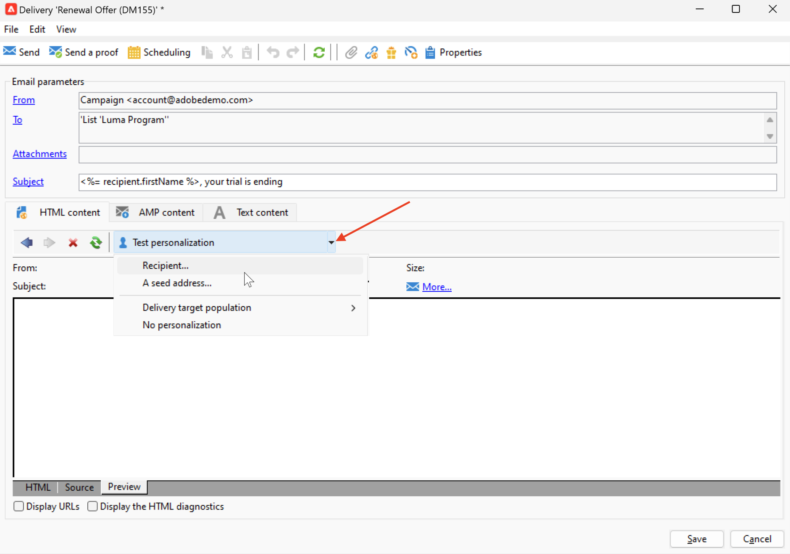

# Förhandsgranska och testa din e-post {#preview-test}

När meddelandeinnehållet har definierats kan du använda testprofiler för att förhandsgranska och testa det. Om du infogade [personaliserat innehåll](personalize.md)kan du med hjälp av testprofildata kontrollera hur det här innehållet visas i meddelandet. Om du vill identifiera eventuella fel i meddelandeinnehållet eller personaliseringsinställningarna skickar du korrektur för att testa profiler. Ett korrektur ska skickas varje gång en ändring görs för att validera det senaste innehållet.

## Förhandsgranska innehåll{#preview-content}

Innan du skickar korrektur bör du kontrollera meddelandeinnehållet i förhandsgranskningsavsnittet i leveransfönstret.

Följ stegen nedan om du vill förhandsgranska meddelandeinnehållet:

1. Bläddra till **Förhandsgranska** leveransfliken.
1. Klicka på **[!UICONTROL Test personalization]** för att välja en profil för att fylla i personaliseringsdata. Du kan välja en specifik mottagare i databasen, en dirigeringsadress eller välja en profil från målpopulationen, om den redan har definierats. Ni kan också kontrollera innehållet utan personalisering.

   

1. Förhandsgranskningen genereras så att du kan kontrollera meddelandeåtergivningen. I meddelandeförhandsgranskningen ersätts anpassade element med de valda testprofildata.

   

1. Välj andra testprofiler om du vill förhandsgranska e-poståtergivningen för varje variant av meddelandet.

## Skicka korrektur {#send-proofs}

Genom att skicka korrektur kan du kontrollera länken för avanmälan, spegelsidan och alla andra länkar, validera meddelandet, verifiera att bilder visas, upptäcka eventuella fel osv. Du kanske också vill kontrollera din design och återgivning på olika enheter.

Ett korrektur är ett specifikt meddelande som gör att du kan testa ett meddelande innan det skickas till huvudmålgruppen. Mottagarna av beviset ansvarar för att godkänna meddelandet: återgivning, innehåll, personaliseringsinställningar, konfiguration.

### Korrektur för mottagare {#proofs-recipients}

Korrekturmålet kan definieras i leveransmallen eller vara specifikt för en leverans. Bläddra i båda fallen till måldefinitionsskärmen från **[!UICONTROL To]** och väljer **[!UICONTROL Target of the proofs]** -fliken.

Typen av korrekturmål har valts i **[!UICONTROL Targeting mode]** nedrullningsbar lista.

* Använd **[!UICONTROL Definition of a specific proof target]** om du vill välja mottagare i databasen som korrekturmål.
* Använd **[!UICONTROL Substitution of the address]** om du vill ange e-postadresser och använda målmottagardata för att validera innehållet. Ersättningsadresserna kan anges manuellt eller väljas i listrutan. Den associerade uppräkningen är Ersättningsadress (rcpAddress).
Som standard utförs ersättningen slumpmässigt, men du kan välja en viss mottagare från huvudmålet via  **[!UICONTROL Detail]** ikon.

   {width="800" align="left"}

   Välj **[!UICONTROL Select a profile (must be included in the target)]** och välj en mottagare.

   {width="800" align="left"}

* Använd **[!UICONTROL Seed addresses]**  om du vill använda dirigerade adresser som korrekturmål. Dessa adresser kan importeras från en fil eller anges manuellt.

   >[!NOTE]
   >
   >Seed-adresser tillhör inte standardmottagartabellen (nms:mottagare), de skapas i en separat tabell. Om du utökar mottagartabellen med nya data måste du utöka både dirigerade adresstabellen och samma data.

   Läs mer om dirigerade adresser i [Campaign Classic v7-dokumentation](https://experienceleague.adobe.com/docs/campaign-classic/using/sending-messages/using-seed-addresses/about-seed-addresses.htmll){target="_blank"}.

* Använd **[!UICONTROL Specific target and Seed addresses]** om du vill kombinera dirigerade adresser och specifika e-postadresser. De relaterade konfigurationerna definieras sedan i två separata underflikar.

### Skicka en korrektur{#proofs-send}

Följ stegen nedan för att skicka korrektur av meddelanden:

1. Klicka på knappen **[!UICONTROL Send a proof]** -knappen.
1. Från **[!UICONTROL Send a proof]** kontrollerar du korrekturmottagarna.
1. Klicka **[!UICONTROL Analyze]** för att starta förberedelse av korrekturmeddelanden.

   {width="800" align="left"}

1. När färdigställandet är klart, använd **[!UICONTROL Confirm delivery]** för att börja skicka korrekturmeddelanden.

Bläddra till **[!UICONTROL Audit]** fliken för leveransen för att kontrollera leveransen av korrekturkopior.

Vi rekommenderar att du skickar korrektur efter varje ändring av meddelandeinnehållet.

>[!NOTE]
>
>I det skickade korrekturet är länken till spegelsidan inte aktiv. Den aktiveras endast i de slutliga meddelandena.

### Korregenskaper{#proofs-properties}

Korregenskaper anges i **[!UICONTROL Advanced]** -fliken i fönstret för leveransegenskaper. Bläddra till **[!UICONTROL Proof properties...]** -länk för att definiera parametrar och etikett för korrektur. Du kan välja att behålla:

* Duplicera adresser i korrekturet
* Blocklist adresser i korrekturet
* Adresser i karantän i korrekturet

Som standard identifieras korrekturmeddelanden av `Proof #N` omnämnas i ämnet, där `N` är korrekturnumret. Numret ökas med varje korrekturleveransanalys. Du kan ändra `proof` vid behov.

{width="800" align="left"}

## Instruktionsvideo {#video-proof}

Lär dig hur du skickar och validerar ett bevis på en e-postleverans.

>[!VIDEO](https://video.tv.adobe.com/v/333404)
