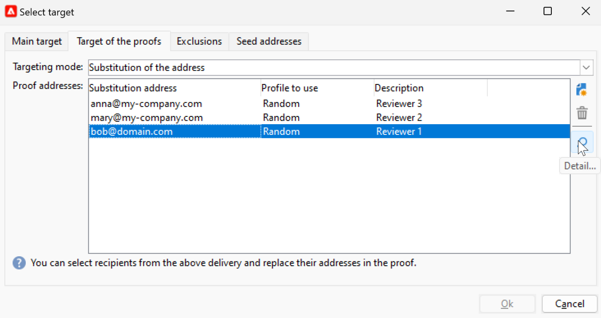

# Förhandsgranska och testa din e-post {#preview-test}

När meddelandeinnehållet har definierats kan du använda testprofiler för att förhandsgranska och testa det. Om du infogade [anpassat innehåll](personalize.md) kan du kontrollera hur det här innehållet visas i meddelandet med hjälp av testprofildata. Om du vill identifiera eventuella fel i meddelandeinnehållet eller personaliseringsinställningarna skickar du korrektur för att testa profiler. Ett korrektur ska skickas varje gång en ändring görs för att validera det senaste innehållet.

## Förhandsgranska innehåll{#preview-content}

Innan du skickar korrektur bör du kontrollera meddelandeinnehållet i förhandsgranskningsavsnittet i leveransfönstret.

Följ stegen nedan om du vill förhandsgranska meddelandeinnehållet:

1. Bläddra till fliken **Förhandsgranska** för leveransen.
1. Klicka på knappen **[!UICONTROL Test personalization]** för att välja en profil för att fylla i personaliseringsdata. Du kan välja en specifik mottagare i databasen, en dirigeringsadress eller välja en profil från målpopulationen, om den redan har definierats. Ni kan också kontrollera innehållet utan personalisering.

   

1. Förhandsgranskningen genereras så att du kan kontrollera meddelandeåtergivningen. I meddelandeförhandsgranskningen ersätts anpassade element med de valda testprofildata.

   

1. Välj andra testprofiler om du vill förhandsgranska e-poståtergivningen för varje variant av meddelandet.

## Skicka korrektur {#send-proofs}

För e-postleveranser kan du skicka korrektur för att validera meddelandeinnehållet. Genom att skicka korrektur kan du kontrollera länken för avanmälan, spegelsidan och alla andra länkar, validera meddelandet, verifiera att bilder visas, upptäcka eventuella fel osv. Du kanske också vill kontrollera din design och återgivning på olika enheter.

Ett korrektur är ett specifikt meddelande som gör att du kan testa ett meddelande innan det skickas till huvudmålgruppen. Mottagarna av beviset ansvarar för att godkänna meddelandet: rendering, innehåll, personaliseringsinställningar, konfiguration.

### Korrektur för mottagare {#proofs-recipients}

Korrekturmålet kan definieras i leveransmallen eller vara specifikt för en leverans. I båda fallen bläddrar du till måldefinitionsskärmen från länken **[!UICONTROL To]** och väljer fliken **[!UICONTROL Target of the proofs]**.

Typen av korrekturmål har valts i listrutan **[!UICONTROL Targeting mode]**.

* Använd alternativet **[!UICONTROL Definition of a specific proof target]** för att välja mottagare i databasen som korrekturmål.
* Använd alternativet **[!UICONTROL Substitution of the address]** för att ange e-postadresser och använd målmottagardata för att validera innehållet. Ersättningsadresserna kan anges manuellt eller väljas i listrutan. Den associerade uppräkningen är Ersättningsadress (rcpAddress).
Som standard utförs ersättningen slumpmässigt, men du kan välja en specifik mottagare från huvudmålet via ikonen **[!UICONTROL Detail]**.

  {width="800" align="left"}

  Välj alternativet **[!UICONTROL Select a profile (must be included in the target)]** och välj en mottagare.

  {width="800" align="left"}

* Använd alternativet **[!UICONTROL Seed addresses]** om du vill använda dirigerade adresser som korrekturmål. Dessa adresser kan importeras från en fil eller anges manuellt.

  >[!NOTE]
  >
  >Seed-adresser tillhör inte standardmottagartabellen (nms:mottagare), de skapas i en separat tabell. Om du utökar mottagartabellen med nya data måste du utöka både dirigerade adresstabellen och samma data.

  Läs mer om dirigeringsadresser i [det här avsnittet](../audiences/test-profiles.md).

* Använd alternativet **[!UICONTROL Specific target and Seed addresses]** för att kombinera startadresser och specifika e-postadresser. De relaterade konfigurationerna definieras sedan i två separata underflikar.

### Skicka en korrektur{#proofs-send}

Följ stegen nedan för att skicka korrektur av meddelanden:

1. Klicka på knappen **[!UICONTROL Send a proof]** på skärmen för meddelandedefinition.
1. Kontrollera korrekturmottagarna i fönstret **[!UICONTROL Send a proof]**.
1. Klicka på **[!UICONTROL Analyze]** för att starta korrekturmeddelandeförberedelsen.

   {width="800" align="left"}

1. När leveransförberedelsen är klar använder du **[!UICONTROL Confirm delivery]** för att börja skicka korrekturmeddelanden.

Bläddra till fliken **[!UICONTROL Audit]** i leveransen för att kontrollera leveransen av korrekturkopior.

Vi rekommenderar att du skickar korrektur efter varje ändring av meddelandeinnehållet.

>[!NOTE]
>
>I det skickade korrekturet är länken till spegelsidan inte aktiv. Den aktiveras endast i de slutliga meddelandena.

### Korregenskaper{#proofs-properties}

Korregenskaper anges på fliken **[!UICONTROL Advanced]** i fönstret för leveransegenskaper. Bläddra till länken **[!UICONTROL Proof properties...]** för att definiera parametrar och etiketter för korrektur. Du kan välja att behålla:

* Duplicera adresser i korrekturet
* Blocklist adresser i korrekturet
* Adresser i karantän i korrekturet

Som standard identifieras korrekturmeddelanden av `Proof #N` som omnämns i ämnet, där `N` är korrekturnumret. Numret ökas med varje korrekturleveransanalys. Du kan ändra prefixet `proof` efter behov.

{width="800" align="left"}

## Instruktionsvideo {#video-proof}

Lär dig hur du skickar och validerar ett bevis på en e-postleverans.

>[!VIDEO](https://video.tv.adobe.com/v/333404)
