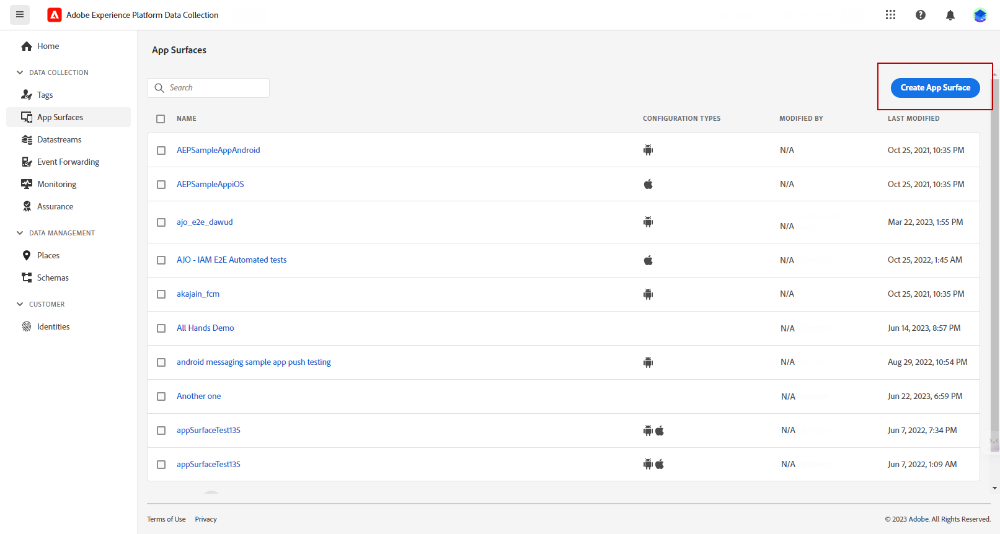
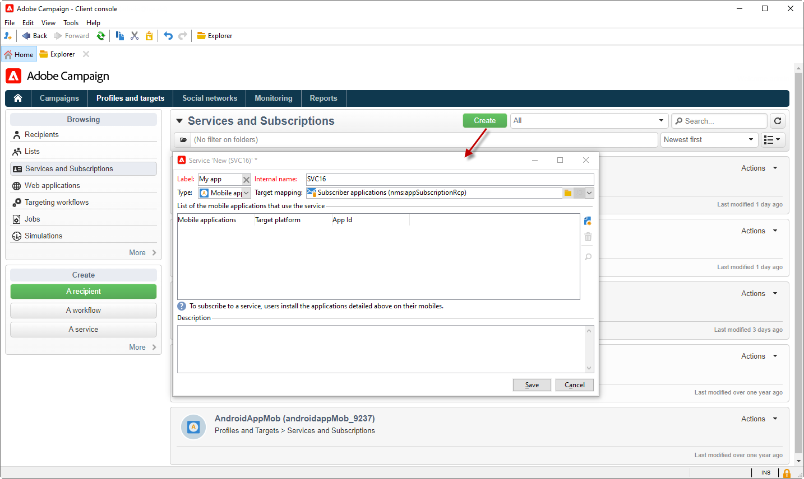
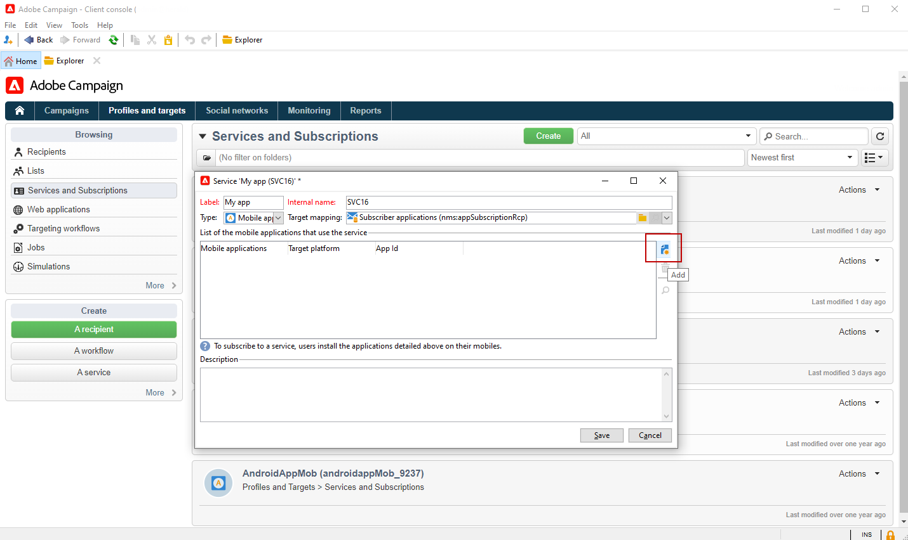
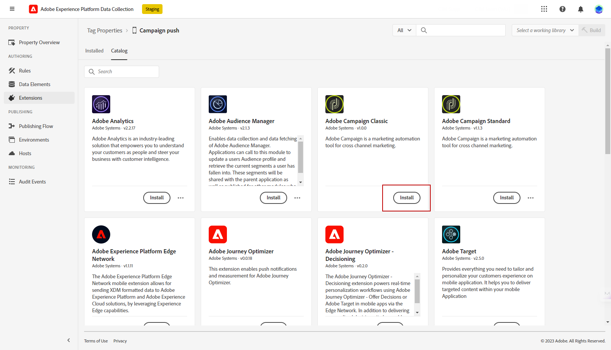
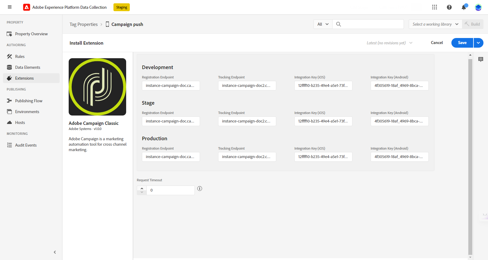

# Ändrad konfiguration för push-meddelanden {#push-notifications-config}

Campaign v8.5 introducerar vår senaste tjänst för push-meddelanden, som bygger på ett robust ramverk som bygger på modern spetsteknik. Den här tjänsten är utformad för att låsa upp nya nivåer av skalbarhet, så att dina meddelanden kan nå en större publik med smidig effektivitet. Med vår förbättrade infrastruktur och våra optimerade processer kan ni förvänta er större skalbarhet och tillförlitlighet, så att ni kan engagera och kommunicera med era mobilappsanvändare som aldrig förr.

>[!AVAILABILITY]
>
> Den här funktionen är exklusivt tillgänglig för nya kunder från och med Campaign v8.5 och progressivt introducerad till en uppsättning utvalda kunder. Om din miljö etablerades före juni 2023 gäller den här sidan inte dig och du måste följa de detaljerade procedurerna [på den här sidan](push-settings.md).

I samband med den här uppdaterade implementeringen kan du skicka push-meddelanden i Adobe Campaign på följande sätt:

1. [Skapa en appyta i Adobe Experience Platform Data Collection](#create-app-surface)

1. [Konfigurera programinställningarna i Adobe Campaign](#push-config-campaign)

1. [Skapa och konfigurera en mobil egenskap i Adobe Experience Platform Data Collection](#create-mobile-property)

1. [Lägg till Adobe Adobe Experience Platform Assurance-tillägg](https://developer.adobe.com/client-sdks/documentation/platform-assurance-sdk/){target="_blank"}(rekommenderas)

1. [Lägg till Campaign Classic i ditt mobilprogram](#campaign-mobile-ap)

1. [Skapa en leverans för både iOS och Android](##push-create)

>[!NOTE]
>
> Äldre FCM och APNS p12 stöds inte i datainsamling.

## Skapa en appyta i Adobe Experience Platform Data Collection {#create-app-surface}

Du måste lägga till dina push-inloggningsuppgifter för mobilprogrammet i [!DNL Adobe Experience Platform Data Collection].

Registrering av push-autentiseringsuppgifter krävs för mobilappen för att godkänna att Adobe skickar push-meddelanden åt dig. Se stegen nedan:

1. Från [!DNL Adobe Experience Platform Data Collection]väljer du **[!UICONTROL App Surfaces]** i den vänstra panelen.

1. Klicka **[!UICONTROL Create App Surface]** för att skapa en ny konfiguration.

   

1. Ange **[!UICONTROL Name]** för konfigurationen.

1. Från **[!UICONTROL Mobile Application Configuration]** väljer du operativsystem:

   * **För iOS**

     

      1. Ange mobilappen **Paket-ID** i **[!UICONTROL App ID (iOS Bundle ID)]** fält.

         Program-ID:t finns i **Allmänt** fliken för det primära målet i **XCode** av ditt Apple-utvecklarkonto.

      1. Aktivera **[!UICONTROL Push Credentials]** för att lägga till dina autentiseringsuppgifter.

      1. Dra och släpp .p8-filen Apple Push Notification Authentication Key.

         Den här nyckeln kan hämtas från **Certifikat**, **Identifierare** och **Profiler** sidan för ditt Apple-utvecklarkonto.

      1. Ange **Nyckel-ID**. Detta är en 10-teckensträng som tilldelas när en p8-autentiseringsnyckel skapas.

         Den finns under **Tangenter** tabba in **Certifikat**, **Identifierare** och **Profiler** sidan för ditt Apple-utvecklarkonto.

      1. Ange **Team-ID**. Detta är ett strängvärde som finns under **medlemskap** -fliken.

   * **För Android**

     

      1. Ange **[!UICONTROL App ID (Android package name)]**. Vanligtvis är paketnamnet program-id:t i din `build.gradle` -fil.

      1. Byt **[!UICONTROL Push Credentials]** för att lägga till dina autentiseringsuppgifter.

      1. Dra och släpp FCM-push-inloggningsuppgifterna. Mer information om hur du hämtar push-autentiseringsuppgifter finns i [Google Documentation](https://firebase.google.com/docs/admin/setup#initialize-sdk){target="_blank"}.

1. Klicka **[!UICONTROL Save]** för att skapa din appkonfiguration.

## Konfigurera programinställningarna i Adobe Campaign{#push-config-campaign}

### Skapa en tjänst {#create-service}

Innan du skickar push-meddelanden måste du definiera inställningarna för dina iOS- och Android-appar i Adobe Campaign.

Push-meddelanden skickas till appanvändarna via en dedikerad tjänst. När användarna installerar din app prenumererar de på den här tjänsten: Adobe Campaign förlitar sig på den här tjänsten för att endast rikta sig till appens prenumeranter. I den här tjänsten måste du lägga till dina iOS- och Android-appar som ska skickas på iOS- och Android-enheter.

Följ stegen nedan för att skapa en tjänst för att skicka push-meddelanden:

1. Bläddra till **[!UICONTROL Profiles and Targets > Services and Subscriptions]** och klicka på **[!UICONTROL Create]**.

   {width="800" align="left"}

1. Ange **[!UICONTROL Label]** och **[!UICONTROL Internal name]** och väljer **[!UICONTROL Mobile application]** typ.

   >[!NOTE]
   >
   >Standardvärdet **[!UICONTROL Subscriber applications (nms:appSubscriptionRcp)]** målmappningen är länkad till mottagartabellen. Om du vill använda en annan målmappning måste du skapa en ny målmappning och ange den i **[!UICONTROL Target mapping]** tjänstens fält. Läs mer om målmappningar i [den här sidan](../audiences/target-mappings.md).

1. Använd sedan **[!UICONTROL Add]** till höger för att definiera de mobilprogram som använder den här tjänsten.

   

### Skapa ett mobilprogram {#create-sapp}

När du har skapat tjänsten måste du nu definiera de mobilprogram som ska använda den här tjänsten.

>[!BEGINTABS]

>[!TAB iOS]

Så här skapar du en app för iOS-enheter:

1. Från din tjänst klickar du på **[!UICONTROL Add]** välj **[!UICONTROL Create an iOS application]**. Klicka på **[!UICONTROL Next]**.

   

1. Från **[!UICONTROL Launch app configurations list]** markerar du appytan som skapades i det här avsnittet. Klicka på **[!UICONTROL Next]**.

   

1. (valfritt) Du kan förbättra innehållet i ett push-meddelande med **[!UICONTROL Application variables]**. Dessa är helt anpassningsbara och utgör en del av den meddelandenyttolast som skickas till den mobila enheten.

   I exemplet nedan är **mediaURl** och **mediaExt** -variabler läggs till för att skapa omfattande push-meddelanden och ger sedan programmet den bild som ska visas i meddelandet.

   

1. Bläddra till **[!UICONTROL Subscription parameters]** för att definiera mappningen med ett tillägg till **[!UICONTROL Subscriber applications (nms:appsubscriptionRcp)]** schema.

1. Bläddra till **[!UICONTROL Sounds]** för att definiera ett ljud som ska spelas upp. Klicka **[!UICONTROL Add]** och fylla **[!UICONTROL Internal name]** fält som måste innehålla namnet på filen som är inbäddad i programmet eller namnet på systemljudet.

1. Klicka **[!UICONTROL Next]** för att börja konfigurera utvecklingsprogrammet.

1. The **[!UICONTROL Integration key]** är specifikt för varje program. Det länkar mobilprogrammet till Adobe Campaign och kommer att användas när Campaign-tillägget konfigureras.

   Se till att samma **[!UICONTROL Integration key]** definieras i Adobe Campaign och i programkoden via SDK.

   Läs mer i [dokumentation för utvecklare](https://developer.adobe.com/client-sdks/documentation/adobe-campaign-classic/#configuration-keys){target="_blank"}

   >[!NOTE]
   >
   > The **[!UICONTROL Integration key]** är helt anpassningsbart med strängvärde, men måste vara exakt densamma som den som anges i SDK:n.
   >
   > Du kan inte använda samma certifikat för utvecklingsversionen (sandlådan) och produktionsversionen av programmet.

   

1. Välj ikonen på menyn **[!UICONTROL Application icon]** fält för att anpassa mobilapplikationer i din tjänst.

1. Klicka **[!UICONTROL Next]** för att börja konfigurera produktionsprogrammet och följa de steg som beskrivs ovan. Observera att du inte kan använda samma **[!UICONTROL Integration key]** för utvecklingsversionen (sandlådan) och produktionsversionen av programmet.

1. Klicka på **[!UICONTROL Finish]**.

Ditt iOS-program kan nu användas i Campaign.

>[!TAB Android]

Så här skapar du en app för Android-enheter:

1. Från din tjänst klickar du på **[!UICONTROL Add]** välj **[!UICONTROL Create an Android application]**. Klicka på **[!UICONTROL Next]**.

   

1. Från **[!UICONTROL Launch app configurations list]** markerar du appytan som skapas i det här avsnittet och klickar på **[!UICONTROL Next]**.

   

1. Integreringsnyckeln är specifik för varje program. Det länkar mobilprogrammet till Adobe Campaign och kommer att användas när Campaign-tillägget konfigureras.

   Se till att samma **[!UICONTROL Integration key]** definieras i Adobe Campaign och i programkoden via SDK.

   Läs mer i [dokumentation för utvecklare](https://developer.adobe.com/client-sdks/documentation/adobe-campaign-classic/#configuration-keys){target="_blank"}

   >[!NOTE]
   >
   > The **[!UICONTROL Integration key]** är helt anpassningsbart med strängvärde, men måste vara exakt densamma som den som anges i SDK:n.

   

1. Välj ikonen på menyn **[!UICONTROL Application icon]** fält för att anpassa mobilapplikationer i din tjänst.

1. (valfritt) Du kan förbättra innehållet i ett push-meddelande med **[!UICONTROL Application variables]** vid behov. Dessa är helt anpassningsbara och utgör en del av den meddelandenyttolast som skickas till den mobila enheten.

1. Bläddra till **[!UICONTROL Subscription parameters]** för att definiera mappningen med ett tillägg till **[!UICONTROL Subscriber applications (nms:appsubscriptionRcp)]** schema.

1. Klicka **[!UICONTROL Finish]** och sen **[!UICONTROL Save]**.

Ditt Android-program kan nu användas i Campaign.

>[!ENDTABS]

Nedan visas FCM-nyttolastsnamnen för att ytterligare anpassa ditt push-meddelande:

| Meddelandetyp | Konfigurerbart meddelandeelement (FCM-nyttolastnamn) | Konfigurerbara alternativ (FCM-nyttolastnamn) |
|:-:|:-:|:-:|
| datameddelande | N/A | validate_only |
| meddelande | title, body, android_channel_id, icon, sound, tag, color, click_action, image, ticker, sticky, visibility, notification_priority, notification_count   | validate_only |

## Konfigurera en mobil egenskap i Adobe Experience Platform Data Collection {#create-mobile-property}

1. Gå till Taggar-menyn från startsidan för Datainsamling.

1. Klicka på **[!UICONTROL New Property]**.

   

1. Ange ett namn för egenskapen och välj **[!UICONTROL Mobile]** som plattformen.

   

1. Klicka **[!UICONTROL Save]** för att skapa egenskapen mobile.

1. Få åtkomst till din nya mobila egenskap.

1. Från kontrollpanelen för mobila egenskaper kan du komma åt **[!UICONTROL Extensions]** menyn **[!UICONTROL Catalog]** -fliken.

   

1. Installera **[!DNL Adobe Campaign Classic]** tillägg. [Läs mer om Campaign-tillägget](https://developer.adobe.com/client-sdks/documentation/adobe-campaign-classic/#configure-campaign-classic-extension)

   

1. Fyll i instansinformationen:

   * **[!UICONTROL Registration endpoint]** eller **[!UICONTROL Tracking endpoint]** URL:er finns i **[!UICONTROL Tools]** > **[!UICONTROL Advanced]** > **[!UICONTROL Deployment wizard]** i Campaign.
   * **[!UICONTROL Integration keys]** finns i den mobilapp som konfigurerats i [det här avsnittet](#create-app).

   

1. Klicka på **[!UICONTROL Save]**.

1. Du måste nu publicera konfigurationen från **[!UICONTROL Publishing flow]** -menyn. [Läs mer](https://developer.adobe.com/client-sdks/documentation/getting-started/create-a-mobile-property/#publish-the-configuration)

Din mobila egenskap synkroniseras nu automatiskt med **[!UICONTROL Adobe Experience Platform Data Collection]** tekniskt arbetsflöde. [Läs mer](../../automation/workflow/technical-workflows.md#list-technical-workflows)

## Lägg till Campaign Classic i ditt mobilprogram {#campaign-mobile-app}

Adobe Experience Platform Mobile SDK hjälper er att driva lösningar och tjänster från Adobe Experience Cloud i era mobilappar. SDK-konfigurationen hanteras via användargränssnittet för datainsamling för flexibel konfiguration och utbyggbara, regelbaserade integreringar.

[Läs mer i Adobe Developer-dokumentationen](https://developer.adobe.com/client-sdks/documentation/adobe-campaign-classic/#add-campaign-classic-to-your-app){target="_blank"}.

## Skapa ett push-meddelande{#push-create}

När du har konfigurerat ditt mobilprogram i datainsamling kan du nu skapa och skicka push-meddelanden i Adobe Campaign.

Se [den här sidan](push.md#push-create) för de detaljerade elementen som är specifika för leveransen av iOS- och Android-meddelanden.
