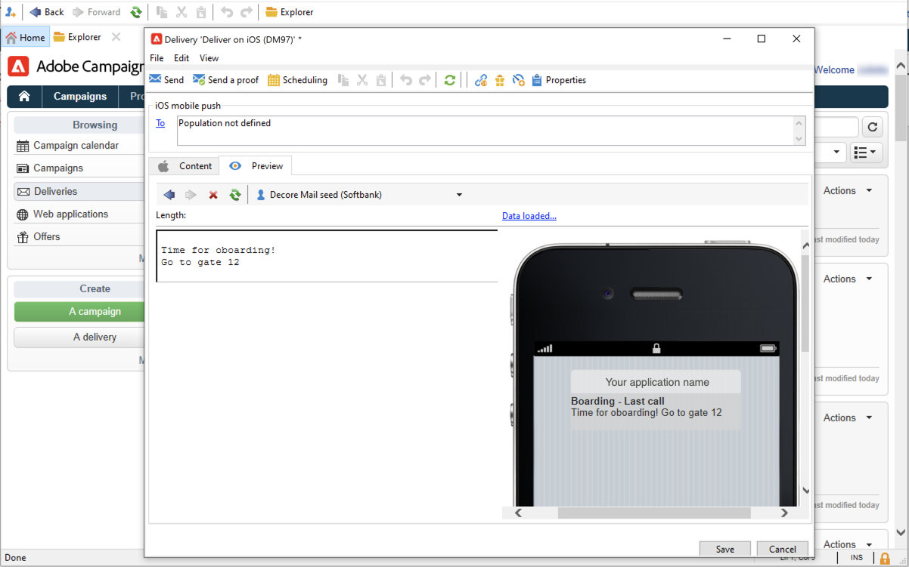

# Skapa och skicka push-meddelanden

Med mobilappsleveranser kan du skicka meddelanden till iOS- och Android-system.

Om du vill skicka push-meddelanden i Adobe Campaign måste du:

1. Konfigurera kampanjmiljön
1. Skapa en informationstjänst av mobiltyp för ditt mobilprogram.
1. Lägg till iOS- och Android-versionerna av programmet i den här tjänsten.
1. Skapa en leverans för både iOS och Android.

[!DNL :arrow_upper_right:] Läs om hur du kommer igång med mobilappar i dokumentationen för  [Campaign Classic v7](https://experienceleague.adobe.com/docs/campaign-classic/using/sending-messages/sending-push-notifications/about-mobile-app-channel.html)

## Integrera med Adobe SDK

### Integrera Campaign SDK

Campaign SDK underlättar integreringen av mobilapplikationer i Adobe Campaign.

Kompatibla SDK-versioner visas i [kampanjkompatibilitetsmatrisen](../start/compatibility-matrix.md#MobileSDK).

[!DNL :arrow_upper_right:] Lär dig hur du integrerar Campaign Android och iOS SDK med din app i  [det här avsnittet](../config/push-config.md)

### Konfigurera Campaign Extension i Launch

Ni kan integrera Adobe Experience Platform Launch SDK med Campaign genom att utnyttja tillägget Campaign Classic.

[!DNL :arrow_upper_right:] Läs mer i dokumentationen för  [Adobe Mobile SDK](https://aep-sdks.gitbook.io/docs/using-mobile-extensions/adobe-campaignclassic)

## Konfigurera appinställningarna i Campaign

Du måste definiera dina inställningar för iOS- och Android-appar i Adobe Campaign.

[!DNL :arrow_upper_right:] Riktlinjer för konfiguration av iOS finns i dokumentationen för  [Campaign Classic v7](https://experienceleague.adobe.com/docs/campaign-classic/using/sending-messages/sending-push-notifications/configure-the-mobile-app/configuring-the-mobile-application.html?lang=en#sending-messages)

[!DNL :arrow_upper_right:] Riktlinjer för konfiguration av Android finns i dokumentationen för  [Campaign Classic v7](https://experienceleague.adobe.com/docs/campaign-classic/using/sending-messages/sending-push-notifications/configure-the-mobile-app/configuring-the-mobile-application-android.html?lang=en#sending-messages)

## Skapa ditt första push-meddelande

I det här avsnittet beskrivs de element som är specifika för leveransen av iOS- och Android-meddelanden.

[!DNL :arrow_upper_right:] Alla steg för att skapa push-meddelanden finns i dokumentationen för  [Campaign Classic v7](https://experienceleague.adobe.com/docs/campaign-classic/using/sending-messages/sending-push-notifications/creating-notifications.html?lang=en)

>[!CAUTION]
>
>Med Campaign v8 är mobilregistreringen nu **asynkron**. [Läs mer](../dev/staging.md)

Om du vill skapa en ny leverans går du till fliken **[!UICONTROL Campaigns]**, klickar på **[!UICONTROL Deliveries]** och klickar på **[!UICONTROL Create]** ovanför listan över befintliga leveranser.

[!DNL :arrow_upper_right:] Global information om hur du skapar en leverans finns i  [Campaign Classic v7-dokumentationen](https://experienceleague.adobe.com/docs/campaign-classic/using/sending-messages/key-steps-when-creating-a-delivery/steps-about-delivery-creation-steps.html?lang=en#sending-messages).

### Skicka meddelanden på iOS {#send-notifications-on-ios}

1. Välj leveransmallen **[!UICONTROL Deliver on iOS]** och klicka på **[!UICONTROL Continue]**.

   

1. Om du vill definiera målet för meddelandet klickar du på länken **[!UICONTROL To]** och sedan på **[!UICONTROL Add]**.

   

1. Välj **[!UICONTROL Subscribers of an iOS mobile application (iPhone, iPad)]**, välj den tjänst som är relevant för ditt mobilprogram och välj sedan iOS-versionen av programmet.

   

1. Välj meddelandetyp: **[!UICONTROL Alert]**, **[!UICONTROL Badge]**, **[!UICONTROL Alert and badge]** eller **[!UICONTROL Silent Push]**.

   

1. I fältet **[!UICONTROL Title]** anger du etiketten för titeln som du vill ska visas i meddelandet.

1. Ange **[!UICONTROL Message]** och **[!UICONTROL Value of the badge]** baserat på den valda meddelandetypen.

1. Du kan också definiera följande element:

   * Med **[!UICONTROL Action button]** kan du definiera en etikett för åtgärdsknappen som visas i varningsmeddelanden (**action_loc_key** fält för nyttolasten).

   * I fältet **[!UICONTROL Play a sound]** väljer du det ljud som ska spelas upp av mobilterminalen när meddelandet tas emot.

   * I fältet **[!UICONTROL Application variables]** anger du värdet för varje variabel. Du kan till exempel konfigurera en specifik programskärm som ska visas när användaren aktiverar meddelandet.

1. När meddelandet har konfigurerats klickar du på fliken **[!UICONTROL Preview]** för att förhandsgranska meddelandet.

   

[!DNL :arrow_upper_right:] Alla detaljerade steg för att skapa och skicka push-meddelanden på iOS finns i dokumentationen för  [Campaign Classic v7](https://experienceleague.adobe.com/docs/campaign-classic/using/sending-messages/sending-push-notifications/creating-notifications.html?lang=en#sending-notifications-on-ios)

### Skicka meddelanden på Android {#send-notifications-on-android}

1. Välj leveransmallen **[!UICONTROL Deliver on Android (android)]**.

   

1. Om du vill definiera målet för meddelandet klickar du på länken **[!UICONTROL To]** och sedan på **[!UICONTROL Add]**.

   

1. Välj **[!UICONTROL Subscribers of an Android mobile application]**, välj den tjänst som är relevant för ditt mobilprogram (Neotrips, i det här fallet) och välj sedan Android-versionen av programmet.

   

1. Ange sedan innehållet för meddelandet.

   

1. Klicka på ikonen **[!UICONTROL Insert emoticon]** för att infoga uttryckssymboler i push-meddelandet.

1. I fältet **[!UICONTROL Application variables]** anger du värdet för varje variabel. Du kan till exempel konfigurera en specifik programskärm som ska visas när användaren aktiverar meddelandet.

1. När meddelandet har konfigurerats klickar du på fliken **[!UICONTROL Preview]** för att förhandsgranska meddelandet.

   <!---->

[!DNL :arrow_upper_right:] Alla detaljerade steg för att skapa och skicka push-meddelanden på Android finns i dokumentationen för  [Campaign Classic v7](https://experienceleague.adobe.com/docs/campaign-classic/using/sending-messages/sending-push-notifications/creating-notifications.html?lang=en#sending-notifications-on-android)

## Testa, skicka och övervaka dina push-meddelanden

Använd samma process som för e-postleveranser om du vill skicka ett korrektur och den slutliga leveransen. Läs mer i Campaign Classic v7-dokumentationen:

* Validera en leverans och skicka korrektur
   [!DNL :arrow_upper_right:] [Lär dig viktiga steg för att validera en leverans](https://experienceleague.adobe.com/docs/campaign-classic/using/sending-messages/key-steps-when-creating-a-delivery/steps-validating-the-delivery.html)

* Bekräfta och skicka leveransen
   [!DNL :arrow_upper_right:] [Lär dig viktiga steg för att skicka en leverans](https://experienceleague.adobe.com/docs/campaign-classic/using/sending-messages/key-steps-when-creating-a-delivery/steps-sending-the-delivery.html?lang=en)

När du har skickat meddelanden kan du övervaka och spåra dina leveranser. Läs mer i Campaign Classic v7-dokumentationen:

* Kantlinjer för push-meddelanden
   [!DNL :arrow_upper_right:] [Läs mer om karantän för push-meddelanden](https://experienceleague.adobe.com/docs/campaign-classic/using/sending-messages/monitoring-deliveries/understanding-quarantine-management.html?lang=en#push-notification-quarantines)

* Felsökning
   [!DNL :arrow_upper_right:] [Lär dig hur du felsöker push-meddelanden](https://experienceleague.adobe.com/docs/campaign-classic/using/sending-messages/sending-push-notifications/troubleshooting.html?lang=en)