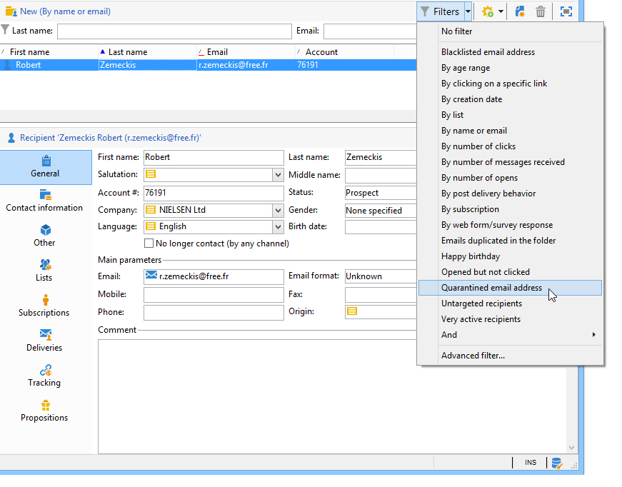

# Karantän {#quarantine-management}

Adobe Campaign hanterar en lista med adresser i karantän för onlinekanaler (e-post, SMS, push-meddelanden). Vissa leverantörer av internetåtkomst betraktar automatiskt e-post som skräppost om frekvensen av ogiltiga adresser är för hög. Med karantän kan du därför undvika att läggas till i blockeringslista av dessa leverantörer. Dessutom bidrar karantäner till att minska SMS-kostnaderna genom att utesluta felaktiga telefonnummer från leveranser.

När adressaten eller telefonnumret sätts i karantän utesluts mottagarna från målet vid leveransanalysen: kommer du inte att kunna skicka marknadsföringsmeddelanden, inklusive e-post för automatiserade arbetsflöden, till dessa kontakter. Om dessa adresser i karantän också finns med i listor, kommer de att uteslutas när de skickas till dessa listor. En e-postadress kan sättas i karantän, till exempel när postlådan är full, om adressen inte finns eller om e-postservern till exempel inte är tillgänglig.

<!--For more on best practices to secure and optimize your deliveries, refer to [this page](delivery-best-practices.md).-->

**Karantän** gäller endast för **adress**, a **telefonnummer**, eller en **enhetstoken**, men inte själva profilen. En profil vars e-postadress är placerad i karantän kan till exempel uppdatera sin profil och ange en ny adress. Därefter kan den användas av leveransåtgärder igen. Om två profiler råkar ha samma telefonnummer, påverkas båda om numret sätts i karantän. Adresserna eller telefonnumren i karantän visas i [exkluderingsloggar](#delivery-quarantines) (för leverans) eller i [karantänlista](#non-deliverable-bounces) (för hela plattformen).

Å andra sidan kan profiler vara **blockeringslista** efter en avanmälan (avanmälan), för en viss kanal: detta innebär att de inte längre är målinriktade. Om en profil på blockeringslista för e-postkanalen har två e-postadresser, kommer därför båda adresserna att exkluderas från leveransen. Du kan kontrollera om det finns en profil på blockeringslista för en eller flera kanaler i dialogrutan **[!UICONTROL No longer contact]** i profilens **[!UICONTROL General]** -fliken. [Läs mer](../audiences/view-profiles.md).

>[!NOTE]
>
>När mottagarna rapporterar ditt meddelande som skräppost eller svarar på ett SMS-meddelande med ett nyckelord som &quot;STOP&quot;, sätts deras adress eller telefonnummer i karantän som **[!UICONTROL Denylisted]**. Deras profil uppdateras därefter.
>
> E-postadresser sätts i karantän för e-postkanalen. För mobilappskanalen sätts enhetstoken i karantän. Telefonnummer sätts i karantän för SMS-kanalen.

## Varför skickas ett e-postmeddelande, en telefon eller en enhet till karantän {#quarantine-reason}

Adobe Campaign hanterar karantän beroende på typ av leveransfel och orsaken till detta. Dessa tilldelas vid kvalificering av felmeddelanden. Läs mer om hantering av leveransfel [på den här sidan](delivery-failures.md).

Det finns två typer eller fel:

* **Hårt fel**: e-postadressen, telefonnumret eller enheten skickas omedelbart till karantänen.
* **Mjukt fel**: mjuka fel ökar en felräknare och kan sätta i karantän för e-post, telefonnummer eller enhetstoken. Kampanjresultat [återförsök](delivery-failures.md#retries).: När felräknaren når gränsvärdet sätts adressen, telefonnumret eller enhetstoken i karantän. [Läs mer](delivery-failures.md#retries).

I listan över adresser i karantän visas **[!UICONTROL Error reason]** anger varför den valda adressen placerades i karantän. [Läs mer](#identifying-quarantined-addresses-for-the-entire-platform).

Om en användare kvalificerar ett e-postmeddelande som skräppost omdirigeras meddelandet automatiskt till en teknisk postlåda som hanteras av Adobe. Användarens e-postadress skickas sedan automatiskt till karantänen med status **[!UICONTROL Denylisted]**.    Den här statusen avser endast adressen, profilen finns inte på blockeringslista, så att användaren fortsätter att ta emot SMS-meddelanden och push-meddelanden. Läs mer om feedbackslingor i [Guide till bästa leveransmetoder](https://experienceleague.adobe.com/docs/deliverability-learn/deliverability-best-practice-guide/transition-process/infrastructure.html#feedback-loops).

>[!NOTE]
>
>Karantänen i Adobe Campaign är skiftlägeskänslig.    Se till att importera e-postadresser med små bokstäver så att inte e-postadresserna fortsätter att ta emot meddelanden.

## Åtkomst till adresser i karantän {#access-quarantined-addresses}

Adresser i karantän kan visas för en viss leverans eller för hela plattformen.

### Karantän för leverans{#delivery-quarantines}

Karantänadresser listas under leveransförberedelsefasen i leveransloggarna för leveransinstrumentpanelen.

För varje leverans kan du även kontrollera **[!UICONTROL Delivery summary]** rapport: Den visar antalet adresser i karantän i leveransmålet och visar:

* Antalet adresser som placerats i karantän under leveransanalysen.
* Antalet adresser som placerats i karantän efter leveransåtgärden.

### Ej levererbara och studsadresser{#non-deliverable-bounces}

Visa listan över adresser i karantän **för hela plattformen** kan kampanjadministratörer gå till  **[!UICONTROL Administration > Campaign Management > Non deliverables Management > Non deliverables and addresses]**. I det här avsnittet visas element i karantän för **e-post**, **SMS** och **Push-meddelande** kanaler.

>[!NOTE]
>
>Antalet karantän ökar med tiden. Om en e-postadress till exempel anses ha en livslängd på tre år och mottagartabellen ökar med 50 % varje år, kan ökningen av antalet karantän beräknas enligt följande:
>
>Slutet av år 1: (1&#42;0,33)/(1+0.5)=22 %.
>
>Slutet av år 2: (1.22)&#42;0,33)+0,33)/(1,5+0,75)=32,5 %.

Dessutom är **[!UICONTROL Non-deliverables and bounces]** inbyggd rapport, tillgänglig från **Rapporter** på den här startsidan, visar information om adresserna i karantän, typer av fel som uppstått och felinformation per domän. Du kan filtrera data för en viss leverans eller anpassa rapporten efter behov.

Läs mer om studsadresser i [Handbok om bästa praxis för leverans](https://experienceleague.adobe.com/docs/deliverability-learn/deliverability-best-practice-guide/metrics-for-deliverability/bounces.html)

### E-postadress i karantän {#quarantined-recipient}

Du kan slå upp status för e-postadressen för alla mottagare.

Det gör du genom att markera mottagarprofilen och klicka på knappen **[!UICONTROL Deliveries]** -fliken. För alla leveranser till den mottagaren kan du ta reda på om adressen misslyckades, placerades i karantän under analysen osv.

För varje mapp kan du endast visa mottagare vars e-postadress är i karantän, med **[!UICONTROL Quarantined email address]** inbyggt filter enligt nedan:

## Ta bort en adress i karantän {#remove-a-quarantined-address}

Adresser som matchar specifika villkor tas automatiskt bort från karantänlistan av **Databasrensning** inbyggt arbetsflöde.

Adresserna tas automatiskt bort från karantänlistan i följande fall:

* Adresser i en **[!UICONTROL With errors]** status kommer att tas bort från karantänlistan efter en slutförd leverans.
* Adresser i en **[!UICONTROL With errors]** status tas bort från karantänlistan om den senaste mjuka studsen inträffade för mer än 10 dagar sedan. Mer information om mjuk felhantering finns i [det här avsnittet](#soft-error-management).
* Adresser i en **[!UICONTROL With errors]** status som studsade med **[!UICONTROL Mailbox full]** felet tas bort från karantänlistan efter 30 dagar.

Status ändras sedan till **[!UICONTROL Valid]**.

>[!CAUTION]
>
>Mottagare med en adress i en **[!UICONTROL Quarantine]** eller **[!UICONTROL Denylisted]** status tas aldrig bort, även om de får ett e-postmeddelande.

Du kan också ta bort en adress manuellt från karantänlistan. Om du vill ta bort en adress från karantänen kan du:

* Ändra status till **[!UICONTROL Valid]** från **[!UICONTROL Administration > Campaign Management > Non deliverables Management > Non deliverables and addresses]** nod.

   

* Ändra status till **[!UICONTROL Allowlisted]**: I det här fallet finns adressen kvar på karantänlistan, men den kommer att riktas systematiskt, även om ett fel inträffar.

>[!CAUTION]
>
>Om du tar bort en adress från karantänlistan börjar du skicka igen till den här adressen. Detta kan få allvarliga konsekvenser för leveransförmågan och IP-anseendet, vilket i slutänden kan leda till att din IP-adress eller sändande domän blockeras. Fortsätt med extra försiktighet när du överväger att ta bort en adress från karantän. Kontakta Adobe Support om du behöver hjälp.
