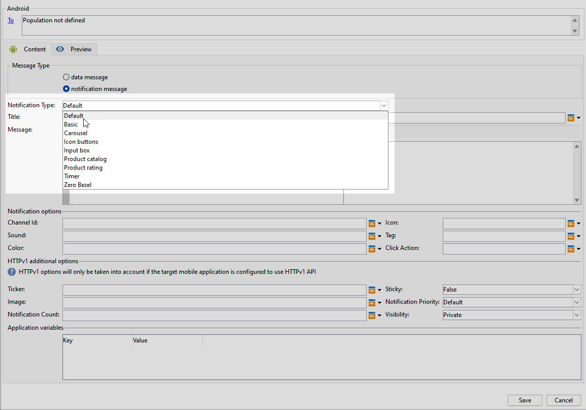
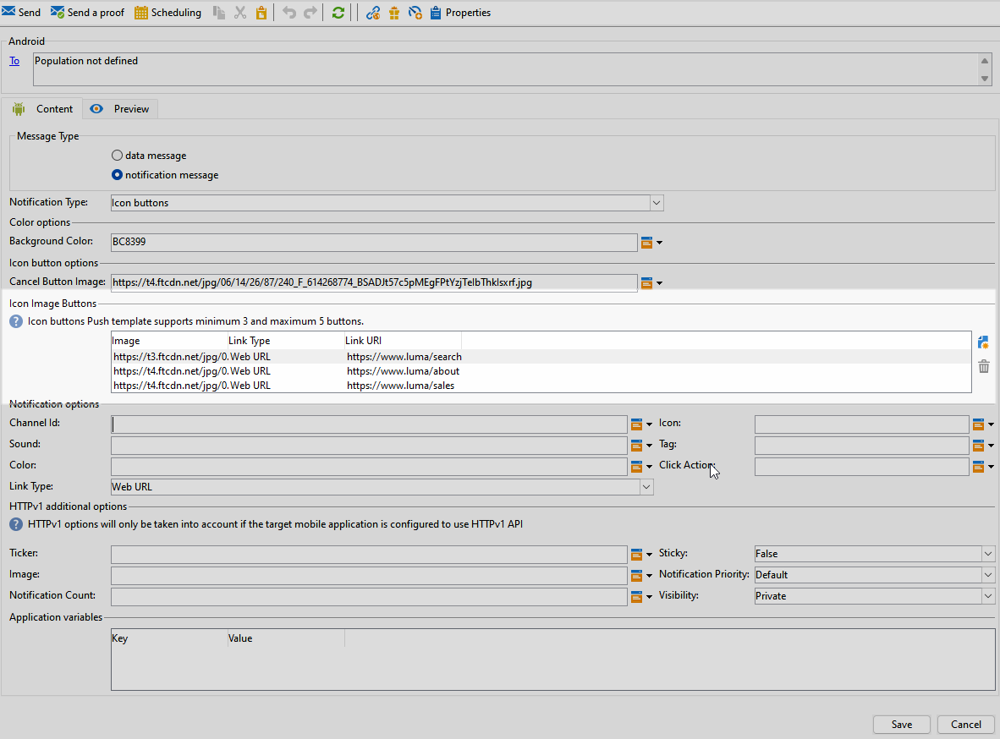
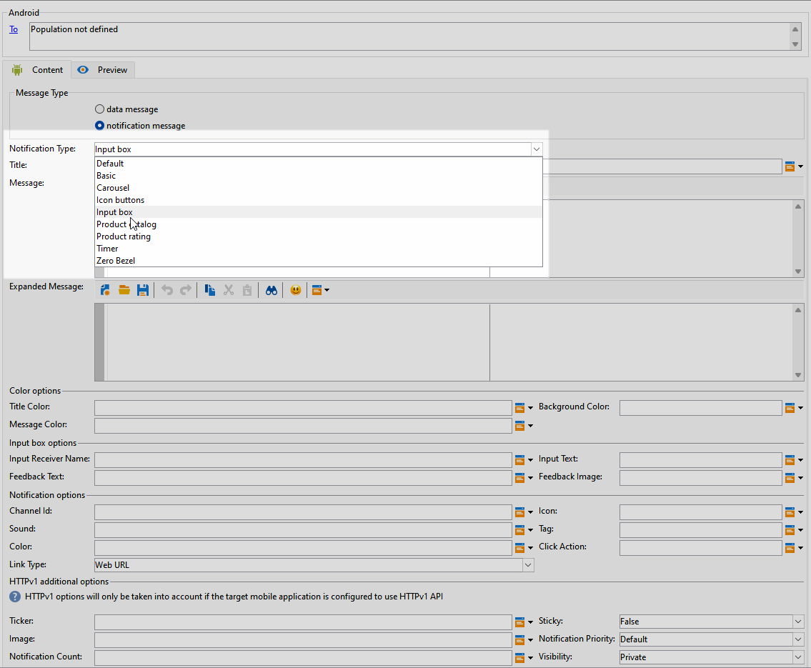
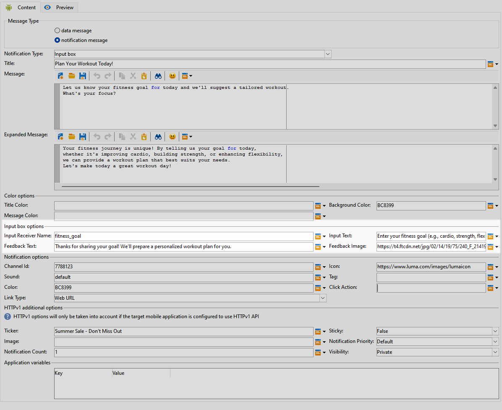
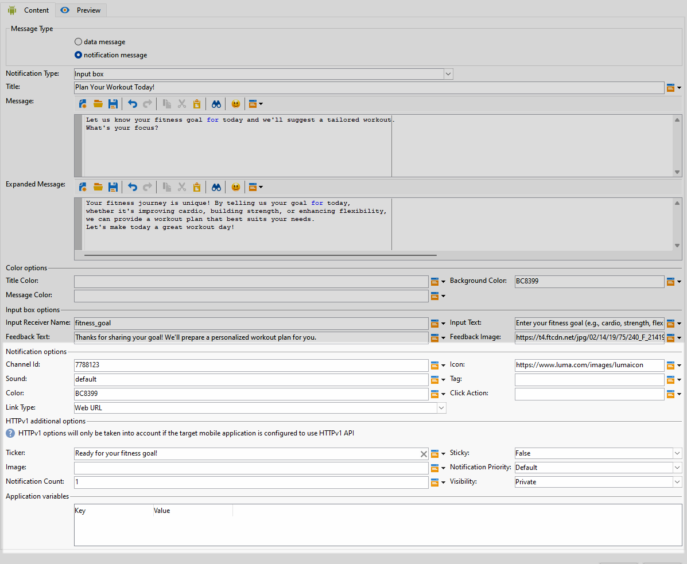
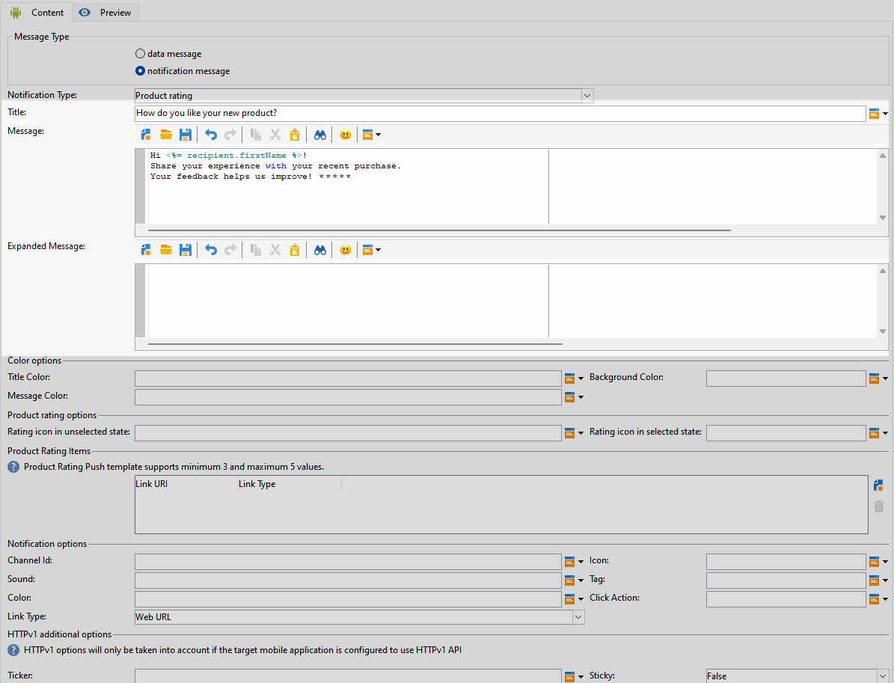
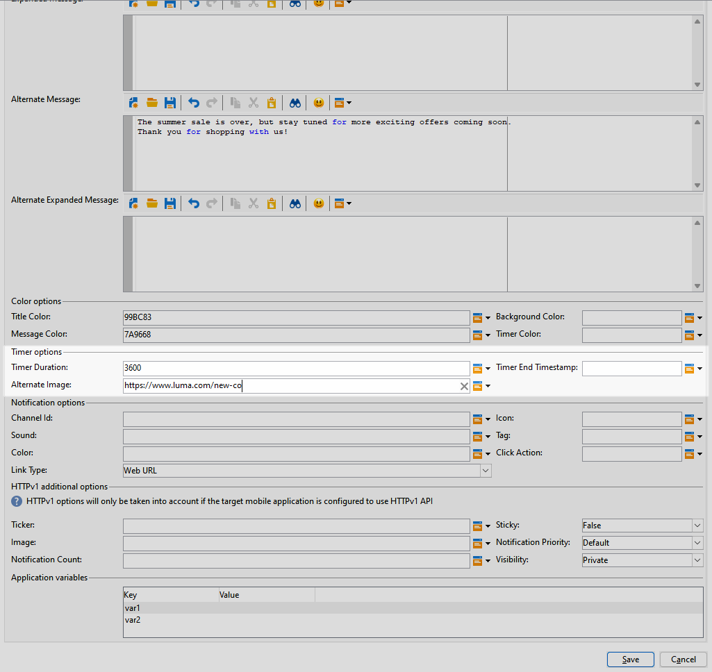
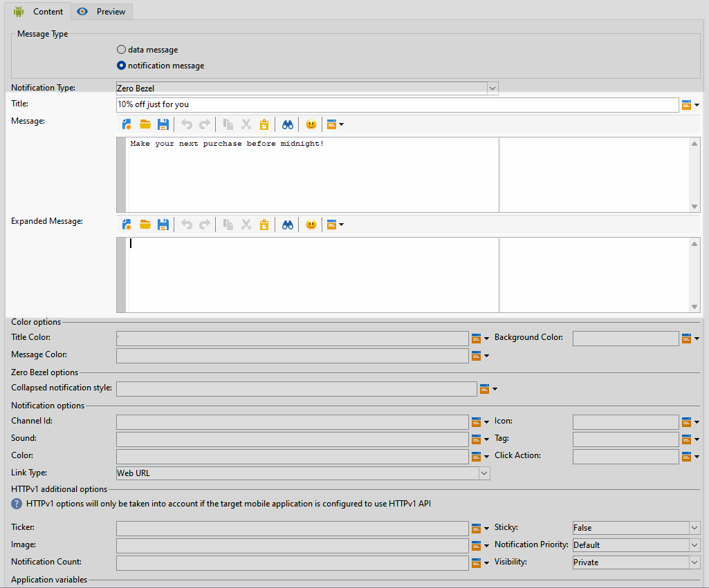

# Designa en omfattande Android-leverans {#rich-push}

>[!IMPORTANT]
>
>Innan du utformar ett push-meddelande måste du först konfigurera V2-anslutningen. Mer information finns på [den här sidan](https://experienceleague.adobe.com/en/docs/campaign-classic/using/sending-messages/sending-push-notifications/configure-the-mobile-app/configuring-the-mobile-application-android#configuring-external-account-android).

Med Firebase Cloud Messaging kan du välja mellan två typer av meddelanden:

* **[!UICONTROL Data message]** hanteras av klientprogrammet. Dessa meddelanden skickas direkt till mobilprogrammet som genererar och visar ett Android-meddelande på enheten. Datameddelanden innehåller bara dina anpassade programvariabler.

* **[!UICONTROL Notification message]**, hanteras automatiskt av FCM SDK. FCM visar automatiskt meddelandet på användarnas enheter för klientprogrammets räkning. Meddelanden innehåller en fördefinierad uppsättning parametrar och alternativ, men de kan fortfarande anpassas ytterligare med anpassade programvariabler.

Om rullningslisten är inaktiverad i gränssnittet öppnar du **[!UICONTROL Administration]** `>` **[!UICONTROL Platform]** `>` **[!UICONTROL Options]** och ställer in alternativet **[!UICONTROL XtkUseScrollBar]** på 1.

## Definiera innehållet i ett Android-meddelande {#push-message}

När du har skapat din push-leverans kan du definiera innehållet med någon av följande mallar:

* Med **Standard** kan du skicka meddelanden med en enkel ikon och en medföljande bild.

* **Grundläggande** kan innehålla text, bilder och knappar i dina meddelanden.

* Med **Carousel** kan du skicka meddelanden med text och flera bilder som användare kan svepa igenom.

* Med ikonknapparna **kan du skicka meddelanden med en ikon och en motsvarande bild.**

* **Inmatningsrutan** samlar in användarindata och feedback direkt via meddelandet.

* **Produktkatalogen** visar en mängd olika produktbilder.

* **Med produktklassificering** kan användare ge feedback och betygsätta produkter.

* **Timer** innehåller en nedräkningstimer i dina meddelanden.

* **Nollkantsram** använder hela bakgrundsytan för en bild, med text utan synliga skarvar.

Gå igenom flikarna nedan för att lära dig mer om hur du anpassar mallarna.

>[!BEGINTABS]

>[!TAB Standard]

1. Välj **[!UICONTROL Default]** i listrutan **[!UICONTROL Notification type]**.

   

1. Skriv texten i fälten **[!UICONTROL Title]** och **[!UICONTROL Message]** för att skapa meddelandet.

   

1. Använd dynamiska personaliseringsfält för att definiera innehåll, personalisera data och lägga till dynamiskt innehåll. [Läs mer](../send/personalize.md)

1. Om du vill anpassa push-meddelandet ytterligare konfigurerar du **[!UICONTROL Notification options]** och **[!UICONTROL HTTPv1 additional options]** för push-meddelandet. [Läs mer](#push-advanced)

   

När du har definierat meddelandeinnehållet kan du använda testprenumeranter för att förhandsgranska och testa meddelandet.

>[!TAB Grundläggande]

1. Välj **[!UICONTROL Basic]** i listrutan **[!UICONTROL Notification Type]**.

   

1. Skriv texten i fälten **[!UICONTROL Title]**, **[!UICONTROL Message]** och **[!UICONTROL Expanded message]** för att skapa meddelandet.

   Texten **[!UICONTROL Message]** visas i den komprimerade vyn när **[!UICONTROL Expanded message]** visas när meddelandet expanderas.

   

1. Använd dynamiska personaliseringsfält för att definiera innehåll, personalisera data och lägga till dynamiskt innehåll. [Läs mer](../send/personalize.md)

1. Ange de hexadecimala färgkoderna för **[!UICONTROL Title]**, **[!UICONTROL Message]** och **[!UICONTROL Background]** på menyn **[!UICONTROL Color options]**.

1. Lägg till **[!UICONTROL Remind later button]** vid behov. Ange **[!UICONTROL Reminder Text]** och **Datum** i motsvarande fält.

   Fältet **[!UICONTROL Reminder Date]** förväntar sig ett värde som representerar en epok i sekunder.

1. Klicka på **[!UICONTROL Add button]** och fyll i följande fält:

   * **[!UICONTROL Label]**: Texten visas på knappen.
   * **[!UICONTROL Link URI]**: Ange den URI som ska köras när du klickar på knappen.

   Du kan inkludera upp till tre knappar i ditt push-meddelande. Om du väljer att använda **[!UICONTROL Remind later button]** kan du bara inkludera högst två knappar.

1. Markera **[!UICONTROL Link type]** för din knapps länkade URL:

   * **[!UICONTROL Web URL]**: Webb-URL:er dirigerar användare till onlineinnehåll. När de klickar uppmanas de enhetens standardwebbläsare att öppna och navigera till den angivna URL:en.

   * **[!UICONTROL Deeplink]**: Djuplänkar är URL-adresser som vägleder användare till specifika avsnitt i ett program även om programmet stängs. När du klickar på det här alternativet kan en dialogruta visas så att användarna kan välja mellan olika appar som kan hantera länken.

   * **[!UICONTROL Open App]**: Med öppna app-URL:er kan du ansluta direkt till innehåll i ett program. Det gör att ditt program kan etablera sig som standardhanterare för en viss typ av länk, utan att dialogrutan för olika betydelser visas.

   Mer information om hur du hanterar Android App Links finns i [dokumentationen för Android-utvecklare](https://developer.android.com/training/app-links).

   

1. Om du vill anpassa push-meddelandet ytterligare konfigurerar du **[!UICONTROL Notification options]** och **[!UICONTROL HTTPv1 additional options]** för push-meddelandet. [Läs mer](#push-advanced)

   

När du har definierat meddelandeinnehållet kan du använda testprenumeranter för att förhandsgranska och testa meddelandet.

>[!TAB Carousel]

1. Välj **[!UICONTROL Carousel]** i listrutan **[!UICONTROL Notification Type]**.

   

1. Skriv texten i fälten **[!UICONTROL Title]**, **[!UICONTROL Message]** och **[!UICONTROL Expanded message]** för att skapa meddelandet.

   Texten **[!UICONTROL Message]** visas i den komprimerade vyn när **[!UICONTROL Expanded message]** visas när meddelandet expanderas.

   

1. Använd uttrycksredigeraren för att definiera innehåll, anpassa data och lägga till dynamiskt innehåll. [Läs mer](../send/personalize.md)

1. Ange de hexadecimala färgkoderna för **[!UICONTROL Title]**, **[!UICONTROL Message]** och **[!UICONTROL Background]** på menyn **[!UICONTROL Color options]**.

1. Välj hur **[!UICONTROL Carousel]** ska användas:

   * **[!UICONTROL Auto]**: bläddrar automatiskt igenom bilder som bildrutor och övergår i fördefinierade intervall.
   * **[!UICONTROL Manual]**: gör att användare kan svepa mellan bildrutor manuellt för att navigera bland bilderna.

1. I listrutan **[!UICONTROL Layout]** väljer du alternativet **[!UICONTROL Filmstrip]** om du vill inkludera förhandsvisningar av de föregående och nästa bilderna bredvid huvudbildrutan.

1. Klicka på **[!UICONTROL Add image]** och ange din bild-URL, text- och åtgärds-URL.

   Se till att du inkluderar minst tre bilder och högst fem bilder.

   

1. Om du vill anpassa push-meddelandet ytterligare konfigurerar du **[!UICONTROL Notification options]** och **[!UICONTROL HTTPv1 additional options]** för push-meddelandet. [Läs mer](#push-advanced)

   

När du har definierat meddelandeinnehållet kan du använda testprenumeranter för att förhandsgranska och testa meddelandet.

>[!TAB Ikonknappar]

1. Välj **[!UICONTROL Icon buttons]** i listrutan **[!UICONTROL Notification Type]**.

   

1. Ange de hexadecimala färgkoderna för **[!UICONTROL Background]** på menyn **[!UICONTROL Color options]**.

   

1. Ange URL:en för **[!UICONTROL Cancel button image]**.

1. Klicka på **[!UICONTROL Add image]** under **[!UICONTROL Icon image buttons]**. Ange sedan **bild-URL**, **Länktyp** och **länk-URI**.

   Du måste ha minst tre bilder och högst fem knappar.

   

1. Om du vill anpassa push-meddelandet ytterligare konfigurerar du **[!UICONTROL Notification options]** och **[!UICONTROL HTTPv1 additional options]** för push-meddelandet. [Läs mer](#push-advanced)

   

När du har definierat meddelandeinnehållet kan du använda testprenumeranter för att förhandsgranska och testa meddelandet.

>[!TAB Inmatningsruta]

1. Välj **[!UICONTROL Input box]** i listrutan **[!UICONTROL Notification Type]**.

   

1. Skriv texten i fälten **[!UICONTROL Title]**, **[!UICONTROL Message]** och **[!UICONTROL Expanded message]** för att skapa meddelandet.

   Texten **[!UICONTROL Message]** visas i den komprimerade vyn när **[!UICONTROL Expanded message]** visas när meddelandet expanderas.

   

1. Ange de hexadecimala färgkoderna för **[!UICONTROL Title]**, **[!UICONTROL Message]** och **[!UICONTROL Background]** på menyn **[!UICONTROL Color options]**.

1. Fyll i följande alternativ på menyn **[!UICONTROL Input box options]**:

   * **[!UICONTROL Input receiver name]**: Ange namnet eller identifieraren för mottagaren av indata.
   * **[!UICONTROL Input text]**: Ange texten för **Inmatningsrutan**.
   * **[!UICONTROL Feedback text]**: Ange texten som ska visas efter ett svar.
   * **[!UICONTROL Feedback image]**: Lägg till URL:en för bilden som visas efter ett svar.

   

1. Om du vill anpassa push-meddelandet ytterligare konfigurerar du **[!UICONTROL Notification options]** och **[!UICONTROL HTTPv1 additional options]** för push-meddelandet. [Läs mer](#push-advanced)

   

När du har definierat meddelandeinnehållet kan du använda testprenumeranter för att förhandsgranska och testa meddelandet.

>[!TAB Produktkatalog]

1. Välj **[!UICONTROL Product catalog]** i listrutan **[!UICONTROL Notification Type]**.

   

1. Skriv texten i fälten **[!UICONTROL Title]**, **[!UICONTROL Message]** och **[!UICONTROL Expanded message]** för att skapa meddelandet.

   Texten **[!UICONTROL Message]** visas i den komprimerade vyn när **[!UICONTROL Expanded message]** visas när meddelandet expanderas.

   

1. Ange de hexadecimala färgkoderna för **[!UICONTROL Title]**, **[!UICONTROL Message]** och **[!UICONTROL Background]** på menyn **[!UICONTROL Color options]**.

1. Fyll i följande alternativ på menyn **[!UICONTROL Product catalog options]**:

   * **[!UICONTROL Action button text]**: Texten visas på knappen.
   * **[!UICONTROL Action button text color]**: Färg på åtgärdsknappstexten.
   * **[!UICONTROL Action button color]**: Åtgärdsknappens färg.
   * **[!UICONTROL Action button URI]**: Ange den URI som ska köras när du klickar på knappen.
   * **[!UICONTROL Display type]**: Välj mellan lodrät eller vågrät visning.

   

1. Klicka på **[!UICONTROL Add]** på menyn **[!UICONTROL Product catalog items]** och ange följande information för varje objekt:

   * **[!UICONTROL Title]**
   * **[!UICONTROL Description]**
   * **[!UICONTROL Image URL]**
   * **[!UICONTROL Price]**
   * **[!UICONTROL URI]**

   Se till att du inkluderar högst tre objekt.

   

1. Om du vill anpassa push-meddelandet ytterligare konfigurerar du **[!UICONTROL Notification options]** och **[!UICONTROL HTTPv1 additional options]** för push-meddelandet. [Läs mer](#push-advanced)

När du har definierat meddelandeinnehållet kan du använda testprenumeranter för att förhandsgranska och testa meddelandet.

>[!TAB Produktklassificering]

1. Välj **[!UICONTROL Product rating]** i listrutan **[!UICONTROL Notification Type]**.

   

1. Skriv texten i fälten **[!UICONTROL Title]**, **[!UICONTROL Message]** och **[!UICONTROL Expanded message]** för att skapa meddelandet.

   Texten **[!UICONTROL Message]** visas i den komprimerade vyn när **[!UICONTROL Expanded message]** visas när meddelandet expanderas.

   

1. Ange de hexadecimala färgkoderna för **[!UICONTROL Title]**, **[!UICONTROL Message]** och **[!UICONTROL Background]** på menyn **[!UICONTROL Color options]**.

1. Ange URL:erna för **[!UICONTROL Rating icon in unselected state]** och **[!UICONTROL Rating icon in selected state]** på menyn **[!UICONTROL Product rating options]**.

   

1. Klicka på **[!UICONTROL Add]** på menyn **[!UICONTROL Product rating items]** och ange **[!UICONTROL Link URI]** och välj **[!UICONTROL Link type]**.

   * **[!UICONTROL Web URL]**: Webb-URL:er dirigerar användare till onlineinnehåll. När de klickar uppmanas de enhetens standardwebbläsare att öppna och navigera till den angivna URL:en.

   * **[!UICONTROL Deeplink]**: Djuplänkar är URL-adresser som vägleder användare till specifika avsnitt i ett program även om programmet stängs. När du klickar på det här alternativet kan en dialogruta visas så att användarna kan välja mellan olika appar som kan hantera länken.

   * **[!UICONTROL Open App]**: Med öppna app-URL:er kan du ansluta direkt till innehåll i ett program. Det gör att ditt program kan etablera sig som standardhanterare för en viss typ av länk, utan att dialogrutan för olika betydelser visas.

   * **[!UICONTROL Dismiss]**: Ingen URL är associerad med knappen. Om du klickar stängs dialogrutan eller gränssnittet.

   Se till att du inkluderar minst tre värden och högst fem värden.

   

1. Om du vill anpassa push-meddelandet ytterligare konfigurerar du **[!UICONTROL Notification options]** och **[!UICONTROL HTTPv1 additional options]** för push-meddelandet. [Läs mer](#push-advanced)

   

När du har definierat meddelandeinnehållet kan du använda testprenumeranter för att förhandsgranska och testa meddelandet.

>[!TAB Timer]

1. Välj **[!UICONTROL Timer]** i listrutan **[!UICONTROL Notification Type]**.

   

1. Skriv texten i fälten **[!UICONTROL Title]**, **[!UICONTROL Message]** och **[!UICONTROL Expanded message]** för att skapa meddelandet.

   Texten **[!UICONTROL Message]** visas i den komprimerade vyn när **[!UICONTROL Expanded message]** visas när meddelandet expanderas.

   

1. Ange den text som ska visas när timern har gått ut i fälten **[!UICONTROL Alternate title]**, **[!UICONTROL Alternate message]** och **[!UICONTROL Alternate expanded message]**.

1. Ange de hexadecimala färgkoderna för **[!UICONTROL Title]**, **[!UICONTROL Message]**, **[!UICONTROL Background]** och **[!UICONTROL Timer]** på menyn **[!UICONTROL Color options]**.

   

1. Ange din **[!UICONTROL Timer duration]** på några sekunder eller **[!UICONTROL Timer end timestamp]** till en viss epok-tidsstämpel och lägg till din **[!UICONTROL Alternate image]**-URL som visas när timern har gått ut.

   

1. Om du vill anpassa push-meddelandet ytterligare konfigurerar du **[!UICONTROL Notification options]** och **[!UICONTROL HTTPv1 additional options]** för push-meddelandet. [Läs mer](#push-advanced)

När du har definierat meddelandeinnehållet kan du använda testprenumeranter för att förhandsgranska och testa meddelandet.

>[!TAB Nollkantsram]

1. Välj **[!UICONTROL Zero bezel]** i listrutan **[!UICONTROL Notification Type]**.

   

1. Skriv texten i fälten **[!UICONTROL Title]**, **[!UICONTROL Message]** och **[!UICONTROL Expanded message]** för att skapa meddelandet.

   Texten **[!UICONTROL Message]** visas i den komprimerade vyn när **[!UICONTROL Expanded message]** visas när meddelandet expanderas.

   

1. Ange de hexadecimala färgkoderna för **[!UICONTROL Title]**, **[!UICONTROL Message]** och **[!UICONTROL Background]** på menyn **[!UICONTROL Color options]**.

1. Lägg till din bild-URL i fältet **[!UICONTROL Collapsed notification style]** på menyn **[!UICONTROL Zero bezel options]**.

   

1. Om du vill anpassa push-meddelandet ytterligare konfigurerar du **[!UICONTROL Notification options]** och **[!UICONTROL HTTPv1 additional options]** för push-meddelandet. [Läs mer](#push-advanced)

När du har definierat meddelandeinnehållet kan du använda testprenumeranter för att förhandsgranska och testa meddelandet.

>[!ENDTABS]

## Avancerade inställningar för push-meddelanden {#push-advanced}

### Meddelandealternativ {#notification-options}

| Parameter | Beskrivning |
|---------|---------|
| **[!UICONTROL Channel ID]** | Ange meddelandets kanal-ID. Appen måste skapa en kanal med det här channel-id:t innan något meddelande med det här channel-id:t tas emot. |
| **[!UICONTROL Icon]** | Ställ in meddelandeikonen så att den visas på dina profilers enheter. |
| **[!UICONTROL Sound]** | Ställ in ljudet som ska spelas upp när enheten får ditt meddelande. |
| **[!UICONTROL Tag]** | Ange en identifierare som ska användas för att ersätta befintliga meddelanden i meddelanderutan. Detta förhindrar att flera meddelanden ackumuleras och säkerställer att endast den senaste relevanta aviseringen visas. |
| **[!UICONTROL Color]** | Ange ikonfärgen för aviseringen med hexadecimal färgkod. |
| **[!UICONTROL Click action]** | Ange åtgärden som är associerad med en användare genom att klicka på meddelandet. |
| **[!UICONTROL Notification background color]** | Ange färgen på meddelandebakgrunden med de hexadecimala färgkoderna. |
| **[!UICONTROL Link type]** | <ul><li>Webb-URL: Webb-URL:er dirigerar användare till onlineinnehåll. När de klickar uppmanas de enhetens standardwebbläsare att öppna och navigera till den angivna URL:en.</li><li>Länka ned: Djuplänkar är URL-adresser som vägleder användare till specifika avsnitt i ett program även om programmet stängs. När du klickar på det här alternativet kan en dialogruta visas så att användarna kan välja mellan olika appar som kan hantera länken.</li><li> Öppna program: Med öppna app-URL:er kan du ansluta direkt till innehåll i ett program. Det gör att ditt program kan etablera sig som standardhanterare för en viss typ av länk, utan att dialogrutan för olika betydelser visas.</li></ul> |

### Ytterligare alternativ för HTTPv1 {#additional-options}

| Parameter | Beskrivning |
|---------|---------|
| **[!UICONTROL Ticker]** | Ange anteckningstexten för meddelandet. Endast tillgängligt för enheter med inställningen Android 5.0 Lollipop. |
| **[!UICONTROL Sticky]** | När det är aktiverat visas meddelandet även när användaren klickar på det.  Om det inaktiveras stängs meddelandet automatiskt när användaren interagerar med det. Tack vare det klibbiga beteendet kan viktiga meddelanden finnas kvar på skärmen under längre perioder. |
| **[!UICONTROL Image]** | Ange bildens URL som ska visas i meddelandet. |
| **[!UICONTROL Notification Priority]** | Ange prioritetsnivån för meddelandet, som kan vara standard, minimum, low eller high. Prioritetsnivån avgör hur viktigt och brådskande meddelandet är, vilket påverkar hur det visas och om det kan kringgå vissa systeminställningar. Mer information finns i [FCM-dokumentationen](https://firebase.google.com/docs/reference/fcm/rest/v1/projects.messages#notificationpriority). |
| **[!UICONTROL Notification Count]** | Ange hur många nya olästa uppgifter som ska visas direkt på programikonen. På så sätt kan användaren snabbt se antalet väntande meddelanden. |
| **[!UICONTROL Visibility]** | Ange synlighetsnivån för ditt meddelande, som kan vara offentlig, privat eller hemlig. Synlighetsnivån avgör hur mycket av meddelandets innehåll som visas på låsskärmen och andra känsliga områden. Mer information finns i [FCM-dokumentationen](https://firebase.google.com/docs/reference/fcm/rest/v1/projects.messages#visibility). |
| **[!UICONTROL Application variables]** | Gör att du kan definiera meddelandebeteende. Dessa variabler är helt anpassningsbara och ingår som en del av den meddelandenyttolast som skickas till den mobila enheten. |
