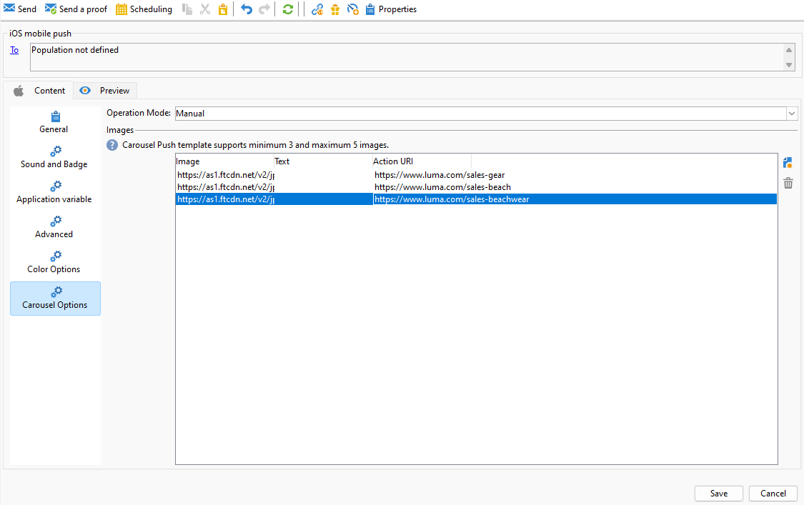

# Designa en omfattande iOS-leverans {#rich-push}

>[!IMPORTANT]
>
>Innan du utformar ett push-meddelande måste du först konfigurera V2-anslutningen. Mer information finns på [den här sidan](https://experienceleague.adobe.com/en/docs/campaign-classic/using/sending-messages/sending-push-notifications/configure-the-mobile-app/configuring-the-mobile-application).

## Definiera innehållet i ett iOS-meddelande {#push-message}

När du har skapat din push-leverans kan du definiera innehållet med någon av följande mallar:

* Med **Standard** kan du skicka meddelanden med en enkel ikon och en medföljande bild.

* **Grundläggande** kan innehålla text, bilder och knappar i dina meddelanden.

* Med **Carousel** kan du skicka meddelanden med text och flera bilder som användare kan svepa igenom.

Gå igenom flikarna nedan för att lära dig mer om hur du anpassar mallarna.

>[!BEGINTABS]

>[!TAB Standard]

1. Välj **[!UICONTROL General notification (Alert, Sound, Badge)]** som **[!UICONTROL Notification type]**.

1. Välj **[!UICONTROL Default]** i listrutan **[!UICONTROL Notification Type]**.

   

1. I fältet **[!UICONTROL Title]** anger du etiketten för titeln som du vill ska visas i listan med meddelanden som är tillgängliga från meddelandecentret.

   I det här fältet kan du definiera värdet för parametern **title** i iOS-meddelandenyttolasten.

1. Du kan också lägga till en **[!UICONTROL Subtitle]** som motsvarar parametern **subtitle** i iOS-meddelandenyttolasten.

1. Ange innehållet i meddelandet i avsnittet **[!UICONTROL Message content]** i guiden.

   

1. Navigera till fliken **[!UICONTROL Sound and Badge]** om du vill anpassa ytterligare inställningar, till exempel ljud- och märkordsalternativ för meddelanden. [Läs mer](#sound-badge)

   

1. **[!UICONTROL Application variables]** läggs automatiskt till på fliken **[!UICONTROL Application variables]**. De gör att du kan definiera meddelandebeteende, till exempel kan du konfigurera en specifik programskärm som ska visas när användaren aktiverar meddelandet.

1. Utforska de **[!UICONTROL Advanced options]** som är tillgängliga för dina push-meddelanden om du vill göra ytterligare anpassningar. [Läs mer](#push-advanced)

   

1. När meddelandet har konfigurerats klickar du på fliken **[!UICONTROL Preview]** för att förhandsgranska meddelandet.

>[!TAB Grundläggande]

1. Välj **[!UICONTROL General notification (Alert, Sound, Badge)]** som **[!UICONTROL Notification type]**.

1. Välj **[!UICONTROL Basic]** i listrutan **[!UICONTROL Notification Type]**.

   

1. Skriv texten i fälten **[!UICONTROL Title]**,**[!UICONTROL Expanded message]**, **[!UICONTROL Message]** och **[!UICONTROL Expanded message]** för att skapa meddelandet.

   Texten **[!UICONTROL Message]** visas i den komprimerade vyn när **[!UICONTROL Expanded message]** visas när meddelandet expanderas.

   

1. Du kan också lägga till en **[!UICONTROL Subtitle]** som motsvarar parametern **subtitle** i iOS-meddelandenyttolasten.

1. Navigera till fliken **[!UICONTROL Sound and Badge]** om du vill anpassa ytterligare inställningar, till exempel ljud- och märkordsalternativ för meddelanden. [Läs mer](#sound-badge)

1. **[!UICONTROL Application variables]** läggs automatiskt till på fliken **[!UICONTROL Application variables]**. De gör att du kan definiera meddelandebeteende, till exempel kan du konfigurera en specifik programskärm som ska visas när användaren aktiverar meddelandet.

1. Utforska de **[!UICONTROL Advanced options]** som är tillgängliga för dina push-meddelanden om du vill göra ytterligare anpassningar. [Läs mer](#push-advanced)

   

1. Ange hexadecimala färgkoder för **[!UICONTROL Title]**, **[!UICONTROL Message]** och **[!UICONTROL Background]** på menyn **[!UICONTROL Color options]**.

   

När du har definierat meddelandeinnehållet kan du använda testprenumeranter för att förhandsgranska och testa meddelandet.

>[!TAB Carousel]

1. Välj **[!UICONTROL General notification (Alert, Sound, Badge)]** som **[!UICONTROL Notification type]**.

1. Välj **[!UICONTROL Carousel]** i listrutan **[!UICONTROL Notification Type]**.

   

1. Skriv texten i fälten **[!UICONTROL Title]**, **[!UICONTROL Expanded Title]** och **[!UICONTROL Message]** för att skapa meddelandet.

   

1. Navigera till fliken **[!UICONTROL Sound and Badge]** om du vill anpassa ytterligare inställningar, till exempel ljud- och märkordsalternativ för meddelanden. [Läs mer](#sound-badge)

1. **[!UICONTROL Application variables]** läggs automatiskt till på fliken **[!UICONTROL Application variables]**. De gör att du kan definiera meddelandebeteende, till exempel kan du konfigurera en specifik programskärm som ska visas när användaren aktiverar meddelandet.

   

1. Utforska de **[!UICONTROL Advanced options]** som är tillgängliga för dina push-meddelanden om du vill göra ytterligare anpassningar. [Läs mer](#push-advanced)

1. Ange hexadecimala färgkoder för **[!UICONTROL Title]**, **[!UICONTROL Message]** och **[!UICONTROL Background]** på menyn **[!UICONTROL Color options]**.

1. Välj hur **[!UICONTROL Carousel]** ska fungera på fliken **[!UICONTROL Carousel options]**:

   * **[!UICONTROL Auto]**: bläddrar automatiskt igenom bilder som bildrutor och övergår i fördefinierade intervall.
   * **[!UICONTROL Manual]**: gör att användare kan svepa mellan bildrutor manuellt för att navigera bland bilderna.

1. Klicka på **[!UICONTROL Add image]** och ange **[!UICONTROL Image URL]**, **[!UICONTROL Text]** och **[!UICONTROL Action URL]**.

   Se till att du inkluderar minst tre bilder och högst fem bilder.

   

När du har definierat meddelandeinnehållet kan du använda testprenumeranter för att förhandsgranska och testa meddelandet.

>[!TAB Timer]

1. Välj **[!UICONTROL General notification (Alert, Sound, Badge)]** som **[!UICONTROL Notification type]**.

1. Välj **[!UICONTROL Timer]** i listrutan **[!UICONTROL Notification Type]**.

   

1. Skriv texten i fälten **[!UICONTROL Title]**,**[!UICONTROL Expanded title]**, **[!UICONTROL Message]** och **[!UICONTROL Expanded message]** för att skapa meddelandet.

   Texten **[!UICONTROL Message]** visas i den komprimerade vyn när **[!UICONTROL Expanded message]** visas när meddelandet expanderas.

   

1. Du kan också lägga till en **[!UICONTROL Subtitle]** som motsvarar parametern **subtitle** i iOS-meddelandenyttolasten.

1. Navigera till fliken **[!UICONTROL Sound and Badge]** om du vill anpassa ytterligare inställningar, till exempel ljud- och märkordsalternativ för meddelanden. [Läs mer](#sound-badge)

1. **[!UICONTROL Application variables]** läggs automatiskt till på fliken **[!UICONTROL Application variables]**. De gör att du kan definiera meddelandebeteende, till exempel kan du konfigurera en specifik programskärm som ska visas när användaren aktiverar meddelandet.

1. Utforska de **[!UICONTROL Advanced options]** som är tillgängliga för dina push-meddelanden om du vill göra ytterligare anpassningar. [Läs mer](#push-advanced)

1. Ange hexadecimala färgkoder för **[!UICONTROL Title]**, **[!UICONTROL Message]** och **[!UICONTROL Background]** på menyn **[!UICONTROL Color options]**.

   

1. På fliken **[!UICONTROL Timer]** anger du **[!UICONTROL Timer duration]** i sekunder eller **[!UICONTROL Timer end timestamp]** till en specifik epok-tidsstämpel.

1. Ange den text och bild som ska visas när timern har gått ut i fälten **[!UICONTROL Alternate title]**, **[!UICONTROL Alternate message]** och **[!UICONTROL Alternate image]**.

   

När du har definierat meddelandeinnehållet kan du använda testprenumeranter för att förhandsgranska och testa meddelandet.

>[!ENDTABS]

## Avancerade inställningar för push-meddelanden {#push-advanced}

### Ljud- och märkesalternativ {#sound-badge}

| Parameter | Beskrivning |
|---------|---------|
| **[!UICONTROL Clean Badge]** | Aktivera det här alternativet om du vill uppdatera badge-värdet. |
| **[!UICONTROL Value]** | Ange ett tal som ska användas för att visa antalet nya olästa uppgifter direkt på programikonen. |
| **[!UICONTROL Critical alert mode]** | Aktivera det här alternativet om du vill lägga till ljud i meddelandet även om användarens telefon är inställd på fokusläge eller om iPhone är avstängt. |
| **[!UICONTROL Name]** | Välj det ljud som ska spelas upp av mobilterminalen när meddelandet tas emot. |
| **[!UICONTROL Volume]** | Ange ljudvolym från 0 till 100. Ljud måste inkluderas i programmet och definieras när tjänsten skapas. |

### Avancerade alternativ {#notification-options}

| Parameter | Beskrivning |
|---------|---------|
| **[!UICONTROL Mutable content]** | Aktivera det här alternativet om du vill tillåta mobilprogrammet att hämta medieinnehåll. |
| **[!UICONTROL Thread-id]** | Ange den identifierare som används för att gruppera relaterade meddelanden. |
| **[!UICONTROL Category]** | Ange namnet på kategori-ID:t som ska visa åtgärdsknappar. Dessa meddelanden ger användaren ett snabbare sätt att utföra olika åtgärder som svar på ett meddelande utan att öppna eller navigera i programmet. |
| **[!UICONTROL Target content ID]** | Ange en identifierare som används för att ange vilket programfönster som ska flyttas fram när meddelandet öppnas. |
| **[!UICONTROL Launch image]** | Ange namnet på startbildfilen som ska visas. Om användaren väljer att starta programmet visas den valda bilden i stället för programmets startskärm. |
| **[!UICONTROL Click action]** | Ange åtgärden som är associerad med en användare genom att klicka på meddelandet. |
| **[!UICONTROL Interruption level]** | <ul><li>Aktiv: Som standard visas meddelandet omedelbart, skärmen visas och ett ljud kan spelas upp. Meddelanden går inte igenom fokusläget.</li><li>Passiv: Systemet lägger till meddelandet i meddelandelistan utan att skärmen eller ljudet ljussätts upp. Meddelanden går inte igenom fokusläget.</li><li> Tidskänslig: Systemet visar meddelandet omedelbart, lyser upp skärmen, kan spela upp ett ljud och gå igenom fokus-lägen. Den här nivån kräver inget särskilt tillstånd från Apple.</li><li>Kritiskt: Systemet visar meddelandet omedelbart, lyser upp skärmen och kringgår avstängningsväxeln eller fokusläget. Observera att den här nivån kräver ett särskilt tillstånd från Apple.</li></ul> |
| **[!UICONTROL Relevance score]** | Ange ett relevansvärde mellan 0 och 100. Systemet använder detta för att sortera meddelandena i meddelandesammanfattningen. |

