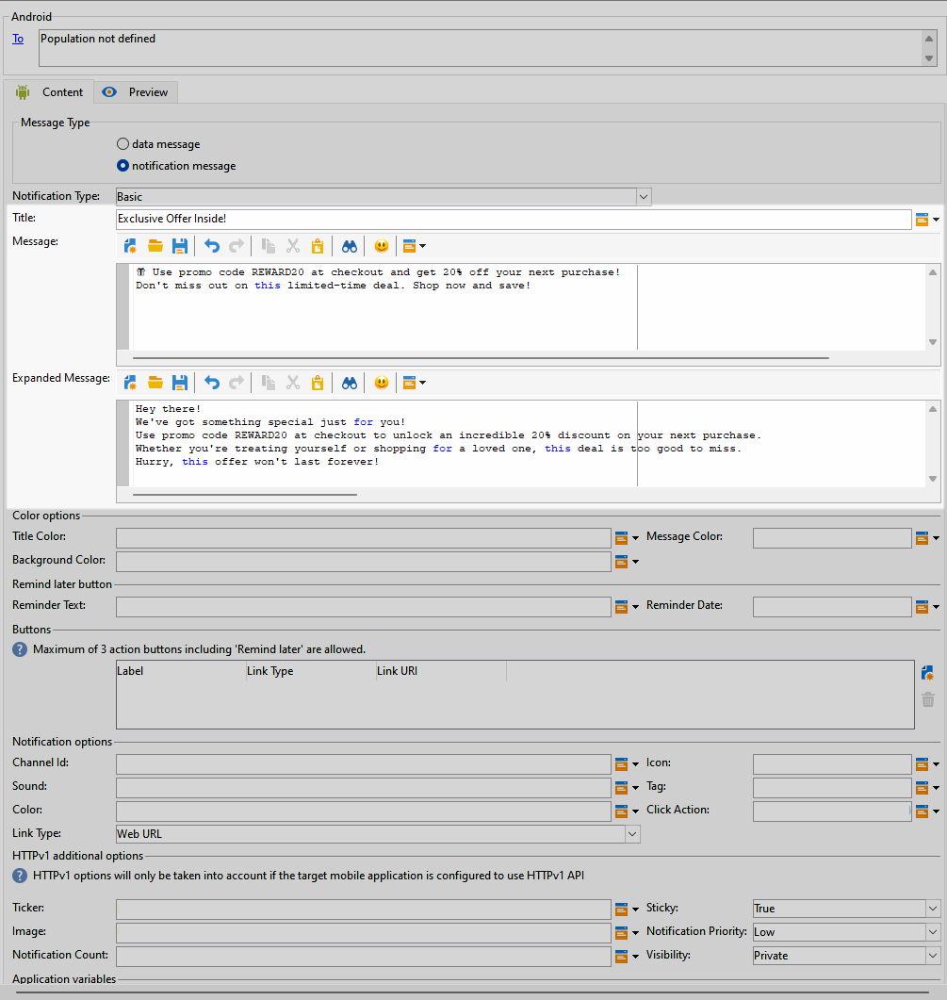

# Designa en omfattande push-leverans för Android {#rich-push}

Med Firebase Cloud Messaging kan du välja mellan två typer av meddelanden:

* The **[!UICONTROL Data message]** hanteras av klientprogrammet. Dessa meddelanden skickas direkt till mobilprogrammet, som genererar och visar ett Android-meddelande på enheten. Datameddelanden innehåller bara dina anpassade programvariabler.

* The **[!UICONTROL Notification message]**, hanteras automatiskt av FCM SDK. FCM visar automatiskt meddelandet på användarnas enheter för klientprogrammets räkning. Meddelanden innehåller en fördefinierad uppsättning parametrar och alternativ, men de kan fortfarande anpassas ytterligare med anpassade programvariabler.

## Definiera innehållet i meddelandet {#push-message}

När du har skapat din push-leverans kan du definiera innehållet. Tre mallar är tillgängliga:

* **Standardmall** Med kan du skicka meddelanden med en enkel ikon och en medföljande bild.

* **Grundläggande mall** kan innehålla text, bilder och knappar i dina meddelanden.

* **Carousel-mall** Med kan du skicka meddelanden med text och flera bilder som användare kan svepa igenom.

Bläddra bland flikarna nedan om du vill veta hur du skapar ett meddelande för varje mall.

>[!BEGINTABS]

>[!TAB Standardmall]

1. Från **[!UICONTROL Notification type]** nedrullningsbar meny, välja **[!UICONTROL Default]**.

   

1. Skriv texten i **[!UICONTROL Title]** och **[!UICONTROL Message]** fält.

   

1. Använd dynamiska personaliseringsfält för att definiera innehåll, personalisera data och lägga till dynamiskt innehåll. [Läs mer](../send/personalize.md)

1. Konfigurera **[!UICONTROL Notification options]** och **[!UICONTROL HTTPv1 additional options]** om ditt push-meddelande. [Läs mer](#push-advanced)

   

När du har definierat meddelandeinnehållet kan du använda testprenumeranter för att förhandsgranska och testa meddelandet.

>[!TAB Grundläggande mall]

1. Från **[!UICONTROL Notification Type]** nedrullningsbar meny, välja **[!UICONTROL Basic]**.

   

1. Skriv texten i **[!UICONTROL Title]**, **[!UICONTROL Message]** och **[!UICONTROL Expanded message]** fält.

   The **[!UICONTROL Message]** texten visas i den komprimerade vyn när **[!UICONTROL Expanded message]** visas när meddelandet expanderas.

   

1. Använd dynamiska personaliseringsfält för att definiera innehåll, personalisera data och lägga till dynamiskt innehåll. [Läs mer](../send/personalize.md)

1. Under **[!UICONTROL Color options]** anger du hexadecimala färgkoder för **[!UICONTROL Title]**, **[!UICONTROL Message]** och **[!UICONTROL Background]**.

1. Lägg till en **[!UICONTROL Remind later button]** vid behov. Ange **[!UICONTROL Reminder Text]** och **Datum** i motsvarande fält.

   The **[!UICONTROL Reminder Date]** ett värde som representerar en epok i sekunder förväntas.

1. Klicka **[!UICONTROL Add button]** och fylla i följande fält:

   * **[!UICONTROL Label]**: Texten visas på knappen.
   * **[!UICONTROL Link URI]**: Ange den URI som ska köras när du klickar på knappen.

   Du kan inkludera upp till tre knappar i ditt push-meddelande. Om du väljer **[!UICONTROL Remind later button]** kan du bara använda högst två knappar.

1. Välj **[!UICONTROL Link type]** av knappens länkade URL:

   * **[!UICONTROL Web URL]**: Webb-URL:er dirigerar användare till onlineinnehåll. När de klickar uppmanas de enhetens standardwebbläsare att öppna och navigera till den angivna URL:en.

   * **[!UICONTROL Deeplink]**: Djuplänkar är URL-adresser som vägleder användare till specifika avsnitt i ett program även om programmet stängs. När du klickar på det här alternativet kan en dialogruta visas så att användarna kan välja mellan olika appar som kan hantera länken.

   * **[!UICONTROL Open App]**: Med öppna app-URL:er kan du ansluta direkt till innehåll i ett program. Det gör att ditt program kan etablera sig som standardhanterare för en viss typ av länk, utan att dialogrutan för olika betydelser visas.

   Mer information om hur du hanterar Android-applänkar finns i [Dokumentation för Android-utvecklare](https://developer.android.com/training/app-links).

   

1. Konfigurera **[!UICONTROL Notification options]** och **[!UICONTROL HTTPv1 additional options]** om ditt push-meddelande. [Läs mer](#push-advanced)

   

När du har definierat meddelandeinnehållet kan du använda testprenumeranter för att förhandsgranska och testa meddelandet.

>[!TAB Carousel-mall]

1. Från **[!UICONTROL Notification Type]** nedrullningsbar meny, välja **[!UICONTROL Carousel]**.

   

1. Skriv texten i **[!UICONTROL Title]**, **[!UICONTROL Message]** och **[!UICONTROL Expanded message]** fält.

   The **[!UICONTROL Message]** texten visas i den komprimerade vyn när **[!UICONTROL Expanded message]** visas när meddelandet expanderas.

   

1. Använd uttrycksredigeraren för att definiera innehåll, anpassa data och lägga till dynamiskt innehåll. [Läs mer](../send/personalize.md)

1. Under **[!UICONTROL Color options]** anger du hexadecimala färgkoder för **[!UICONTROL Title]**, **[!UICONTROL Message]** och **[!UICONTROL Background]**.

1. Välj hur **[!UICONTROL Carousel]** används:

   * **[!UICONTROL Auto]**: bläddrar automatiskt igenom bilderna som bildrutor och övergår i fördefinierade intervall.
   * **[!UICONTROL Manual]**: gör att användare kan svepa mellan bildrutor manuellt för att navigera bland bilderna.

1. Från **[!UICONTROL Layout]** nedrullningsbar meny, välja **[!UICONTROL Filmstrip]** om du vill inkludera förhandsvisningar av föregående och nästa bild bredvid huvudbilden.

1. Klicka **[!UICONTROL Add image]** och ange din bild-URL, text- och åtgärds-URL.

   Se till att du inkluderar minst tre bilder och högst fem bilder.

   

1. Konfigurera **[!UICONTROL Notification options]** och **[!UICONTROL HTTPv1 additional options]** om ditt push-meddelande. [Läs mer](#push-advanced)

   

När du har definierat meddelandeinnehållet kan du använda testprenumeranter för att förhandsgranska och testa meddelandet.

>[!ENDTABS]

## Avancerade inställningar för push-meddelanden {#push-advanced}

### Meddelandealternativ {#notification-options}

| Parameter | Beskrivning |
|---------|---------|
| **[!UICONTROL Channel ID]** | Ange meddelandets kanal-ID. Appen måste skapa en kanal med det här channel-id:t innan något meddelande med det här channel-id:t tas emot. |
| **[!UICONTROL Icon]** | Ställ in meddelandeikonen så att den visas på dina profilers enheter. |
| **[!UICONTROL Sound]** | Ställ in ljudet som ska spelas upp när enheten får ditt meddelande. |
| **[!UICONTROL Tag]** | Ange en identifierare som ska användas för att ersätta befintliga meddelanden i meddelanderutan. Detta förhindrar att flera meddelanden ackumuleras och säkerställer att endast den senaste relevanta aviseringen visas. |
| **[!UICONTROL Color]** | Ange ikonfärgen för aviseringen med hexadecimal färgkod. |
| **[!UICONTROL Click action]** | Ange åtgärden som är associerad med en användare genom att klicka på meddelandet. |
| **[!UICONTROL Notification background color]** | Ange färgen på meddelandebakgrunden med de hexadecimala färgkoderna. |
| **[!UICONTROL Link type]** | <ul><li>Webb-URL: Webb-URL:er dirigerar användare till onlineinnehåll. När de klickar uppmanas de enhetens standardwebbläsare att öppna och navigera till den angivna URL:en.</li><li>Länka ned: Djuplänkar är URL-adresser som vägleder användare till specifika avsnitt i ett program även om programmet stängs. När du klickar på det här alternativet kan en dialogruta visas så att användarna kan välja mellan olika appar som kan hantera länken.</li><li> Öppna program: Med öppna app-URL:er kan du ansluta direkt till innehåll i ett program. Det gör att ditt program kan etablera sig som standardhanterare för en viss typ av länk, utan att dialogrutan för olika betydelser visas.</li></ul> |

### Ytterligare alternativ för HTTPv1 {#additional-options}

| Parameter | Beskrivning |
|---------|---------|
| **[!UICONTROL Ticker]** | Ange anteckningstexten för meddelandet. Endast tillgängligt för enheter med inställningen Android 5.0 Lollipop. |
| **[!UICONTROL Sticky]** | När det är aktiverat visas meddelandet även när användaren klickar på det.  Om det är inaktiverat stängs meddelandet automatiskt när användaren interagerar med det. Tack vare det klibbiga beteendet kan viktiga meddelanden finnas kvar på skärmen under längre perioder. |
| **[!UICONTROL Image]** | Ange bildens URL som ska visas i meddelandet. |
| **[!UICONTROL Notification Priority]** | Ange prioritetsnivån för meddelandet, som kan vara standard, minimum, low eller high. Prioritetsnivån avgör hur viktigt och brådskande meddelandet är, vilket påverkar hur det visas och om det kan kringgå vissa systeminställningar. Mer information finns i [FCM-dokumentation](https://firebase.google.com/docs/reference/fcm/rest/v1/projects.messages#notificationpriority). |
| **[!UICONTROL Notification Count]** | Ange hur många nya olästa uppgifter som ska visas direkt på programikonen. På så sätt kan användaren snabbt se antalet väntande meddelanden. |
| **[!UICONTROL Visibility]** | Ange synlighetsnivån för ditt meddelande, som kan vara offentlig, privat eller hemlig. Synlighetsnivån avgör hur mycket av meddelandets innehåll som visas på låsskärmen och andra känsliga områden. Mer information finns i [FCM-dokumentation](https://firebase.google.com/docs/reference/fcm/rest/v1/projects.messages#visibility). |
| **[!UICONTROL Application variables]** | Gör att du kan definiera meddelandebeteende. Dessa variabler är helt anpassningsbara och ingår som en del av den meddelandenyttolast som skickas till den mobila enheten. |
