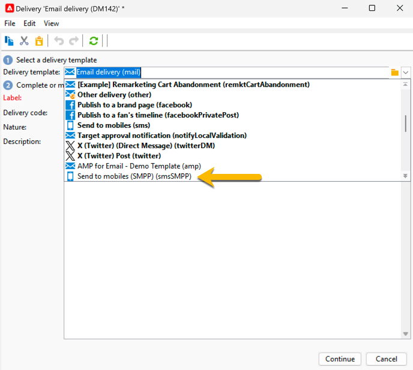
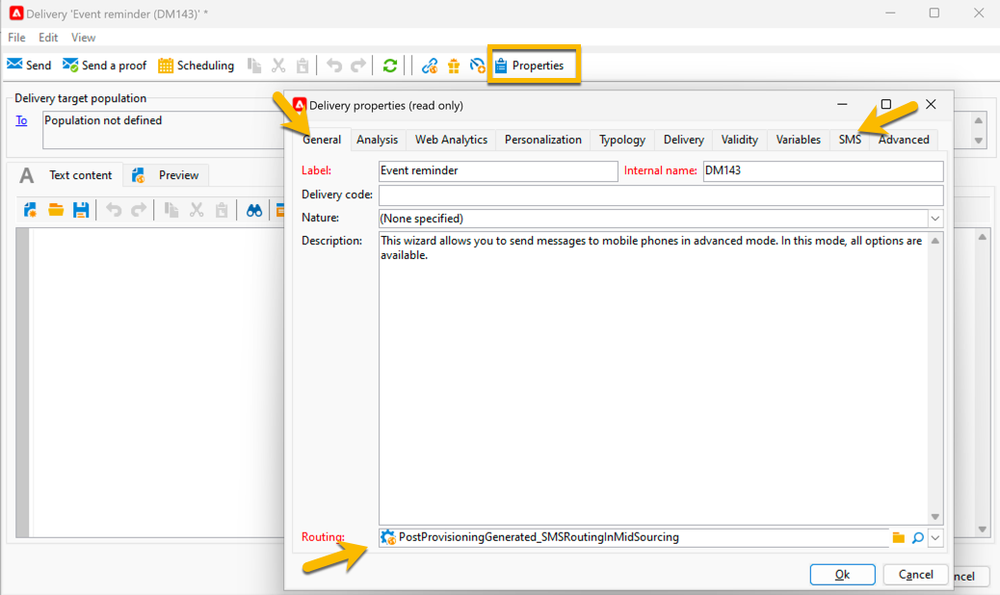

# Skapa din första SMS-leverans {#sms-delivery}

Följ stegen nedan för att skapa en ny SMS-leverans:

1. Skapa en ny leverans och välj den [SMS-leveransmall](sms-mid-sourcing.md#sms-delivery-template) som du skapade för SMS-utskick.

   {zoomable="yes"}

   Stegen för att skapa leveranser beskrivs på [den här sidan](../../start/create-message.md).

<!-- * For standalone instance,  [learn more here](sms-standalone-instance.md#sms-delivery-template).
* For mid-sourcing infrastructure, -->

1. Byt namn på leveransen i fältet **[!UICONTROL Label]** och lägg till information i fältet **[!UICONTROL Delivery code]** och listan **[!UICONTROL Nature]** om det behövs för spårningen. Du kan också lägga till en **[!UICONTROL Description]** i leveransen.

1. Klicka på knappen **[!UICONTROL Continue]**. Nu har du alla inställningar för mallen i leveransen.

1. Du kan kontrollera i knappen **[!UICONTROL Properties]** att alla har konfigurerats efter behov. [Läs mer om fliken SMS](sms-delivery-settings.md#sms-tab)

   {zoomable="yes"}

1. [Definiera innehållet](sms-content.md) i leveransen.

1. [Välj målgrupp](sms-audience.md).

Steg för att definiera en målgrupp finns på [den här sidan](../../audiences/create-audiences.md).

## Validera och skicka SMS {#sms-validate}

När leveransen är klar kan du

1. [Skicka korrektur](sms-proofs.md) för att validera återgivningen och innehållet,

1. [skicka sedan till den slutliga målgruppen](sms-send.md).

## Övervaka och spåra SMS {#sms-monitor}

[Lär dig övervaka och spåra ditt SMS](sms-monitor.md) när du har skickat meddelandet.
