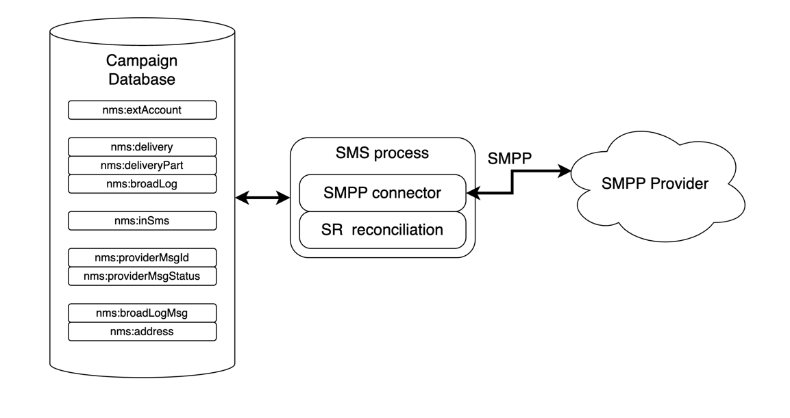

# SMPP-anslutningsbeskrivning {#smpp-connector-desc}

>[!AVAILABILITY]
>
>Den här funktionen är tillgänglig för alla Campaign FDA-miljöer. Det är **inte** tillgängligt för Campaign FFDA-distributioner. Denna dokumentation gäller Adobe Campaign v8.7.2 och senare. Om du vill växla från den gamla till den nya SMS-anslutningen läser du i den här [technote](https://experienceleague.adobe.com/docs/campaign/technotes-ac/tn-new/sms-migration){target="_blank"}
>
>Om du har äldre versioner kan du läsa [Campaign Classic v7-dokumentationen](https://experienceleague.adobe.com/en/docs/campaign-classic/using/sending-messages/sending-messages-on-mobiles/sms-set-up/sms-set-up){target="_blank"}.

## SMS-anslutningsdataflöde {#sms-data-flow}

I det här avsnittet beskrivs hur SMS-processen hanterar data.

Här följer ett blockdiagram på hög nivå som sammanfattar hur SMS-processen interagerar med sin miljö.

{zoomable="yes"}

SMS-processen är värd för två viktiga komponenter: själva SMPP-anslutningen som hanterar kommunikation med SMPP-leverantören och en bakgrundsuppgift för SR-avstämning.

### Dataflöde för SMPP-konton {#sms-data-flow-smpp-accounts}

SMS-processen avfrågar nms:extAccount och skapar nya anslutningar i SMPP-anslutningen och skickar inställningarna för varje konto. Avsökningsfrekvensen kan justeras i serverConf i inställningen *configRefreshMillis* .

För varje aktivt SMPP-konto försöker SMPP-anslutningen att hålla anslutningar aktiva hela tiden. Den återansluter om anslutningen bryts.

### Dataflöde när meddelanden skickas {#sms-data-flow-sending-msg}

* SMS-processen väljer aktiva leveranser genom att skanna nms :delivery. En leverans är aktiv när:
   * Dess tillstånd innebär att meddelanden kan skickas
   * Giltighetsperioden har inte gått ut
   * Det är i själva verket en leverans (t.ex. inte en mall, det tas inte bort)
   * SMPP-anslutningen kunde öppna minst en anslutning för det externa kontot som är länkat till leveransen
* För varje leverans läser SMS-processen in leveransdelar. Om leveransdelen delvis skickades kontrollerar SMS-processen vilka meddelanden som redan skickats genom att kontrollera den breda loggen.
* SMS-processen utökar mallen med personaliseringsdata från leveransdelen.
* SMPP-anslutningen genererar en MT (SUBMIT_SM PDU) som matchar innehållet och andra inställningar.
* SMPP-anslutningen skickar MT via en sändar- (eller sändtagaranslutning).
* Providern returnerar ett ID för denna MT. Den infogas i nms:providerMsgId.
* SMS-processen uppdaterar den breda loggen till skickad status.
* Om ett slutligt fel inträffar, uppdateras den breda loggen i enlighet med detta och en ny typ av fel kan uppstå i nms:broadLogMsg.

### Dataflöde vid mottagning av SR {#sms-data-flow-sr}

* SMPP-anslutningen tar emot och avkodar SR (DELIVER_SM PDU). Regexex som definierats i det externa kontot används för att hämta meddelande-ID och status.
* Meddelande-ID och status infogas i nms:providerMsgStatus
* När SMPP-anslutningen har infogats svarar den med en DELIVER_SM_RESP PDU.
* Om något gick fel under processen skickar SMPP-anslutningen en negativ DELIVER_SM_RESP PDU och loggar ett meddelande.

### Dataflöde när du tar emot en flerlägesobjekt {#sms-data-flow-mo}

* SMPP-anslutningen tar emot och avkodar MO (DELIVER_SM PDU).
* Nyckelordet extraheras från meddelandet. Om den matchar ett deklarerat nyckelord körs motsvarande åtgärder. Det kan skriva till nms:address för att uppdatera karantän.
* Om anpassad TLV deklareras avkodas de enligt deras respektive inställningar.
* Den fullständigt avkodade och bearbetade MO infogas i tabellen nms:inSms.
* SMPP-anslutningen svarar med en DELIVER_SM_RESP PDU. Om något fel upptäcks returneras en felkod till providern.

### Dataflöde vid avstämning av MT och SR {#sms-reconciling-mt-sr}

* SR-avstämningskomponenten läser regelbundet nms:providerMsgId och nms:providerMsgStatus. Data från båda tabellerna sammanfogas.
* För alla meddelanden som har en post i båda tabellerna uppdateras den matchande nms:broadLog-posten.
* Registret nms:broadLogMsg kan uppdateras under processen om ett nytt slags fel upptäcks, eller för att uppdatera räknare för fel som inte har kvalificerats manuellt.

## Matchande MT-, SR- och broadcast-poster {#sms-matching-entries}

Här följer ett diagram som beskriver hela processen:

{zoomable="yes"}

**Fas 1**

* Meddelandet skannas, formateras och skickas sedan till SMPP-anslutningen.
* SMPP-anslutningen formaterar den som en PDU av typen SUBMIT_SM MT.
* MT skickas till SMPP-leverantören.
* Providern svarar med SUBMIT_SM_RESP. SUBMIT_SM och SUBMIT_SM_RESP matchas av sekvensnumret.
* SUBMIT_SM_RESP ger ett ID som kommer från providern. Detta ID infogas tillsammans med det breda logg-ID:t i tabellen nms:providerMsgId.

**Fas 2**

* Providern skickar en DELIVER_SM SR PDU.
* SR tolkas för att extrahera provider-ID, status och felkod. I det här steget används extraheringsregex.
* Leverantörs-ID och dess motsvarande status infogas i nms :providerMsgStatus.
* När alla data infogas i databasen på ett säkert sätt svarar SMPP-kopplingen med DELIVER_SM_RESP. DELIVER_SM och DELIVER_SM_RESP matchas av sekvensnumret.

**Fas 3**

* SR-avstämningskomponenten i SMS-processen söker igenom både nms:providerMsgId- och nms:providerMsgStatus-tabeller med jämna mellanrum.
* Om en rad har matchande provider-ID i båda tabellerna sammanfogas de två posterna. Detta gör att det breda logg-ID:t (som lagras i providerMsgId) kan matchas med statusen (lagras i providerMsgStatus)
* Den breda loggen uppdateras med motsvarande status.

## Tillhörigheter och den dedikerade processkopplingen {#sms-affinities}

Tillhörigheter ignoreras av den dedikerade processkopplingen, den körs bara i SMS-processen.

## serverConf-alternativ {#sms-serverconf-options}

Vissa inställningar kan ställas in i serverConf.xml. Precis som andra inställningar i den här filen bör den anges i filen config-instance.xml. Alla inställningar finns i &lt; mta2 >-elementet.

Den här tabellen sammanfattar alla inställningar. Min/max-värden ger en ungefärlig uppfattning om det intervall som du bör ta hänsyn till i de flesta fall. Felsökningsvärdet är det värde du ska välja när du försöker hitta problem som inte är relaterade till prestanda.

| Inställning | Beskrivning | Standard | Minsta rimliga värde | Högsta rimliga värde | Felsökningsvärde |
|:-:|:-:|:-:|:-:|:-:|:-:|
| batchUpdateSize | Storlek på uppdateringsmikrobatchar | 5000 | 100: Mycket låg latens | maxWaitMessages/updateThreads: Att gå över det här värdet är oanvändbart eftersom maxWaitMessages ändå begränsar buffring | 1: Inaktivera mikrobatchbearbetning, uppdatera meddelanden en i taget |
| configRefreshMillis | Period för konfigurationsinläsning i millisekunder | 10000 | pollPeriodMillis: Låg latens | 600000: Ladda inte om för snabbt för att spara resurser | 500: Låg fördröjning gör att du kan testa nya inställningar snabbare |
| deliveryPartRetryCount | Maximalt antal gånger en deliveryPart provas igen eller skjuts upp. Varning! Om du startar om sändningsprocessen räknas det som ett nytt försök. Krascher kan också räknas som ett nytt försök. | 20 | 1: Inaktivera återförsök | 50: Gör meddelandena mer ihärdiga för att undvika instabila leverantörer | 1: Inaktivera återförsök. 1000: Undvik att tömma felmeddelanden. |
| deliveryPartRetryDelaySeconds | Minsta fördröjning innan du försöker göra om en deliveryPart. Detta är korsprocess och korsbehållare. Fördröjning är i sekunder. | 60 | 0: Omedelbara återförsök | 3600: Mycket långsamma försök (1 timme mellan varje försök) | 1: Gör återförsök enkla att följa i upptagna loggar. |
| logOutput | Skicka övervaknings- och profileringsdata på huvudloggutdata. | true | false: Kan öka genomströmningen lite grann. Förmodad. | true: Aktivera loggning. | true |
| maxWaitMessages | Maximalt antal meddelanden som bearbetas när som helst | 50000 | 256: Tillräckligt för en enstaka leveransDel | 200000: Begränsad med SQL-frågelängd (64 kB) | 1: Bearbeta meddelanden ett i taget |
| pollPeriodMillis | Databasavsökningsfrekvens (i millisekunder) för att söka efter nya meddelanden | 2000 | 500: Mycket låg latens | 10000: Större batchar | 500: Låg fördröjning gör det enkelt att felsöka. |
| prepareThreads | Antal trådar för meddelandeförberedelse | 3 | 1: Enkeltrådad | Antal processorer. Var försiktig med RAM-användning. Om du ökar till över 6 kan du behöva öka maxSMSMemoryMb, maxProcessMemoryAlertMb och maxProcessMemoryWarningMb | 1: Entrådiga trådar genererar renare loggar. |
| profDeliveryStat | Logga olika aggregerad statistik om intern användning av SMS-processen | true | false: Kan öka genomströmningen lite grann. Förmodad. | true: Låg utförlighetslogg | true |
| profLogPerMessage | Logga varje bearbetningssteg för varje meddelande | false | false: Minska loggens utförlighet. | true: Mycket hög utförlighetslogg. **Använd bara när det är absolut nödvändigt**. Stor prestandapåverkan. **Inaktivera den här inställningen så snart tillräckligt med data har samlats in**. | true |
| providerIdScanPeriod | Period i sekunder mellan sökningar efter nya providerID för avstämning | 10 | 1: Låg latens | 60: Större batchar för mer dataflöde | 1: Låg fördröjning hjälper till att felsöka meddelandehanteringen. |
| providerIdThreads | Antal trådar för avstämning av provider-ID. 1 tråd per instans räcker. Ange 0 om du vill inaktivera den här behållaren. | 1 | 0: Inaktivera i den här behållaren | 1 | 1 |
| sendingThreads | Antal skickade trådar | 1 | 1: Enkeltrådad | Antal processorer. För många trådar försämrar vanligtvis prestandan. | 1: Entrådiga trådar genererar renare loggar. |
| updateThreads | Antal trådar för uppdatering av databas | 1 | 1: Enkeltrådad | Antal processorer. Varje tråd skapar en egen DB-anslutning. | 1: Entrådiga trådar genererar renare loggar. |
| verifyMode | Simulera skickade meddelanden. Meddelanden skickas egentligen inte. Användbar för felsökning | false | false | true | false: Kör systemet normalt. true: Testa endast DB-åtkomst och meddelandeförberedelse. |
