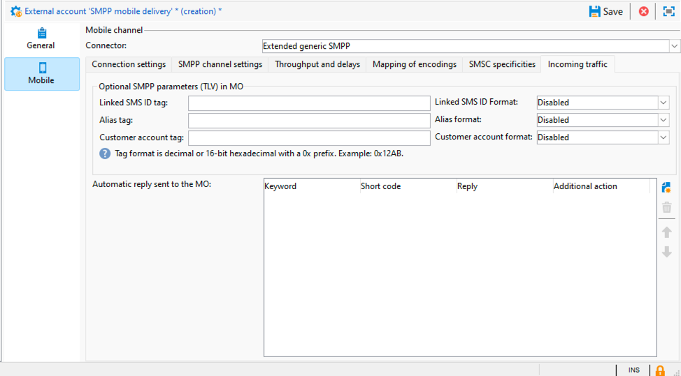

# Inställningar för externt SMPP-konto {#smpp-external-account}

Adobe Campaign använder SMPP-protokollet för att skicka SMS till en tjänsteleverantör.

>[!IMPORTANT]
>
>Adobe Campaign stöder SMPP-protokollversion 3.4.

SMS-kopplingen i Adobe Campaign erbjuder många alternativ för att anpassa sitt beteende så att det är kompatibelt med de flesta SMPP-leverantörer, som tenderar att avvika lite från den officiella specifikationen.

>[!IMPORTANT]
>
>Att konfigurera en anslutning till en ny provider kan kräva viss teknisk kompetens, kunskap om TCP, binär, hexadecimal representation och textkodning. Det kommer också att kräva ett aktivt samarbete med leverantören.

Nätverksutrustningen på SMS-tjänstleverantörens sida kallas ofta SMSC.

## Anslutningsinställningar {#smpp-connection-settings}

{zoomable="yes"}

Här är parametrarna och deras roll som behövs för att upprätta anslutningen:

* **SMSC-implementeringsnamn**: anger namnet på SMSC-implementeringen. Den ska anges med namnet på din leverantör. Fältets roll beskrivs i avsnittet SMPP-felhantering.
* **Server**: DNS-namnet eller IP-adressen för servern som ska anslutas.
* **Port**: Den TCP-port som ska anslutas.
* **Konto**: Inloggningen för anslutningen. Skickades i fältet system_id för BIND PDU:n.
* **Lösenord**: Lösenord för SMPP-anslutningen. Lösenordsfältet för BIND PDU har skickats.
* **Systemtyp**: Värdet skickades i fältet system_type för BIND PDU. Vissa leverantörer behöver ett specifikt värde här.
* **Antal MTA-underordnade anslutningar**: Detta anger hur många anslutningar som öppnas per sändande tråd.
Det totala antalet anslutningar kan beräknas med följande formel:
  *Totalt antal anslutningar = Antal SMS-processer * antal skickade trådar * antal MTA-underordnade anslutningar*

   * Antalet SMS-processer är normalt 1. I vissa mycket höga prestandainstanser kan flera SMS-processer startas parallellt.
   * Antalet skickade trådar anges i serverConf (sendingThreads-inställning). Standardvärdet är 1.
   * Antal MTA-underordnade anslutningar är den här inställningen i det externa kontot.

  Med standardvärden anges antalet anslutningar direkt.

I **överföringsläge** är detta det totala antalet anslutningar.

I **sändare+mottagarläge** definierar detta antalet sändare+mottagarpar (ett par = en sändare + en mottagare).
Det finns inget sätt att ändra balansen mellan sändare och mottagare.

* **Skicka meddelanden via en dedikerad process**:
För Adobe Campaign v8.7.2 och senare ska det här alternativet alltid vara aktiverat. Det har många effekter på hur meddelanden behandlas.
* **SMPP-anslutningsläge**:
Ställ in anslutningen i sändningsläge eller i läget separerad sändare+mottagare.
   * Transmitter+mottagare (eller TX+RX): två separata TCP-anslutningar används för att skicka och ta emot meddelanden.
   * Överförare (eller TRX): en enda TCP-anslutning används för att skicka och ta emot meddelanden.
* **Använd olika parametrar för mottagaren**:
Endast tillgängligt i sändar+mottagarläge.
När rutan är avmarkerad används samma inställningar för sändare och mottagare. När rutan är markerad gäller standardinställningarna bara för sändaren, medan mottagarinställningarna endast gäller mottagaren.
* **Mottagarserver, port, konto, lösenord, systemtyp**
De här inställningarna gäller för mottagaren i läget sändare+mottagare. De fungerar som sändningsdelen, se ovan för [mer information](#smpp-connection-settings).
* **Aktivera utförliga SMPP-spår i loggfilen**
När det här alternativet är aktiverat skickas extra loggar till loggfilen. Detta är mycket användbart vid felsökning, men bör inaktiveras för instanser med hög genomströmning om ingen felsökning behövs.

## SMPP-kanalinställningar {#smpp-channel-settings}

{zoomable="yes"}

### Godkänn teckentransformering

Translitterering är processen att hitta tecken som är likvärdiga med dem som saknas. Det franska specialtecknet&quot;ê&quot; (e med cirkumflex) saknas till exempel i GSM-kodningen, men kan ersättas med&quot;e&quot; utan att försämra läsbarheten för mycket.

När den här rutan är avmarkerad misslyckas textkodningen om strängen inte kan kodas exakt som den är.

När den här rutan är markerad försöker textkodningen att konvertera strängen till en ungefärlig version i stället för att misslyckas. Om vissa tecken inte har någon motsvarighet i målkodningen kommer textkodningen att misslyckas.

Se [Definiera en specifik mappning av kodningsinställningen](#mapping-encodings) för en mer allmän förklaring av kodningsprocessen.

### Source

Definierar standardkälladressen för meddelanden. Den här inställningen gäller endast om källnumret inte har angetts i leveransen. Som standard skickas inte fältet för källnummer, så providern ersätter det för den korta koden.

Detta aktiverar funktionen för åsidosättning av avsändaradress/ADC.

### Source TON/NPI, mål-TON/NPI

TON (typ av nummer) och NPI (Numreringsplansindikator) (beskrivs i avsnitt 5.2.5 i SMPP 3.4-specifikationen). Dessa värden ska ställas in efter vad providern behöver.

De överförs som de är i fälten source_addr_ton, source_addr_npi, dest_addr_ton och dest_addr_npi i PDU:n SUBMIT_SM.

### Tjänsttyp

Det här fältet överförs som det är i fältet service_type i PDU:n SUBMIT_SM. Ange det här till vad providern behöver.

## Genomströmning och förseningar {#smpp-delays}

{zoomable="yes"}

Dessa inställningar styr alla timingaspekter av SMPP-kanalen. Vissa leverantörer kräver mycket exakt kontroll över meddelandehastighet, fönster- och återförsökstider, så dessa inställningar bör anges till värden som matchar leverantörens kapacitet och de villkor som anges i deras kontrakt.

### Skickar fönster

Fönstret är antalet PDU:er för SUBMIT_SM som kan skickas utan att vänta på en matchande SUBMIT_SM_RESP.

Exempel på en överföring med ett maximalt fönster på 4:

{zoomable="yes"}

Fönstret hjälper till att öka genomströmningen när nätverkslänken har hög latens. Fönstrets värde måste vara minst det antal SMS/s som multipliceras med länkens fördröjning (i sekunder) så att kopplingen aldrig väntar på en SUBMIT_SM_RESP innan nästa meddelande skickas.

Om fönstret är för stort kan du skicka fler dubblettmeddelanden vid anslutningsproblem (sällsynta fall). Dessutom har de flesta leverantörer en mycket strikt begränsning för fönstret och vägrar att skicka meddelanden som överskrider gränsen.

Så här beräknar du den optimala skicka-fönsterformeln:

Mät maximal fördröjning mellan SUBMIT_SM och SUBMIT_SM_RESP.
Multiplicera det här värdet (i sekunder) med den maximala MT-genomströmningen: detta ger det optimala värdet för sändande fönster.
Exempel: Om du har angett 300 SMS/s i maximalt MT-dataflöde och det finns 100 ms fördröjning mellan SUBMIT_SM och SUBMIT_SM_RESP i genomsnitt, är det optimala värdet 300 × 0,1 = 30.

Om du är osäker bör du använda ett större fönster för att undvika prestandaproblem.

### Maximal MT-genomströmning

Maximalt antal MT per sekund och anslutning. Den här inställningen används strikt, MTA skickar aldrig meddelanden snabbare än den här gränsen. Det är användbart för leverantörer som kräver exakt begränsning.

Om du vill veta den totala dataflödesgränsen multiplicerar du talet med det totala antalet anslutningar (se formeln ovan).

0 betyder ingen gräns, MTA skickar MT så snabbt som möjligt.

Det rekommenderas i allmänhet att denna inställning hålls under 1000, eftersom det är omöjligt att garantera exakt dataflöde över detta antal, såvida det inte är lämpligt att jämföra den slutliga arkitekturen och särskilt efterfrågad SMPP-leverantör. Det kan vara bättre att öka antalet anslutningar så att de överstiger 1000 MT/s.

### Tid före återanslutning

När TCP-anslutningen bryts väntar anslutningen i så många sekunder innan ett anslutningsförsök görs.

### MT:s förfalloperiod

Detta är tidsgränsen mellan SUBMIT_SM och dess matchande SUBMIT_SM_RESP. Om RESP inte tas emot i tid kommer meddelandet att betraktas som misslyckat och en global återförsöksprincip för MTA kommer att gälla.

### Tidsgräns för bindning

Timeout mellan TCP-anslutningsförsöket och BIND_*_RESP-svaret. När timeout uppstår stängs anslutningen av Campaign-anslutningen och den väntar på att anslutas igen innan den försöker igen.

### fråge_länkperiod

Query_link är en speciell typ av PDU som skickas för att hålla anslutningen vid liv. Perioden är i sekunder. Kampanjkopplingen skickar bara query_link när anslutningen är inaktiv för att spara bandbredd. Om inget RESP tas emot efter två gånger den här perioden betraktas anslutningen som död och en återanslutningsprocess utlöses.

## Mappning av kodningar {#mapping-encodings}

Mer information om textkodning finns i avsnittet [SMS-textkodning](sms-channel.md#sms-text-encoding).

Med den här inställningen kan du definiera en anpassad kodmappning, som skiljer sig från specifikationen. Du kan deklarera en lista med kodningar tillsammans med deras data_coding-värde. MTA kommer att försöka koda med den första kodningen i listan. Om den inte fungerar kommer den att försöka använda nästa kodning i listan osv.. Om ingen kodning kan användas för att koda meddelandet inträffar ett fel. När kodningen hittas kommer MTA att skapa PDU:n SUBMIT_SM med den kodade texten och fältet data_coding med det värde som anges i tabellen.

Ordningen på objekten i tabellen är viktig: kodningarna provas uppifrån och ned. Du bör placera den billigaste eller mest rekommenderade kodningen högst upp i listan och sedan använda mer och mer kostsamma (eller mindre önskvärda) kodningar.

Observera att UCS-2 aldrig kommer att misslyckas eftersom det kan koda alla tecken som stöds i Campaign. Observera att den maximala längden för ett UCS-2 SMS är mycket mindre (endast 70 tecken).

Du kan också använda den här inställningen för att tvinga en viss kodning att alltid användas genom att deklarera endast en rad i mappningstabellen.

Standardmappningen som används när kryssrutan inte är markerad motsvarar följande tabell:

| data_coding | Kodning |
|:-:|:-:|
| 0 | GSM |
| 8 | UCS-2 |

Det innebär att MTA försöker koda meddelandet i GSM, om det lyckas skickas det med data_coding inställd på 0.

Om meddelandet inte kan kodas i GSM kodas det i UCS-2 och anges till 8 för data_coding.

## Specifikationer för SMSC {#smsc-specificities}

{zoomable="yes"}

### Aktivera message_payload

Om alternativet inte är markerat delas lång SMS upp av MTA och skickas i flera SUBMIT_SM PDU:er med UDH. Meddelandet kommer att disponeras om av mobiltelefonen efter UDH-data.

När det här alternativet är markerat skickas lång SMS i en SUBMIT_SM PDU, vilket placerar texten i det valfria fältet message_payload (mer information finns i SMPP-specifikationen).

Om den här funktionen är aktiverad kan Campaign inte räkna SMS-delar individuellt: alla meddelanden räknas som skickade i en del.

### Skicka det fullständiga telefonnumret

När den här kryssrutan inte är markerad skickas bara siffror i telefonnumret till providern (fältet destination_addr i fältet SUBMIT_SM). Detta är standardbeteendet eftersom den internationella nummerindikatorn (vanligtvis ett +-prefix) ersätts av TON- och NPI-fält i SMPP.

När kryssrutan är markerad skickas telefonnumret i befintligt skick utan förbearbetning (och möjliga mellanslag + prefix eller nummertecken/hash/star-tecken).

Den här funktionen påverkar också beteendet för karantänfunktionen för autosvar: när kryssrutan inte är markerad läggs ett +-prefix till telefonnummer som infogas i karantäntabellen för att kompensera för att +-prefixet tas bort från telefonnumret av själva SMPP-protokollet.

### Bindning TON/NPI

TON (typ av nummer) och NPI (Numreringsplansindikator) (beskrivs i avsnitt 5.2.5 i SMPP 3.4-specifikationen). Dessa värden ska ställas in efter vad providern behöver.

De överförs som de är i fälten addr_ton och addr_npi i BIND PDU:n.

### Adressintervall

Skickat som det är i fältet address_range i BIND PDU:n. Det här värdet ska ställas in på det som providern behöver.

### Ogiltigt antal ID-bekräftelser

Begränsar antalet &quot;Meddelande-ID invalid&quot; DELIVER_SM_RESP som kan skickas för en enskild SR. **Detta bör endast användas för felsökningssyften som en lösning** och inställd på 0 under normala förhållanden.

Detaljerad förklaring: säg att du ställer in den här inställningen på 2:

* Providern skickar en SR (DELIVER_SM) med ID &quot;1234&quot;
* Det gick inte att hitta ID:t &quot;1234&quot; i databasen
* Kopplingen räknar med ett &quot;ogiltigt ID&quot;-fel för det ID:t, så DELIVER_SM_RESP skickas med felkoden &quot;ogiltigt meddelande-ID&quot; (normalt beteende).
* Providern försöker på nytt samma SR med ID &quot;1234&quot;
* Det gick fortfarande inte att hitta ID:t &quot;1234&quot; i databasen
* Kopplingen räknar med 2&quot;Ogiltigt ID&quot;-fel för det ID:t, så DELIVER_SM_RESP &quot;OK&quot; skickas, även om det inte har bearbetats korrekt.

Den här funktionen är avsedd att tömma SR-buffertar på providersidan när ogiltiga SR-blockmeddelanden som inte kan bearbetas blockeras.

Om du anger värdet 0 för det här fältet inaktiveras mekanismen så&quot;Meddelande-ID ogiltigt&quot; alltid returneras, vilket är normalt.

Om du ställer in det här fältet på 1 kommer kopplingen alltid att svara &quot;OK&quot; även om ID:t är ogiltigt. Detta bör anges till 1 som endast används under övervakning för felsökning och under kortast möjliga tid, t.ex. för att återhämta sig från ett problem på leverantörssidan.

### Extraheringsregion för ID i SR

SR-formatet används inte strikt av SMPP-protokollspecifikationen. Det är endast en rekommendation som beskrivs i tillägg B till produktspecifikationen. På grund av detta formaterar vissa SMPP-implementerare det här fältet annorlunda, så Campaign behöver ett sätt att extrahera rätt fält.

Som standard hämtas upp till 10 alfanumeriska tecken efter&quot;id:&quot;.

Regex måste ha exakt en hämtningsgrupp (en del inom parentes). Parenteser måste omge den del som motsvarar ID:t. Regex-formatet är PCRE.

När du justerar den här inställningen måste du ta med så mycket kontext som möjligt för att undvika falska utlösare. Om det finns specifika prefix (till exempel&quot;id:&quot; i standarden) inkluderar du dem i regex. Använd också ordavgränsare (\b) så mycket som möjligt för att undvika att skriva in text mitt i ett ord.

Om du inte inkluderar tillräckligt med kontext i regex kan det medföra ett litet säkerhetsfel: det faktiska innehållet i meddelandet kan inkluderas i SR, så om du bara matchar ett specifikt ID-format utan kontext (t.ex. ett UUID) kan det bero på att det faktiska textinnehållet (t.ex. ett UUID som är inbäddat i textfältet) parsas i stället för ID:t.

### Extraktionsområde för statusen i SR

Den här regionen hämtar statusen från textfältet i SR-meddelanden.

Som standard hämtas mellan 5 och 15 tecken efter &quot;stat:&quot;.

Regex måste ha **exakt en hämtningsgrupp** (en del inom parentes). Parenteser måste omge den del som motsvarar statusen. Regex-formatet är PCRE.

### Regex tillämpad för att fastställa lyckad status

Denna regex tillämpas på resultatet av föregående regex (&quot;Statusens extraktionsområde&quot;). Om regex matchar anses meddelandet vara godkänt.

Som standard matchar den allt som börjar med&quot;DELIV&quot;. Den matchar standardvärdet &quot;DELIVRD&quot;.

### Regex används för att fastställa felstatus

Denna regex tillämpas på resultatet av föregående regex (&quot;Statusens extraktionsområde&quot;). Om regex matchar tolkas meddelandet som fel.

Som standard matchar den all felstatus som beskrivs i specifikationen.

### Extraheringsregion för felkoden i SR

Den här regionen hämtar felkoden från textfältet i SR-meddelanden.

Felkoder kan kvalificeras i leveransloggskvalificering.

Som standard hämtas 3 tecken efter&quot;err:&quot;.

### ID-format i MT-bekräftelse

Detta anger formatet på det ID som returneras i fältet message_id i PDU:n SUBMIT_SM_RESP.

* **Ändra inte**: ID:t lagras som det är i databasen, som ASCII-kodad text. Ingen förbearbetning eller filtrering sker.
* **Decimaltal**: ID:t förväntas vara ett decimaltal i ASCII-format. Radavstånd och inledande nollor tas bort när den här inställningen används.
* **Hexadecimalt tal**: ID:t förväntas vara ett hexadecimalt tal i ASCII-format, utan inledande 0x eller avslutande h. ID:t konverteras sedan till ett decimaltal innan det lagras i databasen.
* **Hexadecimal sträng**: ID:t förväntas vara en ASCII-kodad text som i sin tur är en sträng med byte kodade som hexadecimala. I PDU:n hittar du till exempel 0x34 0x31 0x34 0x32 0x34 0x33, som översätts till ASCII &quot;414243&quot;. Sedan avkodas strängen som en hexadecimal sträng med byte och du får &quot;ABC store&quot; som resultat: du får ID:t &quot;ABC&quot; i databasen.

### ID-format i SR

Detta anger formatet för det ID som fångats av ID:ts extraheringsregex i SR. Värden har samma innebörd och samma beteende som formatet i MT ovan.

### SR ID eller felkod i valfritt fält

Om du markerar det här alternativet läggs innehållet i valfria fält till i texten som bearbetas av regexterna ovan. Texten har formatet &quot; 0xTAG:VALUE&quot;, där 0xTAG är taggens fyrsiffriga hexadecimala värde i versaler (t.ex. 0x002E).

Du kanske vill hämta ID:t i fältet för mottaget_meddelande_id. Aktivera den här kryssrutan och följande text läggs till i statusen:

0x001E:05e3299e-8d37-49d0-97c6-8e4fe60c7739

I det här exemplet är 0x001E taggen för det valfria fältet och UUID är fältets värde.

Om du vill hämta det här värdet kan du nu ange följande region i Extraheringsregex för ID:t i fältet för SR:

\b0x001E:([0-9a-f]{8}-[0-9a-f]{4}-[0-9a-f]{4}-[0-9a-f]{4}-[0-9a-f]\{1 2\})\b

>[!IMPORTANT]
>
>Du kan bara fånga valfria fält som har 8-bitars text (ASCII/UTF-8)-värden. Binära fält kan inte hämtas på ett tillförlitligt sätt med det aktuella regex-systemet.

### SR-id eller felkod i textfält

Om du markerar det här alternativet behålls fältet Text: under bearbetningen av SR-textens status. Detta är användbart om providern placerar viktiga data i det här fältet som ID eller status. Vanligtvis kan det här fältet tas bort eftersom det kan innehålla text som inte är ASCII-kodad och stör regex-bearbetningen.

Om du aktiverar det här alternativet kan ett mycket litet säkerhetsfel uppstå om ID:ts extraheringsregion i SR-fältet inte är tillräckligt specifikt: textfältets innehåll kan tolkas som ett ID och en angripare kan använda det för att mata in förfalskade ID:n, vilket kan leda till en partiell denial of service-situation.

### Service ID-tagg

Tillåter att en anpassad TLV läggs till. Det här fältet anger taggen, som skickas som ett hexadecimalt värde i formatet **0x1234**.

Värdet för det anpassade TLV-värdet måste anges i leveransen i fältet&quot;Service ID eller program ID&quot; i leveransens avancerade parametrar. Värdet skickas som UTF-8-kodad text.

Med den här inställningen kan du bara lägga till ett TLV-alternativ per meddelande.

>[!NOTE]
>
>Det här alternativet har ersatts av den mycket kraftfullare inställningen **Valfria SMPP-parametrar (TLV)** i leveransparametrar. Dessa funktioner utesluter varandra och kan inte användas samtidigt.

### Aktivera TLS över SMPP

Om det här alternativet är aktiverat krypteras alla anslutningar till SMSC med TLS.

### Certifikatverifiering

* **Fullständig certifikatverifiering**: Kontrollera TLS-certifikatet och fjärrvärdnamnet vid anslutning. Detta värde ger högsta säkerhetsnivå.
* **Hoppa över verifiering av värdnamn**: Kontrollera TLS-fjärrcertifikatet, men kontrollera inte om fjärrvärdnamnet matchar. Minskar säkerheten något.
* **Hoppa över certifikatverifieringen**: Kontrollera inte TLS-certifikatet över huvud taget. Anslutningen är fortfarande krypterad, men den är sårbar för attacker från människan i mitten. Minskar säkerheten mycket.

## Inkommande trafik {#incoming-traffic}

{zoomable="yes"}

### Valfria SMPP-parametrar (TLV) i MO

Med Campaign kan du ta emot 3 extra fält i MO (tabellen nms:inSms): Länkat SMS, alias och stort konto. Med SMPP-kopplingen kan dessa fält fyllas i med data från valfri SMPP-parameter (TLV), med vilket vanligt format som helst.

För varje fält kan du ange den associerade taggen samt dess format. Be SMPP-tjänstleverantören om den här informationen.

* Tagg: taggvärdet, antingen i decimalformat (t.ex. 12345) eller hexadecimalt med 0x-prefix (t.ex. 0x12ab). Taggar kan ligga mellan 0 och 65535.
* Format: format som används för värde. Binära värden är alla bigendian-signerade binära värden. För textfält väljer du den kodning som används av SMPP-providern.

### Automatiskt svar skickat till flerlägesobjektet

Med den här funktionen kan du snabbt svara på text till MO och hantera svartlistor per-shortcode.

Kolumnerna *Nyckelord* och *Kort kod* definierar villkor som utlöser det automatiska svaret: Om båda fälten matchar skickas flerfunktionsmakrot och den ytterligare åtgärden utlöses. Om du vill ange ett jokertecken lämnar du fältet tomt. Nyckelordet matchar det första alfanumeriska ordet i MO-texten, och interpunktion och radavstånd ignoreras. Det betyder att fältet Nyckelord inte får innehålla blanksteg och måste vara ett enda ord.

Inställningen *Nyckelord* är också ett prefix. Om du t.ex. anger &quot;AD&quot; kommer det att matcha &quot;AD&quot;, &quot;ADAPT&quot; och &quot;ADOBE&quot;. Om du har flera nyckelord med ett gemensamt prefix bör du vara uppmärksam på ordningen. Nyckelorden bearbetas uppifrån och ned.

Kolumnen *Svar* är den text som ska besvaras. Ingen personalisering är tillgänglig i det här fältet. Svarstexten är alltid densamma. Om du lämnar det här fältet tomt kommer inget meddelande att skickas, men den ytterligare åtgärden kommer att utlösas ändå.

Åtgärdskolumnen *Additional* ger en extra åtgärd när både nyckelord och kort kod matchar (tom kort kod matchar alla korta koder). För närvarande kan du skicka till karantän eller ta bort från karantän. Om du anger ytterligare en åtgärd men låter svarsfältet vara tomt kommer åtgärden att utföras, men inget svar kommer att skickas. Karantän används bara för den angivna korta koden eller för alla korta koder om fältet lämnas tomt.

Alla poster i tabellen bearbetas i den angivna ordningen tills en regel matchar. Om flera regler matchar en flerfunktionsregel tillämpas bara den översta regeln.

>[!NOTE]
>
>Inställningen **Skicka fullständigt telefonnummer** påverkar beteendet för karantänmekanismen för automatiskt svar: om du inte markerar Skicka fullständigt telefonnummer kommer det telefonnummer som sätts i karantän att föregås av ett plustecken (&quot;+&quot;) så att det blir kompatibelt med det internationella telefonnummerformatet.

>[!NOTE]
>
>I en arkitektur där flera källor finns måste tillämpning av autosvar för den utökade SMPP-anslutningen lägga till skrivåtkomst för mellanoperatorn i den externa kontomappen.

>[!IMPORTANT]
>
>Var försiktig med kodning i automatiska svar, särskilt när du kopierar och klistrar in. Ordbehandlaren brukar lägga till extra formatering, t.ex. fasta mellanslag eller att skriva citattecken i apostrofer.