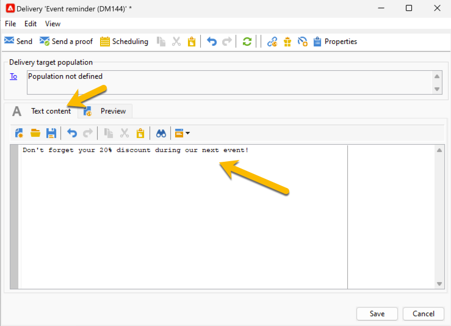

# Definiera SMS-innehållet {#sms-content}

Så här konfigurerar du innehållet i SMS-leveransen:

1. Ange innehållet i meddelandet på fliken **[!UICONTROL Text content]**.

   {zoomable="yes"}

1. Du kan anpassa ditt meddelande genom att infoga anpassningsfält (t.ex. lägga till förnamnet) eller infoga fördefinierade anpassningsblock (t.ex. lägga till hälsningar). Klicka på personaliseringsknappen för att lägga till följande:

   {zoomable="yes"}

   När du till exempel har klickat på **[!UICONTROL Recipient]** > **[!UICONTROL First name]** uppdateras SMS-innehållet med anpassningsfältet enligt nedan:

   {zoomable="yes"}

   Läs mer om personalisering i Adobe Campaign i [det här avsnittet](../personalize.md).

1. Du kan förhandsgranska leveransinnehåll på fliken **[!UICONTROL Preview]**. Om du vill kontrollera dina personaliseringsinställningar klickar du på listrutan **[!UICONTROL Test personalization]** och väljer en mottagare.

   {zoomable="yes"}

   Du kan kontrollera förhandsgranskningen av ditt SMS med personaliseringen:

   {zoomable="yes"}

>[!NOTE]
>
>* SMS-meddelanden är begränsade till en längd på 160 tecken om den latinska 1-teckentabellen (ISO-8859-1) används. Om meddelandet skrivs i Unicode får det inte innehålla fler än 70 tecken. Vissa specialtecken kan påverka meddelandets längd. Mer information om meddelandets längd finns i avsnittet [SMS-teckentranslittation](smpp-external-account.md#smpp-channel-settings).
>
>* När det finns anpassningsfält eller fält för villkorligt innehåll varierar meddelandets storlek från en mottagare till en annan. Meddelandets längd måste utvärderas när personalisering har utförts.
>
>*När du startar analysen kontrolleras meddelandets längd och en varning visas om det skulle uppstå ett spill.

När du har skapat innehållet i leveransen kan du [välja målgrupp](sms-audience.md).
