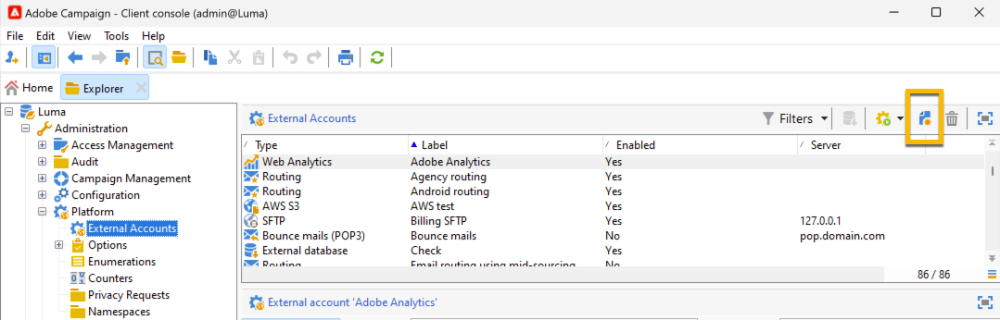
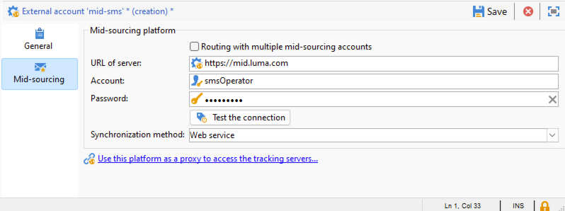

# SMS i en infrastruktur med flera leverantörer {#sms-mid}

>[!IMPORTANT]
>
>Den här dokumentationen gäller Adobe Campaign v8.7.2 och senare.
>
>Om du har äldre versioner kan du läsa [Campaign Classic v7-dokumentationen](https://experienceleague.adobe.com/en/docs/campaign-classic/using/sending-messages/sending-messages-on-mobiles/sms-set-up/sms-set-up).

För att skicka SMS-leveranser med en infrastruktur för medelhög källkod krävs:

1. En SMS-operator på Mid-servern. [Lär dig skapa här](#sms-operator-mid)
1. Ett externt SMS-konto på marknadsföringsservern som kommer att använda den tidigare skapade operatorn. [Lär dig skapa här](#sms-external-account)
1. Ett externt SMPP-konto på MID-servern som anger leveransläget för kanal och mellanleverantörer. [Lär dig skapa här](#smpp-external-account-mid)
1. En leveransmall som refererar till det externa kontot för att effektivisera sändningsprocessen. [Lär dig skapa här](#sms-delivery-template)

## Skapa SMS-operatorn på Mid-servern {#sms-operator-mid}

Först måste du skapa en SMS-operator på mellanservern som ska användas av det externa SMS-kontot på marknadsföringsservern.

Följ stegen nedan för att skapa en SMS-operator:

1. I **[!UICONTROL Administration]** > **[!UICONTROL Access management]** > **[!UICONTROL Operators]** klickar du på **[!UICONTROL New]** och fyller i formuläret i det nya fönstret som öppnas.

   * **[!UICONTROL Name (login)]** och **[!UICONTROL Label]** är obligatoriska.
   * Lösenord är inte obligatoriskt men rekommenderas av säkerhetsskäl.

   Observera att namnet (inloggningen) ska användas senare för att namnge ditt SMPP-externa konto på Mid-servern.

   {zoomable="yes"}

1. Klicka på knappen **[!UICONTROL Add]** i delen **[!UICONTROL Groups and named rights]**.
I det nya fönstret som öppnas väljer du **[!UICONTROL Named rights]** i listan **[!UICONTROL Folder]** och väljer **[!UICONTROL ADMINISTRATION]** i den högra listan.

1. Klicka på knappen **[!UICONTROL Ok]**.

   {zoomable="yes"}

1. Klicka på knappen **[!UICONTROL Save]** för att slutföra skapandet av SMS-operatorn.

   {zoomable="yes"}

Nu kan du se det i operatorlistan.

{zoomable="yes"}

## Skapa ett externt SMS-konto på marknadsföringsservern {#sms-external-account}

I en medelhög infrastruktur måste du skapa ett externt SMS-konto på marknadsföringsservern enligt nedan

>[!IMPORTANT]
>
>Om du använder samma konto och lösenord för flera externa SMS-konton kan det leda till konflikter och överlappning mellan kontona. Läs mer på [SMS-felsökningssidan](smpp-connection.md#sms-troubleshooting).

1. Klicka på ikonen **[!UICONTROL New]** i **[!UICONTROL Administration]** > **[!UICONTROL Platform]** > **[!UICONTROL External Accounts]**

   {zoomable="yes"}

1. Konfigurera **[!UICONTROL Label]** och **[!UICONTROL Internal name]** för ditt externa konto. Definiera kontotypen som **[!UICONTROL Routing]**, markera kryssrutan **[!UICONTROL Enabled]**, välj **[!UICONTROL Mobile (SMS)]** för kanalen och **[!UICONTROL Mid-sourcing]** som leveransläge.

   {zoomable="yes"}

1. På fliken **[!UICONTROL Mid-sourcing]** fyller du i formuläret med URL:en för mellankällservern och SMS-operatorn som tidigare skapats på mittservern.

   Bekräfta anslutningen genom att klicka på knappen **[!UICONTROL Test the connection]**.

   {zoomable="yes"}

1. Klicka på **[!UICONTROL Save]**.

## Skapa ett externt SMPP-konto på Mid-servern {#smpp-external-account-mid}

>[!IMPORTANT]
>
>Om du använder samma konto och lösenord för flera externa SMS-konton kan det leda till konflikter och överlappning mellan kontona. Se sidan [SMS-felsökning](smpp-connection.md#sms-troubleshooting).

Målet är nu att skapa ett externt SMPP-konto på Mid-servern.

Gör så här:

1. Klicka på ikonen **[!UICONTROL New]** i **[!UICONTROL Administration]** > **[!UICONTROL Platform]** > **[!UICONTROL External Accounts]** på mittservern

1. Konfigurera **[!UICONTROL Label]** och **[!UICONTROL Internal name]** för ditt externa konto.

   >[!WARNING]
   >
   >När du tilldelar ett internt namn måste du följa den angivna namnkonventionen: `SMS Operator Name_Internal Name of the Marketing SMS external account`.
   >

   Definiera kontotypen som **[!UICONTROL Routing]**, markera kryssrutan **[!UICONTROL Enabled]**, välj **[!UICONTROL Mobile (SMS)]** för kanalen och **[!UICONTROL Bulk delivery]** som leveransläge.
   {zoomable="yes"}

1. På fliken **[!UICONTROL Mobile]** håller du **[!UICONTROL Extended generic SMPP]** i listrutan **[!UICONTROL Connector]**.

   Rutan **[!UICONTROL Send messages through a dedicated process]** är markerad som standard.

   {zoomable="yes"}

   Om du vill upprätta anslutningen måste du fylla i flikarna i det här formuläret. Mer information finns i [läs mer om det externa SMPP-kontot](smpp-external-account.md#smpp-connection-settings).

## Konfigurera leveransmallen {#sms-delivery-template}

Skapa en SMS-leveransmall där alla inställningar refereras för att underlätta skapandet av din SMS-leverans.

Högerklicka på den befintliga mallen för mobil leverans i **[!UICONTROL Resources]** > **[!UICONTROL Templates]** > **[!UICONTROL Delivery templates]** på marknadsföringsservern och välj **[!UICONTROL Duplicate]**.

{zoomable="yes"}

Ändra **[!UICONTROL Label]** och **[!UICONTROL Internal name]** för mallen så att den lätt känns igen och klicka på knappen **[!UICONTROL Properties]**.

{zoomable="yes"}

På fliken **[!UICONTROL General]** i **[!UICONTROL Routing]** väljer du ett externt SMPP-konto.

{zoomable="yes"}

På fliken **[!UICONTROL SMS]** kan du lägga till valfria parametrar i mallen.

{zoomable="yes"}

[Läs mer om konfigurationen för SMS-fliken](sms-delivery-settings.md).