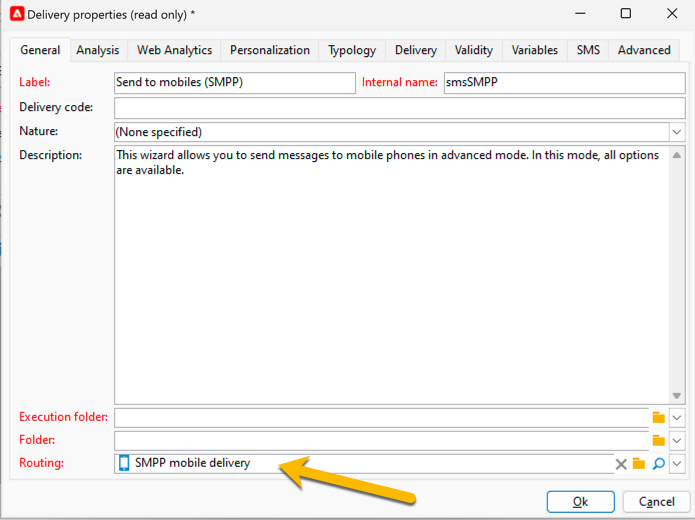

# SMS i en fristående instans {#sms-standalone}

>[!IMPORTANT]
>
>Den här dokumentationen gäller Adobe Campaign v8.7.2 och senare.
>
>Om du har äldre versioner kan du läsa [Campaign Classic v7-dokumentationen](https://experienceleague.adobe.com/sv/docs/campaign-classic/using/sending-messages/sending-messages-on-mobiles/sms-set-up/sms-set-up).

I en fristående instans kräver SMS-leverans:

1. Ett **externt konto** som anger en koppling och meddelandetypen [läs mer här](#external-account)

1. En **leveransmall** där det här externa kontot refereras, [läs mer här](#sms-delivery-template)

## Skapa ett externt konto {#external-account}

>[!IMPORTANT]
>
>Om du använder samma konto och lösenord för flera externa SMS-konton kan det leda till konflikter och överlappning mellan kontona. Läs mer på [SMS-felsökningssidan](smpp-connection.md#sms-troubleshooting).

Så här skapar du ett externt SMPP-konto:

1. Klicka på ikonen **[!UICONTROL New]** i **[!UICONTROL Administration]** > **[!UICONTROL Platform]** > **[!UICONTROL External Accounts]**

   {zoomable="yes"}

1. Konfigurera **[!UICONTROL Label]** och **[!UICONTROL Internal name]** för ditt externa konto. Definiera kontotypen som **[!UICONTROL Routing]**, markera kryssrutan **[!UICONTROL Enabled]**, välj **[!UICONTROL Mobile (SMS)]** för kanalen och **[!UICONTROL Bulk delivery]** som leveransläge.

   {zoomable="yes"}

1. På fliken **[!UICONTROL Mobile]** håller du **[!UICONTROL Extended generic SMPP]** i listrutan **[!UICONTROL Connector]**.
Rutan **[!UICONTROL Send messages through a dedicated process]** är markerad som standard.

   {zoomable="yes"}

   Om du vill upprätta anslutningen måste du fylla i flikarna i det här formuläret. Mer information finns i [läs mer om det externa SMPP-kontot](smpp-external-account.md#smpp-connection-settings).

## Konfigurera leveransmallen {#sms-delivery-template}

Skapa en SMS-leveransmall där det hänvisas till ditt SMPP-externa konto för att underlätta skapandet av din SMS-leverans.

Högerklicka på den befintliga mallen för mobil leverans i **[!UICONTROL Resources]** > **[!UICONTROL Templates]** > **[!UICONTROL Delivery templates]** och välj **[!UICONTROL Duplicate]**.

{zoomable="yes"}

Ändra **[!UICONTROL Label]** och **[!UICONTROL Internal name]** för mallen så att den lätt känns igen och klicka på knappen **[!UICONTROL Properties]**.

{zoomable="yes"}

På fliken **[!UICONTROL General]** i **[!UICONTROL Routing]** väljer du ett externt SMPP-konto.

{zoomable="yes"}

På fliken **[!UICONTROL SMS]** kan du lägga till valfria parametrar i mallen.

{zoomable="yes"}

[Läs mer om konfigurationen för SMS-fliken](sms-delivery-settings.md).
