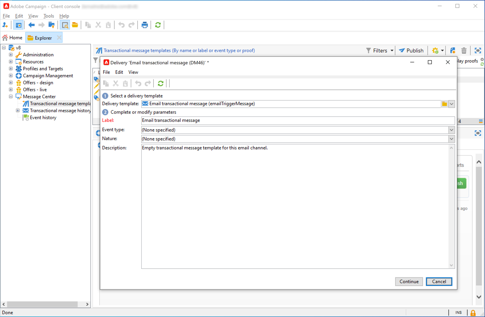

# Skapa och publicera din mall för transaktionsmeddelanden{#template-transactional-messages}

Varje händelse kan utlösa ett personligt meddelande. För att detta ska ske måste du skapa en meddelandemall som matchar varje händelsetyp. Mallar innehåller den information som behövs för att anpassa transaktionsmeddelandet. Du kan också använda mallar för att testa förhandsvisningen av meddelanden och skicka korrektur med dirigerade adresser innan du levererar till det slutliga målet.

## Skapa mallen{#create-message-template}

Följ stegen nedan för att skapa en meddelandemall:

1. Gå till **[!UICONTROL Message Center >Transactional message templates]** i Adobe Campaign-trädet.
1. Högerklicka och välj i listan över transaktionsmeddelandemallar **[!UICONTROL New]** i listrutan eller klicka på **[!UICONTROL New]** ovanför listan med transaktionsmeddelandemallar.

   

1. I leveransfönstret väljer du den leveransmall som passar den kanal du vill använda.

   

1. Ändra vid behov etiketten.
1. Välj den typ av händelse som matchar meddelandet som du vill skicka. Händelsetyper som ska bearbetas av Adobe Campaign måste skapas i förväg. [Läs mer](#create-event-types)

   

   >[!CAUTION]
   >
   >En händelsetyp får aldrig länkas till mer än en mall.

1. Ange en natur och en beskrivning och klicka sedan på **[!UICONTROL Continue]** för att skapa meddelandetexten.

## Skapa innehållet{#create-message-content}

Definitionen av transaktionens meddelandeinnehåll är densamma som för alla leveranser i Adobe Campaign. För e-postleveranser kan du till exempel skapa innehåll i HTML eller textformat, lägga till bilagor eller anpassa leveransobjektet. [Läs mer](../start/create-message.md).

>[!CAUTION]
>
>Bilderna i meddelandet måste vara tillgängliga för alla. Adobe Campaign har ingen mekanism för överföring av bilder för transaktionsmeddelanden.\
>Till skillnad från i JSSP eller webApp, `<%=` har ingen standardescape-konvertering.
>
>Du måste undvika alla data som kommer från händelsen på rätt sätt. Detta beror på hur det här fältet används. Använd till exempel encodeURIComponent i en URL. Om du vill visas i HTML kan du använda escapeXMLString.

När du har definierat meddelandeinnehållet kan du integrera händelseinformation i meddelandetexten och anpassa den. Händelseinformation infogas i texten tack vare personaliseringstaggar.

* Alla anpassningsfält kommer från nyttolasten.
* Det går att referera till ett eller flera personaliseringsblock i ett transaktionsmeddelande. <!--The block content will be added to the delivery content during the publication to the execution instance.-->

Gör så här om du vill infoga personaliseringstaggar i brödtexten i ett e-postmeddelande:

1. Klicka på fliken som matchar e-postformatet (HTML eller text) i meddelandemallen.
1. Ange meddelandets brödtext.
1. Infoga taggen med hjälp av **[!UICONTROL Real time events>Event XML]** menyer.

   

1. Fyll i taggen med följande syntax: **elementnamn**.@**attributnamn** enligt nedan.

   

## Testa mallen för transaktionsmeddelanden {#test-message-template}

### Lägg till dirigerade adresser{#add-seeds}

Med en dirigerad adress kan du visa en förhandsgranskning av meddelandet, skicka ett korrektur och testa meddelandets personalisering innan du skickar meddelandet. Seed-adresserna är kopplade till leveransen och kan inte användas för andra leveranser.

1. Klicka på knappen **[!UICONTROL Seed addresses]** klickar du på **[!UICONTROL Add]** -knappen.

   

1. Tilldela den en etikett som du enkelt kan välja senare och ange startadressen (e-post eller mobiltelefon beroende på kommunikationskanalen).

1. Ange den externa identifieraren: I det här valfria fältet kan du ange en affärsnyckel (unikt ID, namn + e-post osv.) som är gemensamma för alla program på webbplatsen och som används för att identifiera dina profiler. Om det här fältet också finns i Adobe Campaign marknadsföringsdatabas kan du sedan koppla en händelse till en profil i databasen.

   

1. Infoga testdata. Se [det här avsnittet](#personalization-data).

   

1. Klicka **[!UICONTROL Ok]** för att bekräfta skapandet av startadressen.

1. Upprepa processen för att skapa så många adresser du behöver.

   

När adresserna har skapats har du tillgång till deras förhandsgranskning och personalisering.

<!--

### Add personalization data{#personalization-data}

You can add data in the message template to test transactional message personalization. This will allow you to generate a preview or send a proof. If you install the **Deliverability** module, this data allows you to display a rendering of the messages for various desktop, web or mobile clients.

The purpose of this data is to test your messages before their final delivery. These messages do not coincide with actual data to be processed by Message Center.

However, the XML structure must be identical to that of the event stored in the execution instance, as shown below. 

This information enables you to personalize message content using personalization tags.

1. In the message template, click the **[!UICONTROL Seed addresses]** tab.
1. In the event content, enter the test information in XML format.

   
-->

### Förhandsgranska ditt transaktionsmeddelande{#transactional-message-preview}

När du har skapat en eller flera dirigerade adresser och meddelandetexten kan du förhandsgranska meddelandet och kontrollera dess personalisering.

1. Klicka på knappen **[!UICONTROL Preview]** tabbtangenten och sedan **[!UICONTROL A seed address]** i listrutan.

   

1. Välj den startadress som skapades tidigare för att visa det anpassade meddelandet.

   

### Skicka en korrektur

Du kan testa meddelandeleveransen genom att skicka ett korrektur till en startadress som skapats tidigare.

När du skickar ett korrektur utförs samma process som för alla leveranser.

Läs mer om korrektur i [det här avsnittet](../send/preview-and-proof.md#proofs-send).

Om du vill skicka ett bevis på ett transaktionsmeddelande måste du utföra följande åtgärder:

* Skapa en eller flera [dirigeringsadresser](#add-seeds) med personaliseringstest
* Skapa meddelandeinnehållet

Så här skickar du korrekturet:

1. Klicka på **[!UICONTROL Send a proof]** i leveransfönstret.
1. Analysera leveransen.
1. Åtgärda eventuella fel och bekräfta leveransen.

   

1. Kontrollera att meddelandet levererades till startadressen och att innehållet överensstämmer med din konfiguration.

   

Korrektur kan öppnas i varje mall via **[!UICONTROL Audit]** -fliken.

## Publicera mallen {#publish-message-template}

När meddelandemallen skapades<!-- on the control instance--> är klar kan du publicera den så att du kan skicka meddelanden som är länkade till realtids- och grupphändelser.

<!--This process will also publish it on all execution instances.

NOTE: When publishing transactional message templates, typology rules are also automatically published on the execution instances.

Publication lets you automatically create two message templates on the execution instances, which will allow you to send messages linked to real-time and batch events.-->

>[!CAUTION]
>
>När du gör några ändringar i en mall måste du publicera den igen för att ändringarna ska gälla vid leverans av transaktionsmeddelanden.

1. Gå till **[!UICONTROL Message Center > Transactional message templates]** mapp i trädet.
1. Välj den mall som du vill publicera<!--on your execution instances-->.
1. Klicka på **[!UICONTROL Publish]**.

   

När publiceringen är klar skapas båda meddelandemallarna som ska användas för batch- och realtidshändelser i **[!UICONTROL Administration > Production > Message Center Execution> Default > Transactional message templates]** mapp.

När en mall har publicerats, om motsvarande händelse aktiveras, Adobe Campaign<!--execution instance--> tar emot händelsen, länkar den till transaktionsmallen och skickar motsvarande transaktionsmeddelande till varje mottagare.

<!--
>[!NOTE]
>
>If you replace an existing field of the transactional message template, such as the sender address, with an empty value, the corresponding field on the execution instance(s) will not be updated once the transactional message is published again. It will still contain the previous value.
>
>However, if you add a non-empty value, the corresponding field will be updated as usual after the next publication.
-->

## Avpublicera en mall

När en meddelandemall har publicerats <!--on the execution instances-->kan den avpubliceras.

* En publicerad mall kan fortfarande anropas om motsvarande händelse aktiveras: Om du inte längre använder en meddelandemall bör du avpublicera den. Detta för att undvika att skicka ett oönskat transaktionsmeddelande av misstag.

   Du publicerade till exempel en meddelandemall som du bara använder för julkampanjer. Du kanske vill avpublicera den när julperioden är slut och publicera den igen nästa år.

* Du kan inte heller ta bort en transaktionsmeddelandemall som har **[!UICONTROL Published]** status. Du måste avpublicera det först.

Följ stegen nedan om du vill avpublicera en transaktionsmeddelandemall.

1. Bläddra till **[!UICONTROL Message Center > Transactional message templates]** mapp.
1. Välj den mall som ska avpubliceras.
1. Klicka på **[!UICONTROL Unpublish]**.
1. Klicka på **[!UICONTROL Start]**.

Mallstatusen för transaktionsmeddelanden ändras tillbaka från **[!UICONTROL Published]** till **[!UICONTROL Being edited]**.

När borttagningen är klar:

* Båda meddelandemallarna (används för batch- och realtidshändelser) tas bort<!-- from each execution instance-->.

   De visas inte längre i **[!UICONTROL Administration > Production > Message Center Execution > Default > Transactional message templates]** mapp.

* När en mall inte har publicerats kan du ta bort den<!-- from the control instance-->.

   Om du vill göra det markerar du den i listan och klickar på knappen **[!UICONTROL Delete]** överst till höger på skärmen.
