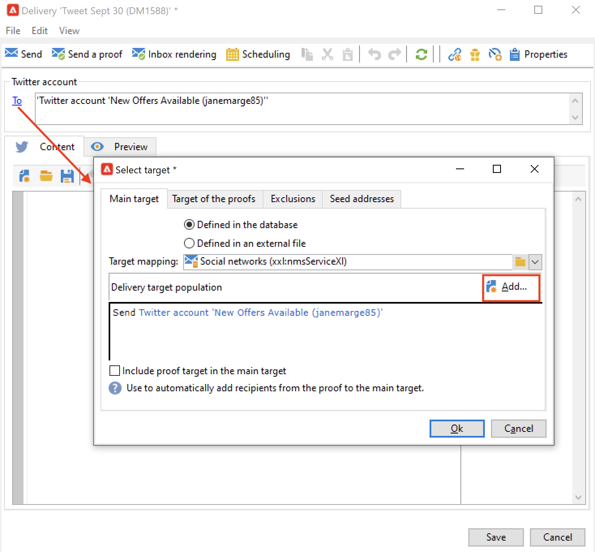

# Skicka meddelanden på X (Twitter) med Adobe Campaign {#post-tw-messages}

Adobe Campaign har en modul för **social marknadsföring** som gör att du kan interagera med kunder och potentiella kunder via X (tidigare Twitter).

När integreringen är konfigurerad kan du:

* Skicka direktmeddelanden till dina följare
* Lägg upp på ditt X-konto
* Samla in nya kontakter genom att återställa profildata, vilket gör att ni kan genomföra riktade kampanjer och, när det är möjligt, implementera flerkanalsstrategier. Den här åtgärden kräver användarens samtycke.

Konfigurationssteg för att integrera ditt X-konto med Adobe Campaign beskrivs på [den här sidan](../connect/ac-tw.md).

## Skapa och publicera ett X-inlägg {#publish-on-tw}

Följ stegen nedan för att publicera ett meddelande på ditt X-konto:

1. Skapa en X-leverans

   Skapa en ny leverans baserat på leveransmallen **[!UICONTROL Tweet (twitter)]**.

   

1. Välj huvudmålet

   Markera det eller de konton som du vill skicka inlägg till.

   

   1. Klicka på länken **[!UICONTROL To]**.
   1. Klicka på knappen **[!UICONTROL Add]**.
   1. Välj **[!UICONTROL A Twitter account]**.
   1. I fältet **[!UICONTROL Folder]** väljer du den tjänstmapp som innehåller X-kontot. Välj sedan det X-konto som du vill skicka tweeten till.

1. Välj korrekturmål

   På fliken **[!UICONTROL Target of the proofs]** kan du definiera X-kontot som ska användas för testleveranser före den slutliga leveransen.

   Så som beskrivs i [konfigurationsstegen](../connect/ac-tw.md#tw-test-account) måste du skapa ett privat test-X-konto som är dedikerat till att skicka korrektur.

   >[!NOTE]
   >
   >Om du använder samma X-testkonto för alla leveranser kan du spara korrekturmålet i **[!UICONTROL Tweet]**-leveransmallen, som du kommer åt via noden **[!UICONTROL Resources > Templates > Delivery templates]**. Korrekturmålet anges sedan som standard för varje ny leverans.

1. Definiera innehållet i ditt inlägg

   Ange innehållet i ditt inlägg på fliken **[!UICONTROL Content]**.

   

   >[!CAUTION]
   >
   >Vid bokföring på X gäller begränsningarna:
   >
   >* Meddelandet får inte innehålla fler än 140 tecken.
   >* HTML-format stöds inte.
   >

1. Förhandsgranska ditt inlägg

   Bläddra på fliken **[!UICONTROL Preview]** för att kontrollera återgivningen av inlägget.

   

   1. Klicka på fliken **[!UICONTROL Preview]**.
   1. Klicka på listrutan **[!UICONTROL Test personalization]** och välj **[!UICONTROL Service]**.
   1. I fältet **[!UICONTROL Folder]** väljer du den tjänstmapp som innehåller ditt X-konto.

1. Skicka en korrektur

   Innan du publicerar din tweet måste du verifiera den genom att skicka ett korrektur av publikationen: du kan sedan få en exakt återgivning av publikationen på en privat X-testsida.

1. Lägg upp meddelandet

   1. När innehållet har godkänts klickar du på knappen **[!UICONTROL Send]**.
   1. Markera **[!UICONTROL Deliver as soon as possible]** och klicka på knappen **[!UICONTROL Analyze]**.
   1. Kontrollera resultatet när analysen är klar.
   1. Klicka på **[!UICONTROL Confirm delivery]** och sedan på **[!UICONTROL Yes]**.

## Skicka direktmeddelanden till följare {#direct-tw-messages}

Det tekniska arbetsflödet för **[!UICONTROL Synchronize Twitter accounts]** återställer listan med X-följare så att du kan skicka direktmeddelanden till dem. [Läs mer](../connect/ac-tw.md#synchro-tw-accounts)

Följ stegen nedan för att skicka direktmeddelanden till dina följare:

1. Skapa en X-leverans baserat på den **[!UICONTROL Tweet (Direct Message)]** inbyggda leveransmallen.

1. Välj huvudmålet

   

   1. Markera länken **[!UICONTROL To]** och knappen **[!UICONTROL Add]**.

   1. Välj en typ av målinriktning

      * Välj **[!UICONTROL Twitter subscribers]** om du vill skicka ett direktmeddelande till alla dina följare.

      * Välj **[!UICONTROL Filter conditions]** om du vill definiera en fråga och visa resultatet. Lär dig hur du skapar ett filter i [det här avsnittet](../audiences/create-filters.md#advanced-filters).

1. Välj korrekturmålet på fliken **[!UICONTROL Target of the proofs]**: det här kontot kommer att få ditt direktmeddelande som bevis.

   Så som beskrivs i [konfigurationsstegen](../connect/ac-tw.md#tw-test-account) måste du skapa ett privat test-X-konto som är dedikerat till att skicka korrektur.

   >[!NOTE]
   >
   >Om du vill skicka alla dina korrektur för direktmeddelanden till samma X-konto kan du spara korrekturmålet i leveransmallen **[!UICONTROL Tweet (Direct Message)]** som du kommer åt via noden **[!UICONTROL Resources > Templates > Delivery templates]**.

1. Ange innehållet i meddelandet på fliken **[!UICONTROL Content]**.

   

   Anpassningsfält kan användas på samma sätt som för e-postleveranser, t.ex. för att lägga till följarens namn i meddelandets brödtext. Läs mer i [det här avsnittet](../send/personalize.md).

1. Förhandsgranska meddelandet

   Bläddra på fliken **[!UICONTROL Preview]** för att kontrollera återgivningen av inlägget.

   

   1. Klicka på fliken **[!UICONTROL Preview]**.
   1. Klicka på listrutan **[!UICONTROL Test personalization]** och välj **[!UICONTROL Visitor Subscription]**.
   1. Välj ett X-konto som du vill testa förhandsvisningen med.

1. Skicka en korrektur

   Innan du skickar ditt meddelande måste du verifiera det genom att [skicka ett bevis till ett testkonto](../send/preview-and-proof.md): du kan sedan få en exakt återgivning av meddelandet på ett privat X-konto och kontrollera innehåll och personalisering.

1. Skicka direktmeddelandet

   1. När innehållet har godkänts klickar du på knappen **[!UICONTROL Send]**.
   1. Markera **[!UICONTROL Deliver as soon as possible]** och klicka på knappen **[!UICONTROL Analyze]**.
   1. Kontrollera resultatet när analysen är klar.
   1. Klicka på **[!UICONTROL Confirm delivery]** och sedan på **[!UICONTROL Yes]**.

>[!CAUTION]
>
>Du kan inte skicka mer än 250 direktmeddelanden per dag. För att undvika att detta tröskelvärde överskrids kan du leverera i vågor. Mer information om detta hittar du i det här [avsnittet](configure-and-send.md#sending-using-multiple-waves).

## Åtkomstspårningsdata {#tw-tracking}

Spårning är aktiverat som standard i den inbyggda leveransmallen **[!UICONTROL Tweet]**.

Spårningsdata kan visas i leveransrapporterna och på fliken **[!UICONTROL Edit > Tracking]** för leveransen och tjänsten.

Spårningskonfigurationen är densamma som för en e-postleverans. Läs mer i [Campaign Classic v7-dokumentationen](https://experienceleague.adobe.com/docs/campaign-classic/using/sending-messages/monitoring-deliveries/about-delivery-monitoring.html){target="_blank"}.

