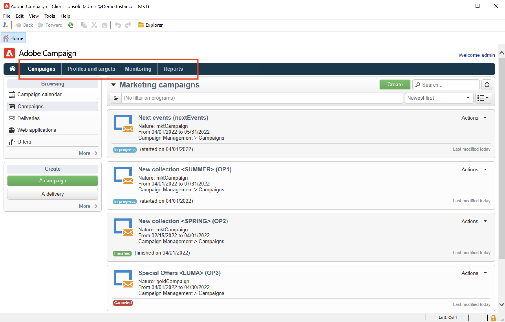

# Upptäck gränssnittet för Campaign

## Åtkomst till Campaign-gränssnittet{#ui-access}

Kampanjarbetsytan är tillgänglig via [Klientkonsol](../architecture/general-architecture.md).

Lär dig hur du installerar och konfigurerar Campaign Client Console i [det här avsnittet](../start/connect.md).

Du kan också använda en webbläsare för att få tillgång till Campaign. I det här sammanhanget är bara en deluppsättning av Campaign-funktionerna tillgängliga. [Läs mer](#web-browser)

## Bläddra i användargränssnittet{#ui-browse}

När du är ansluten till Campaign kommer du åt startsidan. Bläddra bland länkarna för att komma åt funktioner. Vilka funktioner som är tillgängliga i användargränssnittet beror på vilka alternativ och behörigheter du har.

I den centrala delen av startsidan använder du länkar för att komma åt hjälpmaterial för Campaign, communityn och supportwebbplatsen.

Använd flikarna i det övre avsnittet för att bläddra bland funktionerna i Campaign-nyckeln:

>[!NOTE]
>
>Listan över kärnfunktioner som du kan komma åt beror på dina behörigheter och din implementering.

För varje funktion har du tillgång till de viktigaste funktionerna i **[!UICONTROL Browsing]** -avsnitt. The **[!UICONTROL More]** -länken kan du komma åt alla andra komponenter.

Om du till exempel bläddrar till **[!UICONTROL Profiles and targets]** kan du komma åt mottagarlistor, prenumerationstjänster, befintliga arbetsflöden för målinriktning och genvägar för att skapa alla dessa komponenter.

När du markerar ett element på skärmen läses det in på en ny flik så att du enkelt kan bläddra i innehållet.

## Skapa ett element {#create-an-element}

Använd genvägar i **[!UICONTROL Create]** till vänster på skärmen för att lägga till nya element. Du kan också använda **[!UICONTROL Create]** ovanför listan för att lägga till nya element i den aktuella listan.

På leveranssidan kan du till exempel använda **[!UICONTROL Create]** för att skapa en ny leverans.

## Använda en webbläsare {#web-browser}

Du kan även få tillgång till en delmängd av Campaign-funktionerna via en webbläsare.

Webbgränssnittet liknar konsolgränssnittet. Från en webbläsare kan du använda samma navigerings- och visningsfunktioner som i konsolen, men du kan bara utföra en reducerad uppsättning åtgärder på kampanjer. Du kan till exempel visa och avbryta kampanjer, men du kan inte ändra dem.

 [Läs mer om Campaign-webbåtkomst](../start/connect.md#web-access).

## Access Campaign Explorer {#ac-explorer-ui}

Bläddra i Campaign Explorer för att få tillgång till alla funktioner och inställningar i Adobe Campaign.

På den här arbetsytan kan du komma åt Utforskarträdet och bläddra bland alla funktioner och alternativ.

I det vänstra avsnittet visas Campaign Explorer-trädet där du kan bläddra bland alla komponenter och inställningar för instansen, baserat på dina behörigheter.

I det övre avsnittet visas en lista med poster i den aktuella mappen. Dessa listor är helt anpassningsbara. [Läs mer](customize-ui.md)

I det nedre avsnittet visas information om den valda posten.

## Språk{#languages}

Användargränssnittet för Campaign v8 finns på följande språk:

* Engelska (UK)
* Engelska (USA)
* Franska
* Tyska
* Japanska

Språket väljs under installationen.

>[!CAUTION]
>
>Språket kan inte ändras efter att instansen har skapats.

Språk påverkar datum- och tidsformat.

De största skillnaderna mellan amerikansk engelska och brittisk engelska är:

<table> 
 <thead> 
  <tr> 
   <th> Format  </th> 
   <th> Engelska (USA)  </th> 
   <th> Engelska (EN)  </th> 
  </tr> 
 </thead> 
 <tbody> 
  <tr> 
   <td> Datum  </td> 
   <td> Veckan börjar på söndag  </td> 
   <td> Veckan börjar på måndag  </td> 
  </tr> 
  <tr> 
   <td> Kort datum  </td> 
   <td> 
%2M/%2D/%4Y

<strong>ex: 09/25/2018</strong>
 </td> 
   <td> 
%2D/%2M/%4Y

<strong>ex: 25/09/2018</strong>
 </td> 
  </tr> 
  <tr> 
   <td> Kort datum med tid  </td> 
   <td> 
%2M/%2D/%4Y %I:%2N:%2S %P

<strong>ex: 09/25/2018 10:47:25 PM</strong>
 </td> 
   <td> 
%2D/%2M/%4Y %2H:%2N:%2S

<strong>ex: 25/09/2018 22:47:25</strong>
 </td> 
  </tr> 
 </tbody> 
</table>
