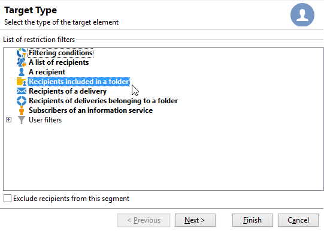

# Skapa din första leverans {#create-a-msg}

På den här sidan får du lära dig hur du skapar en enstaka leverans med ett enda foto. Du kan skapa andra typer av leveranser för att bygga upp dina användningsfall. Läs mer om de olika typerna av leveranser och hur du skapar dem på [den här sidan](gs-message.md).

De viktigaste stegen när du ska skapa en engångsleverans är:

1. **Skapa en ny leverans**. [Läs mer](#create-the-delivery)

1. **Definiera leveransinnehållet**. [Läs mer](#content-of-the-delivery)

1. **Välj målpopulationen**. [Läs mer](#target-population)

Du kan sedan förbereda, testa, skicka och övervaka dina meddelanden med Adobe Campaign.

>[!NOTE]
>
>Stegen som beskrivs i det här avsnittet förutsätter att alla målmottagare och deras profiler lagras i databasen, utom vid extern leverans. Se [Välja externa mottagare](#selecting-external-recipients).

## Skapa leveransen {#create-the-delivery}

Så här skapar du en leverans:

1. Bläddra till listan över leveranser och klicka på **[!UICONTROL Create]**.
1. Välj leveranskanal. Det gör du genom att välja rätt leveransmall i listrutan.

   

   En inbyggd mall tillhandahålls för varje kanal som du har installerat: e-post, telefon, mobilkanaler (push/SMS), direktreklam, X (Twitter) osv. Vilka kanaler som är tillgängliga i listan beror på ditt licensavtal.

   Du kan skapa nya leveransmallar för att förkonfigurera specifika parametrar så att de passar dina behov.  [Läs mer](../send/create-templates.md).

1. Ange ett namn för leveransen i fältet **[!UICONTROL Label]**.

   (valfritt) Leveranskoden kan även tilldelas till leveransen. Namnet på leveransen och dess kod visas i listan över leveranser men visas inte för mottagarna.

1. (valfritt) Lägg till en beskrivning i fältet **[!UICONTROL Description]**.
1. (valfritt) Välj leveranstyp i det relevanta fältet. Den här informationen är användbar för leveransspårning: du kan filtrera baserat på det här villkoret i leveranslistan eller skapa frågor med det här urvalskriteriet.
1. Klicka på **[!UICONTROL Continue]** för att visa meddelandets innehållsfönster.

## Definiera leveransinnehållet {#content-of-the-delivery}

Leveransinnehållet kan konfigureras. Definitionen av leveransinnehåll är specifik för varje kanal. Mer information finns i det dedikerade avsnittet:

* [Definiera e-postinnehållet](../send/email.md)
* [Definiera SMS-innehållet](../send/sms/sms-content.md)
* [Definiera innehållet i direktmeddelanden](../send/direct-mail.md)
* [Definiera innehållet i push-meddelanden](../send/push.md)

## Definiera målgruppen {#target-population}

För varje leverans kan du definiera flera typer av målgrupper:

* **Huvudmålgrupp**: profiler som tar emot meddelanden. [Läs mer](#select-the-main-target)
* **Korrekturmål**: profiler som tar emot korrekturmeddelanden. Ett korrektur är ett specifikt meddelande som gör att du kan testa ett meddelande innan det skickas iväg till huvudmålet. [Läs mer](#select-the-proof-target)

Dessutom kan ni lägga till följande inom ramen för en marknadsföringskampanj:

* **Avsändningsadresser**: mottagare som inte är med i leveransmålet men som tar emot leveransen. [Läs mer](../audiences/test-profiles.md)
* **Kontrollgrupper**: fyllning som inte tar emot leveransen, används för att spåra beteende och kampanjpåverkan. [Läs mer](../../automation/campaigns/marketing-campaign-target.md#add-a-control-group).

### Välj de huvudsakliga mottagarna av leveransen {#select-the-main-target}

I de flesta fall hämtas huvudmålet från Adobe Campaign-databasen (standardläge). Mottagarna kan dock också lagras i en [extern fil](#selecting-external-recipients).

Följ stegen nedan för att välja mottagare av en leverans:

1. Välj **[!UICONTROL To]** i leveransredigeraren.
1. Om mottagarna lagras i databasen väljer du det första alternativet.

   {zoomable="yes"}

1. Välj [målmappningen](../audiences/target-mappings.md) i listrutan **[!UICONTROL Target mapping]**.
1. Klicka på knappen **[!UICONTROL Add]** för att definiera begränsningsfilter.

   {width="60%" align="left" zoomable="yes"}

   Välj en typ av filter och klicka på **[!UICONTROL Next]** för att definiera villkoren. Du kan visa de filtrerade mottagarna på fliken **[!UICONTROL Preview]**. Beroende på måltypen kan du med knappen **[!UICONTROL Refine target]** kombinera flera målinriktningskriterier.

   Följande måltyper är tillgängliga:

   * **[!UICONTROL Filtering conditions]**: använd det här alternativet om du vill definiera en fråga och visa resultatet. Lär dig utforma en fråga i [det här avsnittet](../../automation/workflow/query.md).
   * **[!UICONTROL A list of recipients]**: använd det här alternativet för att ange en lista över profiler som mål. Läs mer om listor i [det här avsnittet](../audiences/create-audiences.md).
   * **[!UICONTROL A recipient]**: använd det här alternativet om du vill välja en viss profil i databasen.
   * **[!UICONTROL Recipients included in a folder]**: använd det här alternativet om du vill ange alla profiler i en viss mapp som mål.
   * **[!UICONTROL Recipients of a delivery]**: Använd det här alternativet om du vill skapa målet från mottagarna av en leverans. Du måste sedan välja leveransen i listan:

     

   * **[!UICONTROL Delivery recipients belonging to a folder]**: Använd det här alternativet om du vill skapa målet från de mottagarleveranser som ingår i en viss mapp.

     

     Du kan filtrera mottagarnas beteende genom att välja i listrutan:

     

     >[!NOTE]
     >
     >Med alternativet **[!UICONTROL Include sub-folders]** kan du även ange leveranser i mappar i trädstrukturen nedanför den valda noden som mål.

   * **[!UICONTROL Subscribers of an information service]** : Med det här alternativet kan du välja ett nyhetsbrev som mottagarna måste prenumerera på för att få det mål som den leverans som skapas har.

     

   * **[!UICONTROL User filters]**: Med det här alternativet kan du komma åt de förkonfigurerade filtren och använda dem som filtreringsvillkor för profiler i databasen. Förkonfigurerade filter visas i [det här avsnittet](../audiences/create-filters.md#default-filters).
   * Med alternativet **[!UICONTROL Exclude recipients from this segment]** kan du rikta in dig på mottagare som inte uppfyller de definierade målvillkoren. Om du vill använda det här alternativet markerar du lämplig ruta och tillämpar sedan målinriktning, enligt definitionen ovan, för att utesluta de resulterande profilerna.

1. Ange ett namn för den här målsättningen i fältet **[!UICONTROL Label]**. Som standard är etiketten etiketten för det första målinriktningskriteriet. När du kombinerar filtervillkor bör du använda ett explicit namn.
1. Klicka på **[!UICONTROL Finish]** för att validera målinriktningsalternativen.

   De definierade målinriktningskriterierna sammanfattas i det centrala avsnittet på fliken för huvudmålkonfiguration. Klicka på ett villkor för att visa dess innehåll (konfiguration och förhandsgranskning). Om du vill ta bort ett villkor klickar du på krysset efter etiketten.

   

### Välj externa mottagare {#selecting-external-recipients}

Du kan skicka meddelanden till profiler som inte lagras i databasen, utan i en extern fil. Om du till exempel vill skicka en leverans till mottagare som har importerats från en textfil gör du så här:

1. Klicka på länken **[!UICONTROL To]** för att välja mottagare av leveransen.
1. Välj alternativet **[!UICONTROL Defined in an external file]**.
1. Markera filen som innehåller mottagarna.
1. När du importerar mottagarna klickar du på länken **[!UICONTROL File format definition...]** för att markera och konfigurera den externa filen.

   Mer information om dataimport finns i [Campaign Classic v7-dokumentationen](https://experienceleague.adobe.com/sv/docs/campaign-classic/using/getting-started/importing-and-exporting-data/generic-imports-exports/executing-import-jobs#step-2---source-file-selection){target="_blank"}.

1. Klicka på **[!UICONTROL Finish]** och konfigurera leveransen som en standardleverans.

>[!CAUTION]
>
>När du definierar innehållet i meddelandet för e-postleverans till externa mottagare ska du inte inkludera länken till spegelsidan: det kan inte genereras i det här leveransläget.

### Uteslutningsinställningar {#define-exclusion-settings}

När du definierar [målgruppen för en leverans](#target-population) används fliken **[!UICONTROL Exclusions]** för att begränsa antalet meddelanden. Standardparametrar rekommenderas, men du kan anpassa inställningarna efter dina behov. Dessa alternativ bör dock endast ändras av en expertanvändare för att undvika felanvändning och fel.

>[!CAUTION]
>
>Som expertanvändare kan du ändra de här inställningarna, men Adobe rekommenderar att du behåller standardkonfigurationen.

Du kan utesluta adresser som har nått ett visst antal efterföljande fel, eller vars kvalitetsklassificering är under ett tröskelvärde som anges i det här fönstret. Du kan också välja om du vill auktorisera icke-kvalificerade adresser som inga data har returnerats för.

Klicka på länken **[!UICONTROL Edit...]** om du vill ändra standardkonfigurationen.

+++ Se tillgängliga alternativ

* **[!UICONTROL Exclude duplicate addresses during delivery]**: Det här alternativet är aktivt som standard och tar bort dubblettadresser under leveransen. Den strategi som tillämpas kan variera beroende på hur Adobe Campaign används och vilken typ av data som finns i databasen. Värdet för alternativet kan konfigureras för varje leveransmall.
* **[!UICONTROL Exclude recipients who no longer want to be contacted]**, d.v.s. mottagare vars e-postadresser är på blockeringslista (avanmäl dig). Detta alternativ måste förbli valt för att man ska kunna följa de professionella etiska reglerna för e-marknadsföring.
* **[!UICONTROL Exclude quarantined recipients]**: Med det här alternativet kan du utesluta profiler med en adress som är i karantän från målet. Vi rekommenderar starkt att du behåller det här alternativet markerat. Läs mer om karantänhantering i [det här avsnittet](../send/quarantines.md).
* **[!UICONTROL Limit delivery]** till ett visst antal meddelanden. Med det här alternativet kan du ange maximalt antal meddelanden som ska skickas. Om målgruppen överskrider antalet angivna meddelanden, tillämpas ett slumpmässigt urval på målet. Om du vill skicka alla meddelanden ska du behålla värdet &#39;0&#39;.
* **[!UICONTROL Keep duplicate records (same identifier)]**: Det här alternativet tillåter att flera leveranser skickas till mottagare som uppfyller flera målinriktningskriterier.
+++

### Välj mottagare av korrekturmeddelanden {#select-the-proof-target}

För e-postleveranser kan du skicka korrektur för att validera meddelandeinnehållet. Genom att skicka korrektur kan du kontrollera länken för avanmälan, spegelsidan och alla andra länkar, validera meddelandet, verifiera att bilder visas, upptäcka eventuella fel osv. Du kanske också vill kontrollera din design och återgivning på olika enheter.

Ett korrektur är ett specifikt meddelande som gör att du kan testa ett meddelande innan det skickas till huvudmålgruppen. Mottagarna av beviset ansvarar för att godkänna meddelandet: rendering, innehåll, personaliseringsinställningar, konfiguration.

Mer information om korrekturmottagare och sändning finns i [det här avsnittet](../send/preview-and-proof.md#send-proofs).

#### Självstudievideo {#seeds-and-proofs-video}

I den här videon får du lära dig hur du lägger till frön och korrektur i ett befintligt e-postmeddelande och hur du skickar det.

>[!VIDEO](https://video.tv.adobe.com/v/3447003?quality=12&captions=swe)

Ytterligare Campaign Classic instruktionsvideor finns [här](https://experienceleague.adobe.com/docs/campaign-classic-learn/tutorials/overview.html?lang=sv).

## Förbered och validera leveransen {#validate-the-delivery}

När en leverans har skapats och konfigurerats måste du validera den innan du skickar den till huvudmålet.

Så här gör du:

1. **Analysera leveransen**: Med det här steget kan du förbereda meddelanden som ska levereras. [Läs mer](../send/delivery-analysis.md).

1. **Skicka korrektur**: I det här steget kan du styra innehåll, URL-adresser, personalisering osv. [Läs mer](../send/preview-and-proof.md).

>[!IMPORTANT]
>
>De två stegen ovanför **måste utföras** efter varje ändring av meddelandeinnehållet.

## Konfigurera och skicka leveransen {#configuring-and-sending-the-delivery}

Få åtkomst till leveransparametrarna för att konfigurera fler inställningar och definiera hur meddelanden ska skickas. Du kan definiera leveransprioritet, konfigurera sändande vågor, konfigurera inställningarna för nya försök och testa leveransen. När konfigurationen är klar kan du bekräfta sändningen. Meddelanden skickas sedan direkt eller baserat på leveransschema.

Lär dig hur du konfigurerar leveransinställningarna på [den här sidan](../send/configure-and-send.md).
