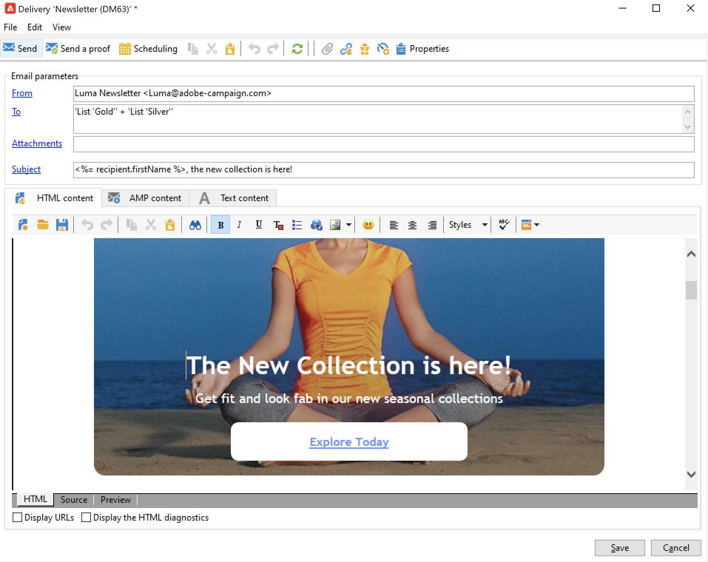

# Kom igång med meddelanden{#gs-ac-audiences}

Med Adobe Campaign kan ni skicka flerkanalskampanjer, inklusive e-post, SMS, push-meddelanden och direktreklam, och mäta hur effektiva de är med hjälp av olika dedikerade rapporter. Dessa meddelanden är utformade och skickas genom leveranser och kan anpassas för varje mottagare.

De viktigaste funktionerna är målinriktning, definition och personalisering av meddelanden, genomförande av kommunikation och tillhörande verksamhetsrapporter. Den huvudsakliga funktionella åtkomstpunkten är leveransassistenten. Den här åtkomstpunkten leder till flera funktioner som täcks av Adobe Campaign.

Lär dig hur du skapar en leverans i [Campaign Classic v7-dokumentationen](https://experienceleague.adobe.com/docs/campaign-classic/using/sending-messages/key-steps-when-creating-a-delivery/steps-about-delivery-creation-steps.html).

Adobe Campaign v8 har följande leveranskanaler:

* **E-postkanal**: Med e-postleveranser kan du skicka personaliserade e-postmeddelanden till målpopulationen. Läs mer i [den här sidan](../send/email.md).

* **Direktpostkanal**: Med direktutskick kan du generera en extraheringsfil som innehåller data om målpopulationen.  Läs mer i [den här sidan](../send/direct-mail.md)

* **Mobilkanal**: leveranser i mobilkanaler gör att du kan skicka personaliserat SMS till målpopulationen.  Läs mer i [den här sidan](../send/sms.md)

* **Mobil programkanal**: mobilappsleveranser gör att du kan skicka meddelanden till iOS- och Android-system.  Läs mer i [den här sidan](../send/push.md)

<!--
* **LINE channel**: LINE deliveries let you send messages on LINE, an instant messaging application available on all smartphones. Learn more in [this page](../send/line.md)
-->

## Välj hur du vill skicka meddelanden

När meddelandet har skapats och dess innehåll har utformats och testats kan du välja hur du vill skicka det. Campaign erbjuder en uppsättning funktioner för att:

* Skicka meddelanden manuellt till huvudmålet

   

   ↗️ Lär dig hur du skickar meddelanden i [Campaign Classic v7-dokumentation](https://experienceleague.adobe.com/docs/campaign-classic/using/sending-messages/sending-emails/sending-an-email/sending-messages.html){target=&quot;_blank&quot;}

* Skicka meddelanden som är kopplade till en [marknadsföringskampanj](campaigns.md)

   

   ↗️ Lär dig hur du skickar meddelanden i samband med en kampanj i [Campaign Classic v7-dokumentationen](https://experienceleague.adobe.com/docs/campaign-classic/using/orchestrating-campaigns/orchestrate-campaigns/marketing-campaign-deliveries.html){target=&quot;_blank&quot;}

* Skicka meddelanden via ett [arbetsflöde](../config/workflows.md)

   

   ↗️ Lär dig hur du automatiserar e-postleveranser i [Campaign Classic v7-dokumentation](https://experienceleague.adobe.com/docs/campaign-classic/using/automating-with-workflows/action-activities/delivery.html){target=&quot;_blank&quot;}

* [Utlös ](../send/transactional.md) meddelanden från en händelse ↗️  [Använd skiftläge: lära dig hur du skickar ett transaktionsmejl med en bifogad fil](https://experienceleague.adobe.com/docs/campaign-classic/using/transactional-messaging/transactional-email-with-attachments.html?lang=en){target=&quot;_blank&quot;}

* Schemalägg meddelanden

   

   ↗️ [Användningsfall: läs om schemat och skicka födelsedag via e-post](https://experienceleague.adobe.com/docs/campaign-classic/using/automating-with-workflows/use-cases/deliveries/sending-a-birthday-email.html?){target=&quot;_blank&quot;}

## Lägg till personalisering

Meddelanden från Adobe Campaign kan personaliseras på olika sätt.

Du kan:

* Infoga dynamiska personaliseringsfält.
↗️ Lär dig hur du använder anpassningsfält i [Campaign Classic v7-dokumentation](https://experienceleague.adobe.com/docs/campaign-classic/using/sending-messages/personalizing-deliveries/personalization-fields.html){target=&quot;_blank&quot;}
* Infoga fördefinierade personaliseringsblock.
↗️ Lär dig vad som är ett personaliseringsblock och hur du använder det i [Campaign Classic v7-dokumentation](https://experienceleague.adobe.com/docs/campaign-classic/using/sending-messages/personalizing-deliveries/personalization-blocks.html){target=&quot;_blank&quot;}
* Skapa villkorsstyrt innehåll.
↗️ Lär dig hur du infogar villkorsstyrt innehåll i [Campaign Classic v7-dokumentation](https://experienceleague.adobe.com/docs/campaign-classic/using/sending-messages/personalizing-deliveries/conditional-content.html){target=&quot;_blank&quot;}

## Skicka transaktionsmeddelanden

Transactional messaging (Message Center) är den Campaign-modul som är avsedd för hantering av utlösarmeddelanden.

? Läs mer om funktioner för transaktionsmeddelanden i [det här avsnittet](../dev/architecture.md#transac-msg-archi)

? Steg för att konfigurera och skicka transaktionsmeddelanden beskrivs i [den här sidan](../send/transactional.md)

↗️ Upptäck den här funktionen i ett slutanvändarfall i [Campaign Classic v7-dokumentation](https://experienceleague.adobe.com/docs/campaign-classic/using/transactional-messaging/transactional-email-with-attachments.html){target=&quot;_blank&quot;}

## Loggar för leverans och spårning

Att övervaka era leveranser efter att de har skickats är ett viktigt steg för att se till att era marknadsföringskampanjer är effektiva och når ut till era kunder. Du kan övervaka efter att du har skickat en leverans samt förstå hur leveransfel och karantäner hanteras.

↗️ Lär dig hur du övervakar leveranser i [Campaign Classic v7-dokumentation](https://experienceleague.adobe.com/docs/campaign-classic/using/sending-messages/monitoring-deliveries/about-delivery-monitoring.html#sending-messages){target=&quot;_blank&quot;}

**Dokumentation** för närliggande ämnen i Campaign Classic v7:

↗️ [Bästa praxis för leverans](https://experienceleague.adobe.com/docs/campaign-classic/using/sending-messages/key-steps-when-creating-a-delivery/delivery-bestpractices/delivery-best-practices.html){target=&quot;_blank&quot;}

↗️ [Testa och skicka ett e-postmeddelande](https://experienceleague.adobe.com/docs/campaign-classic/using/sending-messages/sending-emails/sending-an-email/sending-messages.html){target=&quot;_blank&quot;}

↗️ [Skicka korrektur](https://experienceleague.adobe.com/docs/campaign-classic/using/sending-messages/key-steps-when-creating-a-delivery/steps-validating-the-delivery.html){target=&quot;_blank&quot;}
