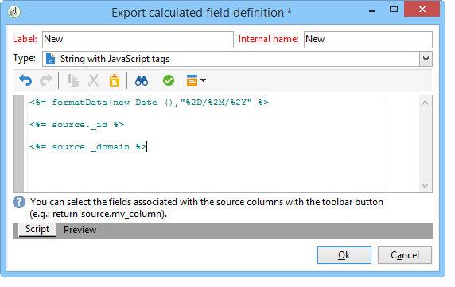

# Definiera filtervillkor{#filter-conditions}

Om du vill utforma frågan måste du välja filtervillkoren i frågeredigeraren. Tillgängliga funktioner och användningsexempel finns på den här sidan.

## Välj operator {#choose-operator}

Inom filtervillkoren måste du länka samman två värden med hjälp av en operator.

Nedan finns en lista över tillgängliga operatorer:

<table> 
 <thead> 
  <tr> 
   <th> Operatör  </th> 
   <th> Syfte  </th> 
   <th> Exempel  </th> 
  </tr> 
 </thead> 
 <tbody> 
  <tr> 
   <td> Equal to   </td> 
   <td> Returnerar ett resultat som är identiskt med de data som anges i den andra värdekolumnen.  </td> 
   <td> <strong>Efternamnet (@lastName) är lika med 'Jones'</strong>, returnerar bara mottagare vars efternamn är Jones.  </td> 
  </tr> 
  <tr> 
   <td> Greater than   </td> 
   <td> Returnerar ett värde som är större än det angivna värdet.  </td> 
   <td> <strong>Ålder (@age) större än 50</strong>, returnerar alla värden större än 50, dvs. 51, 52 osv.  </td> 
  </tr> 
  <tr> 
   <td> Less than   </td> 
   <td> Returnerar ett värde som är mindre än det angivna värdet.  </td> 
   <td> <strong>Skapad (@created) före 'DaysAgo(100)'</strong>, returnerar alla mottagare som skapats för mindre än 100 dagar sedan.  </td> 
  </tr> 
  <tr> 
   <td> Greater than or equal to   </td> 
   <td> Returnerar alla värden som är lika med eller större än det angivna värdet.  </td> 
   <td> <strong>Ålder (@age) som är större än eller lika med 30</strong> returnerar alla mottagare som är 30 år eller äldre.  </td> 
  </tr> 
  <tr> 
   <td> Less than or equal to   </td> 
   <td> Returnerar alla värden som är lika med eller lägre än det angivna värdet.  </td> 
   <td> <strong>Ålder (@age) mindre än eller lika med '60'</strong>, returnerar alla mottagare som är 60 år eller yngre.  </td> 
  </tr> 
  <tr> 
   <td> Inte lika med   </td> 
   <td> Returnerar alla värden som inte är identiska med det angivna värdet.  </td> 
   <td> <strong>Språket (@language) är lika med "English"</strong>.  </td> 
  </tr> 
  <tr> 
   <td> Börjar med   </td> 
   <td> Returnerar resultatet med början på det angivna värdet.  </td> 
   <td> <strong>Kontonr (@account) börjar med 32010.</strong>  </td> 
  </tr> 
  <tr> 
   <td> Börjar inte med    </td> 
   <td> Returnerar resultat som inte börjar med det angivna värdet   </td> 
   <td> <strong>Kontonumret (@account) börjar inte med </strong> . </td> 
  </tr> 
  <tr> 
   <td> Contains   </td> 
   <td> Returnerar resultaten som innehåller minst det angivna värdet.  </td> 
   <td> <strong>E-postdomänen (@domain) innehåller mail</strong>, returnerar alla domännamn som innehåller mail. Domänen gmail.com returneras alltså också.  </td> 
  </tr> 
  <tr> 
   <td> Innehåller inte    </td> 
   <td> Returnerar resultat som inte innehåller det angivna värdet.  </td> 
   <td> <strong>E-postdomänen (@domain) innehåller inte 'vo'</strong>. I det här fallet returneras inte domännamn som innehåller "vo". Domännamnet voila.fr visas inte i resultatet.  </td> 
  </tr> 
  <tr> 
   <td> Like   </td> 
   <td> Like är mycket lik operatören Contains. Du kan infoga ett % jokertecken i värdet.  </td> 
   <td> <strong>Efternamn (@lastName) som Jon%s</strong>. Här används jokertecknet som joker för att hitta namnet Jones om operatorn hade glömt den saknade bokstaven mellan n och s.  </td> 
  </tr> 
  <tr> 
   <td> Not like   </td> 
   <td> liknar Gilla . Du kan inte återställa det angivna värdet. Även här måste det angivna värdet innehålla jokertecknet %.  </td> 
   <td> <strong>Efternamnet (@lastName) är inte som Smi%h</strong>. Här returneras inte mottagare vars efternamn är Smi%h.  </td> 
  </tr> 
  <tr> 
   <td> Is empty   </td> 
   <td> I det här fallet matchar resultatet vi söker efter ett tomt värde i den andra värdekolumnen.  </td> 
   <td> <strong>Mobilen (@mobilePhone) är tom</strong> returnerar alla mottagare som inte har något mobilnummer.  </td> 
  </tr> 
  <tr> 
   <td> Är inte tom   </td> 
   <td> Fungerar i motsatt riktning till operatorn Är tom. Du behöver inte ange data i den andra värdekolumnen.  </td> 
   <td> <strong>E-post (@email) är inte tom</strong>.  </td> 
  </tr> 
  <tr> 
   <td> Ingår i    </td> 
   <td> Returnerar resultat som ingår i de angivna värdena. Dessa värden måste avgränsas med kommatecken.  </td> 
   <td> <strong>Födelsedatum (@bornDate) ingår i </strong> (12/10/1979, 12/10/1984), returnerar de mottagare som är födda mellan dessa datum.   </td> 
  </tr> 
  <tr> 
   <td> Ingår inte i    </td> 
   <td> Fungerar som operatorn Ingår i. Här vill vi exkludera mottagare baserat på de angivna värdena.  </td> 
   <td> <strong>Födelsedatum (@BirthDate) ingår inte i </strong> (12/10/1979, 12/10/1984). Till skillnad från i föregående exempel returneras inte mottagare som fötts inom dessa datum.  </td> 
  </tr> 
 </tbody> 
</table>

## ANVÄND OCH, ELLER, UTOM {#using-and--or--except}

För frågor som använder flera filtervillkor måste du definiera länkar mellan villkoren. Det finns tre möjliga länkar:

* **[!UICONTROL And]** låter dig kombinera två filtreringsvillkor,
* **[!UICONTROL Or]** låter dig erbjuda ett alternativ,
* Med **[!UICONTROL Except]** kan du definiera ett undantag.

Klicka på **[!UICONTROL And]** (erbjuds som standard) och välj i listrutan.

* **[!UICONTROL And]**: lägger till ett villkor och aktiverar överfiltrering.
* **[!UICONTROL Or]**: lägger till ett villkor och aktiverar överfiltrering.

  I följande exempel kan du söka efter mottagare vars e-postdomän innehåller &quot;orange.co.uk&quot; ELLER vars postkod börjar med &quot;NW&quot;.

  

* **[!UICONTROL Except]**: Om du har två filter och den första inte returnerar något värde, skapar den här typen av länk ett undantag.

  I följande exempel vill vi returnera mottagare vars e-postdomän innehåller &quot;orange.co.uk&quot; EXCEPT om mottagarens efternamn är &quot;Smith&quot;.

  

I det här exemplet visas ett filter som gör att du kan visa: mottagare som antingen talar spanska, ELLER är kvinnor med mobilnummer, ELLER mottagare utan kontonummer och vars företagsnamn börjar med bokstaven&quot;N&quot;.

## Prioritera villkor {#prioritizing-conditions}

I det här avsnittet beskrivs hur du prioriterar villkor tack vare de blå pilarna i verktygsfältet.

* Med pilen till höger kan du lägga till en nivå med parenteser i filtret.
* Med pilen som pekar åt vänster kan du ta bort en vald parentesnivå från filtret.

  

* Med de lodräta pilarna kan du flytta ett villkor och på så sätt ändra deras körningssekvens.

I det här exemplet visas hur du använder pilen för att ta bort en parentesnivå. Starta från följande filtreringsvillkor: **[!UICONTROL City equal to London OR gender equal to male and mobile not indicated OR account # starts with "95" and company name starts with "A"]**.

Placera markören på filtervillkoret **[!UICONTROL Gender (@gender) equal to Male]** och klicka på pilen **[!UICONTROL Remove a parenthesis level]**.

Villkoret **[!UICONTROL Gender (@gender) equal to Male]** har tagits bort ur parentesen. Den har flyttat till samma nivå som villkoret&quot;City equal to London&quot;. De här villkoren är sammankopplade (**[!UICONTROL And]**).

## Välj data som ska extraheras {#selecting-data-to-extract}

De tillgängliga fälten varierar mellan olika tabeller. Alla fält lagras i en huvudnod som kallas **[!UICONTROL Main element]**. I följande exempel finns de tillgängliga fälten i mottagartabellen. Fält visas alltid i bokstavsordning.

Det markerade fältets detaljrikedom visas längst ned i fönstret. Fältet **[!UICONTROL Email domain]** är till exempel ett **[!UICONTROL Calculated SQL field]** och dess tillägg är **[!UICONTROL (@domain)]**.

>[!NOTE]
>
>Använd verktyget **[!UICONTROL Search]** för att hitta ett tillgängligt fält.

Dubbelklicka på ett tillgängligt fält för att lägga till det i utdatakolumnerna. I slutet av frågan skapar varje markerat fält en kolumn i fönstret **[!UICONTROL Data preview]**.

Avancerade fält visas inte som standard. Klicka på **[!UICONTROL Display advanced fields]** längst ned till höger i de tillgängliga fälten för att visa allt. Klicka en gång till för att återgå till den tidigare vyn.

I mottagartabellen är de avancerade fälten till exempel **Boolean 1**, **[!UICONTROL Boolean 2]**, **[!UICONTROL Boolean 3]**, **[!UICONTROL Foreign key of "Folder" link]**.

I följande exempel visas de avancerade fälten i mottagartabellen.

De olika kategorierna av fält:

<table> 
 <thead> 
  <tr> 
   <th> Ikon  </th> 
   <th> Beskrivning  </th> 
   <th> Exempel   </th> 
  </tr> 
 </thead> 
 <tbody> 
  <tr> 
   <td>  </td> 
   <td> Enkelt fält   </td> 
   <td> E-post, kön osv.  </td> 
  </tr> 
  <tr> 
   <td>  </td> 
   <td> Primärnyckel. Det här SQL-fältet är ett sätt att identifiera en post i en tabell.  </td> 
   <td> Identifierarmottagare är primära nycklar och identifierare är unika per definition.  </td> 
  </tr> 
  <tr> 
   <td>  </td> 
   <td> Sekundärnyckel. Används som en länk till en annan tabell.  </td> 
   <td> Mottagarens sekundärnyckel, tjänstens externa nyckel osv.  </td> 
  </tr> 
  <tr> 
   <td>  </td> 
   <td> Beräknat fält. Den här typen av fält beräknas på begäran med värdena i databasen.  </td> 
   <td> Ålder, e-postdomän osv.  </td> 
  </tr> 
  <tr> 
   <td>  </td> 
   <td> Fält som innehåller långa texter.  </td> 
   <td> Kommentar, fullständig adress osv.  </td> 
  </tr> 
  <tr> 
   <td>  </td> 
   <td> Indexerat SQL-fält.   </td> 
   <td> Fullständigt namn, ISO-kod osv.   </td> 
  </tr> 
 </tbody> 
</table>

Länka till en tabell och ett samlingselement:

<table> 
 <thead> 
  <tr> 
   <th> Ikon  </th> 
   <th> Beskrivning  </th> 
   <th> Exempel  </th> 
  </tr> 
 </thead> 
 <tbody> 
  <tr> 
   <td>  </td> 
   <td> Länkar till en tabell i synnerhet. Dessa sammanfaller med 1-1-typassociationer. En förekomst av källtabellen kan bara sammanfalla med en förekomst av måltabellen. Till exempel kan bara en mottagare länkas till ett land.  </td> 
   <td> Mapp, delstat, land osv.   </td> 
  </tr> 
  <tr> 
   <td>  </td> 
   <td> Samlingselement i en viss tabell. Dessa sammanfaller med 1-N-typassociationer. En källtabellförekomst kan sammanfalla med flera förekomster av måltabellen, men en förekomst av måltabellen kan sammanfalla med endast en förekomst av källtabellen. En mottagare kan till exempel prenumerera på 'n'-prenumerationsbrev.  </td> 
   <td> Prenumerationer, listor, undantagsloggar osv.  </td> 
  </tr> 
 </tbody> 
</table>

>[!NOTE]
>
>* Använd knappen **[!UICONTROL Add]** (ovanför sidikonfältet) för att lägga till en utdatakolumn där vi vill redigera uttrycket. Mer information om hur du redigerar ett uttryck finns i [det här avsnittet](#building-expressions).
>* Ta bort en utdatakolumn genom att klicka på den röda x (**Ta bort**).
>* Ändra ordningen på utdatakolumnerna med hjälp av pilarna.
>* **[!UICONTROL Distribution of values]** fungerar som ett sätt att visa fördelningen av värdena för det valda fältet (t.ex. distributioner som är kopplade till mottagarorter, mottagarspråk osv.).

## Skapa beräknade fält {#creating-calculated-fields}

Om det behövs lägger du till en kolumn under dataformatering. Ett beräkningsfält lägger till en kolumn i dataförhandsvisningsavsnittet. Klicka på **[!UICONTROL Add a calculated field]**.

Det finns fyra typer av beräknade fält:

* **[!UICONTROL Fixed string]**: gör att du kan lägga till en teckensträng.

  

* **[!UICONTROL String with JavaScript tags]**: Värdet för beräkningsfältet kombinerar en teckensträng och JavaScript-direktiv.

  

* **[!UICONTROL JavaScript expression]**: Värdet för beräkningsfältet är resultatet av en JavaScript-funktionsutvärdering. Det returnerade värdet kan skrivas in (tal, datum osv.).

  

* **[!UICONTROL Enumerations]**: Med den här typen av fält kan du använda/ändra innehållet i en av utdatakolumnerna i en ny kolumn.

  Det går att använda källvärdet för en kolumn och ge den ett målvärde. Det här målvärdet visas i den nya utdatakolumnen.

  Ett exempel på hur du lägger till den beräknade fälttypen **[!UICONTROL Enumerations]** finns i [det här avsnittet](../../workflow/using/adding-enumeration-type-calculated-field.md).

  

  Beräkningsfältet av typen **[!UICONTROL Enumerations]** kan innehålla fyra villkor:

   * **[!UICONTROL Keep the source value]** återställer källvärdet till målet utan att ändra det.
   * Med **[!UICONTROL Use the following value]** kan du ange ett standardmålvärde för icke-definierade källvärden.
   * **[!UICONTROL Generate a warning and continue]** varnar användaren om att källvärdet inte kan ändras.
   * **[!UICONTROL Generate an error and reject the line]** förhindrar att raden beräknas och importeras.

Klicka på **[!UICONTROL Detail of calculated field]** om du vill visa detaljerna för det infogade fältet.

Klicka på krysset **[!UICONTROL Remove the calculated field]** om du vill ta bort det här beräknade fältet.

## Skapa uttryck {#building-expressions}

Med uttrycksredigeringsverktyget kan du beräkna aggregeringar, generera funktioner eller redigera en formel med hjälp av ett uttryck.

I följande exempel visas hur du kör ett antal på en primärnyckel.

Använd följande steg:

1. Klicka på **[!UICONTROL Add]** i fönstret **[!UICONTROL Data to extract]**. I fönstret **[!UICONTROL Formula type]** väljer du en typ av formel att ange uttrycket för.

   Det finns flera typer av formler: **[!UICONTROL Field only]**, **[!UICONTROL Aggregate]**, **[!UICONTROL Expression]**.

   Välj **[!UICONTROL Process on an aggregate function]** och **[!UICONTROL Count]**. Klicka på **[!UICONTROL Next]**.

   

1. Primärnyckeln beräknas.

   

Här är en detaljerad vy över de alternativ som är tillgängliga i fönstret **[!UICONTROL Formula types]**:

1. **[!UICONTROL Field only]** låter dig återgå till fönstret **[!UICONTROL Field to select]**.
1. **[!UICONTROL Aggregate (Process on an aggregate function)]**. Här är några exempel på användning av ballast:

   * Med **[!UICONTROL Count]** kan du köra ett primärnyckelantal.
   * Med **[!UICONTROL Sum]** kan du lägga till alla inköp som gjorts av en kund under ett år.
   * Med **[!UICONTROL Maximum value]** kan du hitta de kunder som har köpt de mest&quot;n&quot;-produkterna.
   * Med **[!UICONTROL Minimum value]** kan du sortera bland kunder och hitta de som senast har prenumererat på ett erbjudande.
   * **[!UICONTROL Average]**. Med den här funktionen kan du beräkna medelåldern för mottagarna.

     I rutan **[!UICONTROL Distinct]** kan du återställa unika värden och värden som inte är noll i en kolumn. Du kan till exempel återställa alla en mottagares spårningsloggar och dessa spårningsloggar ändras till värdet 1 eftersom alla gäller samma mottagare.

1. **[!UICONTROL Expression]** öppnar fönstret **[!UICONTROL Edit the expression]**. Detta gör att du kan identifiera telefonnummer med för många siffror, vilket sannolikt är indatafel.

   

   En lista över alla tillgängliga funktioner finns i [Lista över funktioner](#list-of-functions).

## Lista över funktioner {#list-of-functions}

Om du väljer en **[!UICONTROL Expression]**-typformel kommer du till fönstret&quot;redigera uttrycket&quot;. Olika funktionskategorier kan kopplas till de tillgängliga fälten: **[!UICONTROL Aggregates]**, **[!UICONTROL String]**, **[!UICONTROL Date]**, **[!UICONTROL Numerical]**, **[!UICONTROL Currency]**, **[!UICONTROL Geomarketing]**, **[!UICONTROL Windowing function]** och **[!UICONTROL Others]**.

Uttrycksredigeraren ser ut så här:

Här kan du markera fält i databastabellerna och lägga till avancerade funktioner. Följande funktioner är tillgängliga:

**Aggregat**

<table> 
 <tbody> 
  <tr> 
   <td> <strong>Namn</strong>  </td> 
   <td> <strong>Beskrivning</strong>  </td> 
   <td> <strong>Syntax</strong>  </td> 
  </tr> 
  <tr> 
   <td> <strong>Medel</strong>  </td> 
   <td> Returnerar medelvärdet för en taltypskolumn   </td> 
   <td> Avg(&lt;värde&gt;) </td> 
  </tr> 
  <tr> 
   <td> <strong>Antal</strong>  </td> 
   <td> Räknar värden som inte är null i en kolumn   </td> 
   <td> Count(&lt;värde&gt;) </td>  
  </tr> 
  <tr> 
   <td> <strong>CountAll</strong>  </td> 
   <td> Räknar returnerade värden (alla fält)  </td> 
   <td> CountAll()  </td> 
  </tr> 
  <tr> 
   <td> <strong>Motskild</strong>  </td> 
   <td> Räknar distinkta icke-null-värden för en kolumn   </td> 
   <td> Countdistans(&lt;värde&gt;) </td> 
  </tr> 
  <tr> 
   <td> <strong>Max</strong>  </td> 
   <td> Returnerar det maximala värdet för en tal-, sträng- eller datumtypskolumn   </td> 
   <td> Max(&lt;värde&gt;) </td>  
  </tr> 
  <tr> 
   <td> <strong>Min</strong>  </td> 
   <td> Returnerar det minsta värdet för en tal-, sträng- eller datumtypskolumn   </td> 
   <td> Min(&lt;värde&gt;) </td> 
  </tr> 
  <tr> 
   <td> <strong>StdDev</strong>  </td> 
   <td> Returnerar standardavvikelsen för ett tal, en sträng eller en datumkolumn   </td> 
   <td> StdDev(&lt;värde&gt;) </td> 
  </tr> 
  <tr> 
   <td> <strong>Summa</strong>  </td> 
   <td> Returnerar summan av värdena för en tal-, sträng- eller datumtypskolumn   </td> 
   <td> Sum(&lt;värde&gt;) </td> 
  </tr> 
 </tbody> 
</table>

**Sträng**

<table> 
 <tbody> 
  <tr> 
   <td> <strong>Namn</strong>  </td> 
   <td> <strong>Beskrivning</strong>  </td> 
   <td> <strong>Syntax</strong>  </td> 
  </tr> 
  <tr> 
   <td> <strong>AllNonNull2</strong>  </td> 
   <td> Anger om alla parametrar inte är null och inte tomma  </td> 
   <td> AllNonNull2(&lt;sträng&gt;, &lt;sträng&gt;) </td> 
  </tr> 
  <tr> 
   <td> <strong>AllNonNull3</strong>  </td> 
   <td> Anger om alla parametrar inte är null och inte tomma  </td> 
   <td> AllNonNull3(&lt;sträng&gt;, &lt;sträng&gt;, &lt;sträng&gt;) </td> 
  </tr> 
  <tr> 
   <td> <strong>Ascii</strong>  </td> 
   <td> Returnerar ASCII-värdet för det första tecknet i strängen.  </td> 
   <td> Ascii(&lt;sträng&gt;) </td> 
  </tr> 
  <tr> 
   <td> <strong>Char</strong>  </td> 
   <td> Returnerar tecknet som motsvarar ASCII-koden "n"  </td> 
   <td> Char(&lt;tal&gt;) </td>  
  </tr> 
  <tr> 
   <td> <strong>Charindex</strong>  </td> 
   <td> Returnerar positionen för sträng 2 i sträng 1.  </td> 
   <td> Charindex(&lt;sträng&gt;, &lt;sträng&gt;) </td> 
  </tr> 
  <tr> 
   <td> <strong>GetLine</strong>  </td> 
   <td> Returnerar den n:e raden (från 1 till n) i strängen  </td> 
   <td> GetLine(&lt;sträng&gt;) </td> 
  </tr> 
  <tr> 
   <td> <strong>IfEquals</strong>  </td> 
   <td> Returnerar den tredje parametern om de två första parametrarna är lika. Om inte returneras den sista parametern   </td> 
   <td> IfEquals(&lt;sträng&gt;, &lt;sträng&gt;, &lt;sträng&gt;, &lt;sträng&gt;) </td> 
  </tr> 
  <tr> 
   <td> <strong>IsMemoNull</strong>  </td> 
   <td> Anger om PM:et som skickas som en parameter är null  </td> 
   <td> IsMemoNull(&lt;PM&gt;) </td> 
  </tr> 
  <tr> 
   <td> <strong>JuxtWords</strong>  </td> 
   <td> Sammanfogar de strängar som skickas som parametrar. Lägger till blanksteg mellan strängarna om det behövs.  </td> 
   <td> JuxtWords(&lt;sträng&gt;, &lt;sträng&gt;) </td> 
  </tr> 
  <tr> 
   <td> <strong>JuxtWords3</strong>  </td> 
   <td> Sammanfogar de strängar som skickas som parametrar. Lägger till blanksteg mellan strängarna om det behövs   </td> 
   <td> JuxtWords3(&lt;sträng&gt;, &lt;sträng&gt;, &lt;sträng&gt;) </td>  
  </tr> 
  <tr> 
   <td> <strong>LPad</strong>  </td> 
   <td> Returnerar den slutförda strängen till vänster  </td> 
   <td> LPad(&lt;sträng&gt;, &lt;tal&gt;, &lt;tecken&gt;) </td> 
  </tr> 
  <tr> 
   <td> <strong>Left</strong>  </td> 
   <td> Returnerar de första n tecknen i strängen  </td> 
   <td> Left(&lt;sträng&gt;, &lt;tal&gt;) </td> 
  </tr> 
  <tr> 
   <td> <strong>Length</strong>  </td> 
   <td> Returnerar längden på strängen   </td> 
   <td> Length(&lt;sträng&gt;) </td> 
  </tr> 
  <tr> 
   <td> <strong>Lower</strong>  </td> 
   <td> Returnerar strängen i gemener  </td> 
   <td> Lower(&lt;sträng&gt;) </td> 
  </tr> 
  <tr> 
   <td> <strong>Ltrim</strong>  </td> 
   <td> Tar bort blanksteg till vänster om strängen  </td> 
   <td> Ltrim(&lt;sträng&gt;) </td> 
  </tr> 
  <tr> 
   <td> <strong>Md5Digest</strong>  </td> 
   <td> Returnerar en hexadecimal representation av MD5-nyckeln för en sträng  </td> 
   <td> Md5Digest(&lt;sträng&gt;) </td> 
  </tr> 
  <tr> 
   <td> <strong>PMContains</strong>  </td> 
   <td> Anger om PM:et innehåller den sträng som skickas som en parameter  </td> 
   <td> MemoContains(&lt;PM&gt;, &lt;sträng&gt;) </td> 
  </tr> 
  <tr> 
   <td> <strong>RPad</strong>  </td> 
   <td> Returnerar den slutförda strängen till höger  </td> 
   <td> RPad(&lt;sträng&gt;, &lt;tal&gt;, &lt;tecken&gt;) </td> 
  </tr> 
  <tr> 
   <td> <strong>Right</strong>  </td> 
   <td> Returnerar de sista n tecknen i strängen  </td> 
   <td> Right(&lt;sträng&gt;)  </td> 
  </tr> 
  <tr> 
   <td> <strong>Rtrim</strong>  </td> 
   <td> Tar bort blanksteg till höger om strängen  </td> 
   <td> Rtrim(&lt;sträng&gt;)  </td> 
  </tr> 
  <tr> 
   <td> <strong>Smart</strong>  </td> 
   <td> Returnerar strängen med den första bokstaven i varje ord med versaler  </td> 
   <td> Smart(&lt;sträng&gt;)  </td> 
  </tr> 
  <tr> 
   <td> <strong>Substring</strong>  </td> 
   <td> Extraherar delsträngen från tecken n1 i strängen och med längden n2  </td> 
   <td> Substring(&lt;sträng&gt;, &lt;offset&gt;, &lt;längd&gt;)  </td>  
  </tr> 
  <tr> 
   <td> <strong>ToString</strong>  </td> 
   <td> Konverterar talet till en sträng  </td> 
   <td> ToString(&lt;tal&gt;, &lt;tal&gt;)  </td>  
  </tr> 
  <tr> 
   <td> <strong>Upper</strong>  </td> 
   <td> Returnerar strängen med versaler  </td> 
   <td> Upper(&lt;sträng&gt;)  </td>  
  </tr> 
  <tr> 
   <td> <strong>VirtualLink</strong>  </td> 
   <td> Returnerar sekundärnyckeln för en länk som skickas som en parameter om de andra två parametrarna är lika  </td> 
   <td> VirtualLink(&lt;tal&gt;, &lt;tal&gt;, &lt;tal&gt;)  </td>  
  </tr> 
  <tr> 
   <td> <strong>VirtualLinkStr</strong>  </td> 
   <td> Returnerar sekundärnyckeln (text) för en länk som skickas som en parameter om de andra två parametrarna är lika  </td> 
   <td> VirtualLinkStr(&lt;sträng&gt;, &lt;tal&gt;, &lt;tal&gt;)  </td>  
  </tr> 
  <tr> 
   <td> <strong>dataLength</strong>  </td> 
   <td> Returnerar strängstorleken   </td> 
   <td> dataLength(&lt;sträng&gt;)  </td>  
  </tr> 
 </tbody> 
</table>

**Datum**

<table> 
 <tbody> 
  <tr> 
   <td> <strong>Namn</strong>  </td> 
   <td> <strong>Beskrivning</strong>  </td> 
   <td> <strong>Syntax</strong>  </td> 
  </tr> 
  <tr> 
   <td> <strong>AddDays</strong>  </td> 
   <td> Lägger till ett antal dagar till ett datum  </td> 
   <td> AddDays(&lt;datum&gt;, &lt;tal&gt;)  </td>  
  </tr> 
  <tr> 
   <td> <strong>AddHours</strong>  </td> 
   <td> Lägger till ett antal timmar till ett datum  </td> 
   <td> AddHours(&lt;datum&gt;, &lt;tal&gt;)  </td>  
  </tr> 
  <tr> 
   <td> <strong>AddMinutes</strong>  </td> 
   <td> Lägger till ett antal minuter till ett datum  </td> 
   <td> AddMinutes(&lt;datum&gt;, &lt;tal&gt;)  </td>  
  </tr> 
  <tr> 
   <td> <strong>AddMonths</strong>  </td> 
   <td> Lägger till ett antal månader till ett datum  </td> 
   <td> AddMonths(&lt;datum&gt;, &lt;tal&gt;)  </td>  
  </tr> 
  <tr> 
   <td> <strong>AddSeconds</strong>  </td> 
   <td> Lägger till ett antal sekunder till ett datum  </td> 
   <td> AddSeconds(&lt;datum&gt;, &lt;tal&gt;)  </td>  
  </tr> 
  <tr> 
   <td> <strong>AddYears</strong>  </td> 
   <td> Lägger till ett antal år till ett datum  </td> 
   <td> AddYears(&lt;datum&gt;, &lt;tal&gt;)  </td>  
  </tr> 
  <tr> 
   <td> <strong>DateOnly</strong>  </td> 
   <td> Returnerar endast datumet (med tiden 00:00)*  </td> 
   <td> DateOnly(&lt;datum&gt;)  </td>  
  </tr> 
  <tr> 
   <td> <strong>Day</strong>  </td> 
   <td> Returnerar talet som representerar dagen på datumet  </td> 
   <td> Day(&lt;datum&gt;)  </td>  
  </tr> 
  <tr> 
   <td> <strong>DayOfYear</strong>  </td> 
   <td> Returnerar antalet dagar i året för datumet   </td> 
   <td> DayOfYear(&lt;datum&gt;)  </td>  
  </tr> 
  <tr> 
   <td> <strong>DaysAgo</strong>  </td> 
   <td> Returnerar det datum som motsvarar aktuellt datum minus n dagar   </td> 
   <td> DaysAgo(&lt;tal&gt;)  </td>  
  </tr> 
  <tr> 
   <td> <strong>DaysAgoInt</strong>  </td> 
   <td> Returnerar det datum (heltal åååmmdd) som motsvarar det aktuella datumet minus n dagar   </td> 
   <td> DaysAgoInt(&lt;tal&gt;)  </td>  
  </tr> 
  <tr> 
   <td> <strong>DaysDiff</strong>  </td> 
   <td> Antal dagar mellan två datum  </td> 
   <td> DaysDiff(&lt;slutdatum&gt;, &lt;startdatum&gt;)  </td>  
  </tr> 
  <tr> 
   <td> <strong>DaysOld</strong>  </td> 
   <td> Returnerar åldern i dagar för ett datum  </td> 
   <td> DaysOld(&lt;datum&gt;)  </td>  
  </tr> 
  <tr> 
   <td> <strong>GetDate</strong>  </td> 
   <td> Returnerar serverns aktuella systemdatum  </td> 
   <td> GetDate()  </td> 
  </tr> 
  <tr> 
   <td> <strong>Hour</strong>  </td> 
   <td> Returnerar timmen för datumet  </td> 
   <td> Hour(&lt;datum&gt;)  </td>  
  </tr> 
  <tr> 
   <td> <strong>HoursDiff</strong>  </td> 
   <td> Returnerar antalet timmar mellan två datum  </td> 
   <td> HoursDiff(&lt;slutdatum&gt;, &lt;startdatum&gt;)  </td>  
  </tr> 
  <tr> 
   <td> <strong>Minute</strong>  </td> 
   <td> Returnerar minuterna av datumet  </td> 
   <td> Minute(&lt;datum&gt;)  </td>  
  </tr> 
  <tr> 
   <td> <strong>MinutesDiff</strong>  </td> 
   <td> Returnerar antalet minuter mellan två datum  </td> 
   <td> MinutesDiff(&lt;slutdatum&gt;, &lt;startdatum&gt;)  </td>  
  </tr> 
  <tr> 
   <td> <strong>Month</strong>  </td> 
   <td> Returnerar talet som representerar månaden för datumet  </td> 
   <td> Month(&lt;datum&gt;)  </td>  
  </tr> 
  <tr> 
   <td> <strong>MonthsAgo</strong>  </td> 
   <td> Returnerar det datum som motsvarar aktuellt datum minus n månader  </td> 
   <td> MonthsAgo(&lt;tal&gt;)  </td>  
  </tr> 
  <tr> 
   <td> <strong>MonthsDiff</strong>  </td> 
   <td> Returnerar antalet månader mellan två datum  </td> 
   <td> MonthsDiff(&lt;slutdatum&gt;, &lt;startdatum&gt;)  </td>  
  </tr> 
  <tr> 
   <td> <strong>MonthsOld</strong>  </td> 
   <td> Returnerar åldern i månader för ett datum  </td> 
   <td> MonthsOld(&lt;datum&gt;)  </td>  
  </tr> 
  <tr> 
   <td> <strong>Second</strong>  </td> 
   <td> Returnerar sekunder för datumet  </td> 
   <td> Second(&lt;datum&gt;)  </td>  
  </tr> 
  <tr> 
   <td> <strong>SecondsDiff</strong>  </td> 
   <td> Returnerar antalet sekunder mellan två datum  </td> 
   <td> SecondsDiff(&lt;slutdatum&gt;, &lt;startdatum&gt;)  </td>  
  </tr> 
  <tr> 
   <td> <strong>SubDays</strong>  </td> 
   <td> Subtraherar ett antal dagar från ett datum  </td> 
   <td> SubDays(&lt;datum&gt;, &lt;tal&gt;)  </td>  
  </tr> 
  <tr> 
   <td> <strong>SubHours</strong>  </td> 
   <td> Subtraherar ett antal timmar från ett datum  </td> 
   <td> SubHours(&lt;datum&gt;, &lt;tal&gt;)  </td>  
  </tr> 
  <tr> 
   <td> <strong>SubMinutes</strong>  </td> 
   <td> Subtraherar ett antal minuter från ett datum  </td> 
   <td> SubMinutes(&lt;datum&gt;, &lt;tal&gt;)  </td>  
  </tr> 
  <tr> 
   <td> <strong>SubMonths</strong>  </td> 
   <td> Subtraherar ett antal månader från ett datum  </td> 
   <td> SubMonths(&lt;datum&gt;, &lt;tal&gt;)  </td>  
  </tr> 
  <tr> 
   <td> <strong>SubSeconds</strong>  </td> 
   <td> Subtraherar ett antal sekunder från ett datum  </td> 
   <td> SubSeconds(&lt;datum&gt;, &lt;tal&gt;)  </td>  
  </tr> 
  <tr> 
   <td> <strong>SubYears</strong>  </td> 
   <td> Subtraherar ett antal år från ett datum  </td> 
   <td> SubYears(&lt;datum&gt;, &lt;tal&gt;)  </td>  
  </tr> 
  <tr> 
   <td> <strong>ToDate</strong>  </td> 
   <td> Konverterar ett datum + tid som ett datum  </td> 
   <td> ToDate(&lt;datum + tid&gt;)  </td>  
  </tr> 
  <tr> 
   <td> <strong>ToDateTime</strong>  </td> 
   <td> Konverterar en sträng till ett datum + tid  </td> 
   <td> ToDateTime(&lt;sträng&gt;)  </td>  
  </tr> 
  <tr> 
   <td> <strong>TruncDate</strong>  </td> 
   <td> Avrundar ett datum + tid till närmaste sekund  </td> 
   <td> TruncDate(@lastModified, &lt;antal sekunder&gt;)  </td> 
  </tr> 
  <tr> 
   <td> <strong>TruncDateTZ</strong>  </td> 
   <td> Avrundar ett datum + tid till en viss precision, uttryckt i sekunder  </td> 
   <td> TruncDateTZ(&lt;datum&gt;, &lt;antal sekunder&gt;, &lt;tidszon&gt;)  </td> 
  </tr> 
  <tr> 
   <td> <strong>TruncQuarter</strong>  </td> 
   <td> Avrundar ett datum till kvartal  </td> 
   <td> TruncQuarter(&lt;datum&gt;)  </td>  
  </tr> 
  <tr> 
   <td> <strong>TruncTime</strong>  </td> 
   <td> Avrundar tidsdelen upp till närmaste sekund  </td> 
   <td> TruncTim(e&lt;datum&gt;, &lt;antal sekunder&gt;)  </td>  
  </tr> 
  <tr> 
   <td> <strong>TruncWeek</strong>  </td> 
   <td> Avrundar ett datum till veckan  </td> 
   <td> TruncWeek(&lt;datum&gt;)  </td>  
  </tr> 
  <tr> 
   <td> <strong>TruncYear</strong>  </td> 
   <td> Avrundar ett datum + tid till 1 januari under året  </td> 
   <td> TruncYear(&lt;datum&gt;)  </td>  
  </tr> 
  <tr> 
   <td> <strong>TruncWeek</strong>  </td> 
   <td> Returnerar talet som representerar dagen i veckan på datumet  </td> 
   <td> WeekDay(&lt;datum&gt;)  </td>  
  </tr> 
  <tr> 
   <td> <strong>Year</strong>  </td> 
   <td> Returnerar talet som representerar datumåret  </td> 
   <td> Year(&lt;datum&gt;)  </td>  
  </tr> 
  <tr> 
   <td> <strong>YearAnd Month</strong>  </td> 
   <td> Returnerar talet som representerar året och månaden på datumet  </td> 
   <td> YearAndMonth(&lt;datum&gt;)  </td>  
  </tr> 
  <tr> 
   <td> <strong>YearsDiff</strong>  </td> 
   <td> Returnerar antalet år mellan de två datumen  </td> 
   <td> YearsDiff(&lt;slutdatum&gt;, &lt;startdatum&gt;)  </td>  
  </tr> 
  <tr> 
   <td> <strong>YearsOld</strong>  </td> 
   <td> Returnerar åldern i år för ett datum  </td> 
   <td> YearsOld(&lt;datum&gt;)  </td>  
  </tr> 
 </tbody> 
</table>

>[!NOTE]
>
>Observera att funktionen **Dateonly** tar hänsyn till serverns tidszon, inte till operatorns.

**Numeriskt**

<table> 
 <tbody> 
  <tr> 
   <td> <strong>Namn</strong>  </td> 
   <td> <strong>Beskrivning</strong>  </td> 
   <td> <strong>Syntax</strong>  </td> 
  </tr> 
  <tr> 
   <td> <strong>Abs</strong>  </td> 
   <td> Returnerar det absoluta värdet av ett tal  </td> 
   <td> Abs(&lt;tal&gt;)  </td>  
  </tr> 
  <tr> 
   <td> <strong>Ceil</strong>  </td> 
   <td> Returnerar det lägsta heltalet som är större än eller lika med ett tal  </td> 
   <td> Ceil(&lt;tal&gt;)  </td>  
  </tr> 
  <tr> 
   <td> <strong>Floor</strong>  </td> 
   <td> Returnerar det största heltalet större än eller lika med ett tal   </td> 
   <td> Floor(&lt;tal&gt;)  </td>  
  </tr> 
  <tr> 
   <td> <strong>Greatest</strong>  </td> 
   <td> Returnerar det största av två tal  </td> 
   <td> Greatest(&lt;tal 1&gt;, &lt;tal 2&gt;)  </td>  
  </tr> 
  <tr> 
   <td> <strong>Least</strong>  </td> 
   <td> Returnerar det minsta av två tal  </td> 
   <td> Minst(&lt;tal 1&gt;, &lt;tal 2&gt;)  </td>  
  </tr> 
  <tr> 
   <td> <strong>Mod</strong>  </td> 
   <td> Returnerar resten av heltalsdivisionen av n1 med n2  </td> 
   <td> Mod(&lt;tal 1&gt;, &lt;tal 2&gt;)  </td>  
  </tr> 
  <tr> 
   <td> <strong>Procent</strong>  </td> 
   <td> Returnerar förhållandet mellan två tal uttryckta i procent  </td> 
   <td> Procent(&lt;tal 1&gt;, &lt;tal 2&gt;)  </td>  
  </tr> 
  <tr> 
   <td> <strong>Random</strong>  </td> 
   <td> Returnerar det slumpmässiga värdet  </td> 
   <td> Random()  </td> 
  </tr> 
  <tr> 
   <td> <strong>Round</strong>  </td> 
   <td> Avrundar ett tal till n decimaler  </td> 
   <td> Round(&lt;tal&gt;, &lt;antal decimaler&gt;)  </td>  
  </tr> 
  <tr> 
   <td> <strong>Sign</strong>  </td> 
   <td> Returnerar talets tecken  </td> 
   <td> Sign(&lt;tal&gt;)  </td>  
  </tr> 
  <tr> 
   <td> <strong>ToDouble</strong>  </td> 
   <td> Konverterar ett heltal till ett flyttal  </td> 
   <td> ToDouble(&lt;tal&gt;)  </td>  
  </tr> 
  <tr> 
   <td> <strong>ToInt64</strong>  </td> 
   <td> Konverterar ett flyttal till ett 64-bitars heltal  </td> 
   <td> ToInt64(&lt;tal&gt;)  </td>  
  </tr> 
  <tr> 
   <td> <strong>ToInteger</strong>  </td> 
   <td> Konverterar ett flyttal till ett heltal  </td> 
   <td> ToInteger(&lt;tal&gt;)  </td>  
  </tr> 
  <tr> 
   <td> <strong>Trunc</strong>  </td> 
   <td> Trunkerar n1 till n2 decimaler  </td> 
   <td> Trunc(&lt;n1&gt;, &lt;n2&gt;)  </td>  
  </tr> 
 </tbody> 
</table>

1. Valuta

<table> 
 <tbody> 
  <tr> 
   <td> <strong>Namn</strong>  </td> 
   <td> <strong>Beskrivning</strong>  </td> 
   <td> <strong>Syntax</strong>  </td> 
  </tr> 
  <tr> 
   <td> <strong>ConvertCurrency</strong>  </td> 
   <td> Konverterar ett belopp i en källvaluta till ett belopp i målvalutan   </td> 
   <td> ConvertCurrency(&lt;belopp&gt;, &lt;källvaluta&gt;, &lt;målvaluta&gt;, &lt;konverteringsdatum&gt;)  </td>  
  </tr> 
  <tr> 
   <td> <strong>FormatCurrency</strong>  </td> 
   <td> Formaterar det belopp som visas baserat på de valda valutainställningarna   </td> 
   <td> FormatCurrency(&lt;belopp&gt;, &lt;valuta&gt;)  </td>  
  </tr> 
 </tbody> 
</table>

**Geomarketing**

<table> 
 <tbody> 
  <tr> 
   <td> <strong>Namn</strong>  </td> 
   <td> <strong>Beskrivning</strong>  </td> 
   <td> <strong>Syntax</strong>  </td> 
  </tr> 
  <tr> 
   <td> <strong>Avstånd</strong>  </td> 
   <td> Returnerar avståndet mellan två punkter som definieras av deras longitud och latitud, uttryckt i grader.  </td> 
   <td> Distance(&lt;longitud A&gt;, &lt;latitud A&gt;, &lt;longitud B&gt;, &lt;latitud B&gt;)  </td>  
  </tr> 
 </tbody> 
</table>

**Övriga**

<table> 
 <tbody> 
  <tr> 
   <td> <strong>Namn</strong>  </td> 
   <td> <strong>Beskrivning</strong>  </td> 
   <td> <strong>Syntax</strong>  </td> 
  </tr> 
  <tr> 
   <td> <strong>Case</strong>  </td> 
   <td> Returnerar värdet 1 om villkoret är sant. Annars returneras värdet 2.  </td> 
   <td> Case(When(&lt;villkor&gt;, &lt;värde 1&gt;), Else(&lt;värde 2&gt;))  </td> 
  </tr> 
  <tr> 
   <td> <strong>ClearBit</strong>  </td> 
   <td> Tar bort flaggan i värdet  </td> 
   <td> ClearBit(&lt;identifierare&gt;, &lt;flagga&gt;)  </td>  
  </tr> 
  <tr> 
   <td> <strong>Coalesce</strong>  </td> 
   <td> Returnerar värde 2 om värde 1 är noll eller null, annars returneras värde 1  </td> 
   <td> Coalesce(&lt;värde 1&gt;, &lt;värde 2&gt;)  </td>  
  </tr> 
  <tr> 
   <td> <strong>Decode</strong>  </td> 
   <td> Returnerar värde 3 om värde 1 = värde 2. Om inte returnerar värde 4.  </td> 
   <td> Decode(&lt;värde 1&gt;, &lt;värde 2&gt;, &lt;värde 3&gt;, &lt;värde 4&gt;)  </td>  
  </tr> 
  <tr> 
   <td> <strong>Else</strong>  </td> 
   <td> Returnerar värde 1 (kan endast användas som en parameter för case-funktionen)  </td> 
   <td> Else(&lt;värde 1&gt;, &lt;värde 2&gt;)  </td>  
  </tr> 
  <tr> 
   <td> <strong>GetEmailDomain</strong>  </td> 
   <td> Extraherar domänen från en e-postadress  </td> 
   <td> GetEmailDomain(&lt;värde&gt;)  </td>  
  </tr> 
  <tr> 
   <td> <strong>GetMirrorURL</strong>  </td> 
   <td> Hämtar URL:en för spegelsidservern  </td> 
   <td> GetMirrorURL(&lt;värde&gt;)  </td>  
  </tr> 
  <tr> 
   <td> <strong>Iif</strong>  </td> 
   <td> Returnerar värdet 1 om uttrycket är true. Om inte returneras värdet 2  </td> 
   <td> Iif(&lt;villkor&gt;, &lt;värde 1&gt;, &lt;värde 2&gt;)  </td>  
  </tr> 
  <tr> 
   <td> <strong>IsBitSet</strong>  </td> 
   <td> Anger om flaggan är i värdet  </td> 
   <td> IsBitSet(&lt;identifierare&gt;, &lt;flagga&gt;)  </td>  
  </tr> 
  <tr> 
   <td> <strong>IsEmptyString</strong>  </td> 
   <td> Returnerar värdet 2 om strängen 1 är tom, annars returneras värdet 3  </td> 
   <td> IsEmptyString(&lt;värde 1&gt;, &lt;värde 2&gt;, &lt;värde 3&gt;)  </td>  
  </tr> 
  <tr> 
   <td> <strong>NoNull</strong>  </td> 
   <td> Returnerar den tomma strängen om argumentet är NULL  </td> 
   <td> NoNull(&lt;värde&gt;)  </td>   
  </tr> 
  <tr> 
   <td> <strong>RowId</strong>  </td> 
   <td> Returnerar radnumret  </td> 
   <td> RowId  </td> 
  </tr> 
  <tr> 
   <td> <strong>SetBit</strong>  </td> 
   <td> Tvingar flaggan i värdet  </td> 
   <td> SetBit(&lt;identifierare&gt;, &lt;flagga&gt;)  </td>  
  </tr> 
  <tr> 
   <td> <strong>ToBoolean</strong>  </td> 
   <td> Konverterar ett tal till ett booleskt värde  </td> 
   <td> ToBoolean(&lt;tal&gt;)  </td>   
  </tr> 
  <tr> 
   <td> <strong>When</strong>  </td> 
   <td> Returnerar värdet 1 om uttrycket är true. Annars returnerar den värde 2 (kan bara användas som en parameter för fallfunktionen)  </td> 
   <td> When(&lt;tillstånd&gt;, &lt;värde 1&gt;)  </td>  
  </tr> 
 </tbody> 
</table>

**Fönsterfunktioner**

<table> 
 <tbody> 
  <tr> 
   <td> <strong>Namn</strong>  </td> 
   <td> <strong>Beskrivning</strong>  </td> 
   <td> <strong>Syntax</strong>  </td> 
  </tr> 
  <tr> 
   <td> <strong>Desc</strong>  </td> 
   <td> Tillämpar en fallande sortering  </td> 
   <td> Desc(&lt;värde 1&gt;)  </td>  
  </tr> 
  <tr> 
   <td> <strong>OrderBy</strong>  </td> 
   <td> Sorterar resultatet i partitionen  </td> 
   <td> OrderBy(&lt;värde 1&gt;)  </td>  
  </tr> 
  <tr> 
   <td> <strong>PartitionBy</strong>  </td> 
   <td> Partitionerar resultatet av en fråga i en tabell  </td> 
   <td> PartitionBy(&lt;värde 1&gt;)  </td>  
  </tr> 
  <tr> 
   <td> <strong>RowNum</strong>  </td> 
   <td> Genererar ett radnummer baserat på tabellpartitionen och en sorteringssekvens.  </td> 
   <td> RowNum(PartitionBy(&lt;värde 1&gt;), OrderBy(&lt;värde 1&gt;))  </td> 
  </tr> 
 </tbody> 
</table>
