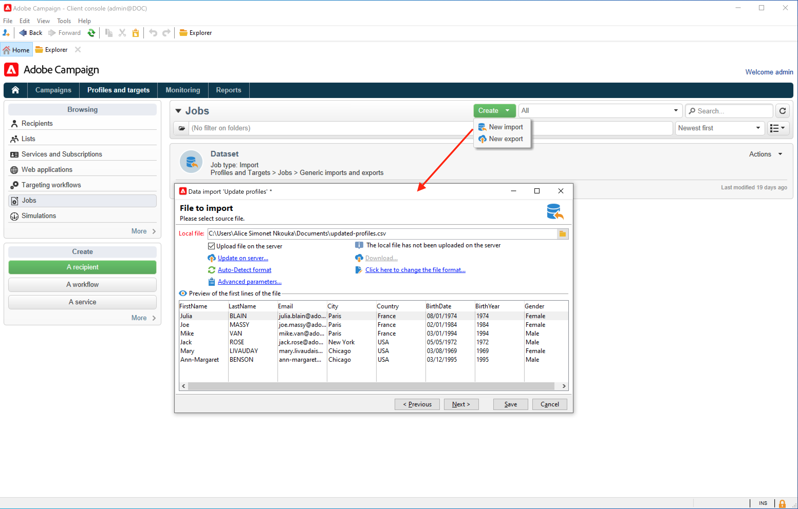

# Importera data till Campaign {#ootb-profiles}

Med Campaign kan du lägga till kontakter i molndatabasen. Du kan läsa in en fil, schemalägga och automatisera flera kontaktuppdateringar, samla in data på webben eller ange profilinformation direkt i mottagartabellen.

[!DNL :bulb:] Kom igång med  
[!DNL :bulb:] målgrupperFörstå Campaign- [datamodellen](../dev/datamodel.md)

## Importera profiler i ett arbetsflöde

Profilimport konfigureras i dedikerade mallar som körs via arbetsflöden via aktiviteten **Importera**. De kan upprepas automatiskt enligt ett schema, t.ex. för att automatisera datautbyte mellan olika informationssystem. Läs mer i [Campaign Classic v7-dokumentationen](https://experienceleague.adobe.com/docs/campaign-classic/using/getting-started/importing-and-exporting-data/import-export-workflows.html){target=&quot;_blank&quot;}.

Läs mer i Campaign Classic v7-dokumentationen:

[!DNL :arrow_upper_right:] [Kom igång med import och export](https://experienceleague.adobe.com/docs/campaign-classic/using/getting-started/importing-and-exporting-data/get-started-data-import-export.html){target=&quot;_blank&quot;}

[!DNL :arrow_upper_right:] [Importera och exportera metodtips](https://experienceleague.adobe.com/docs/campaign-classic/using/getting-started/importing-and-exporting-data/best-practices/import-export-best-practices.html){target=&quot;_blank&quot;}

[!DNL :arrow_upper_right:] [Konfigurera och köra en import](https://experienceleague.adobe.com/docs/campaign-classic/using/getting-started/importing-and-exporting-data/generic-imports-exports/executing-import-jobs.html){target=&quot;_blank&quot;}

## Kör enhetsimporter

Skapa och kör ett allmänt dataimportjobb för att läsa in kontakter i molndatabasen.

[!DNL :arrow_upper_right:] Lär dig hur du kör enhetsimportjobb för att mata in databasen i  [Campaign Classic v7-dokumentationen](https://experienceleague.adobe.com/docs/campaign-classic/using/getting-started/importing-and-exporting-data/generic-imports-exports/about-generic-imports-exports.html){target=&quot;_blank&quot;}.

## Samla in profiler via webbprogram

Använd Campaign för att skapa webbformulär och samla in och hantera profilinformation enkelt och effektivt. Du kan dela dessa formulär på din webbplats, vilket gör det enkelt för dina kontakter att lämna sina uppgifter. Deras information skickas till Campaign för att skapa deras profil eller uppdatera deras information om de redan finns i databasen.

[!DNL :arrow_upper_right:] Lär dig hur du skapar webbformulär i  [Campaign Classic v7-dokumentationen](https://experienceleague.adobe.com/docs/campaign-classic/using/designing-content/web-forms/about-web-forms.html){target=&quot;_blank&quot;}.

**Relaterade ämnen**

* [Skapa målgrupper](audiences.md)
* [Deduplicera profiler](https://experienceleague.adobe.com/docs/campaign-classic/using/automating-with-workflows/use-cases/data-management/deduplication-merge.html){target=&quot;_blank&quot;}
* [Förbättra profildata](https://experienceleague.adobe.com/docs/campaign-classic/using/automating-with-workflows/use-cases/data-management/enriching-data.html){target=&quot;_blank&quot;}
