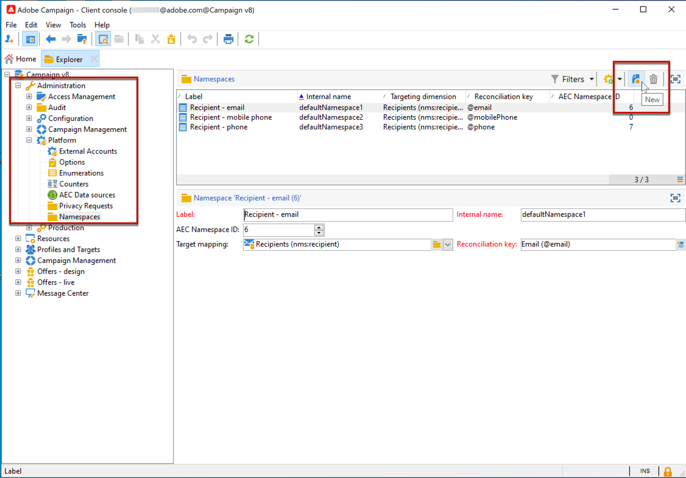
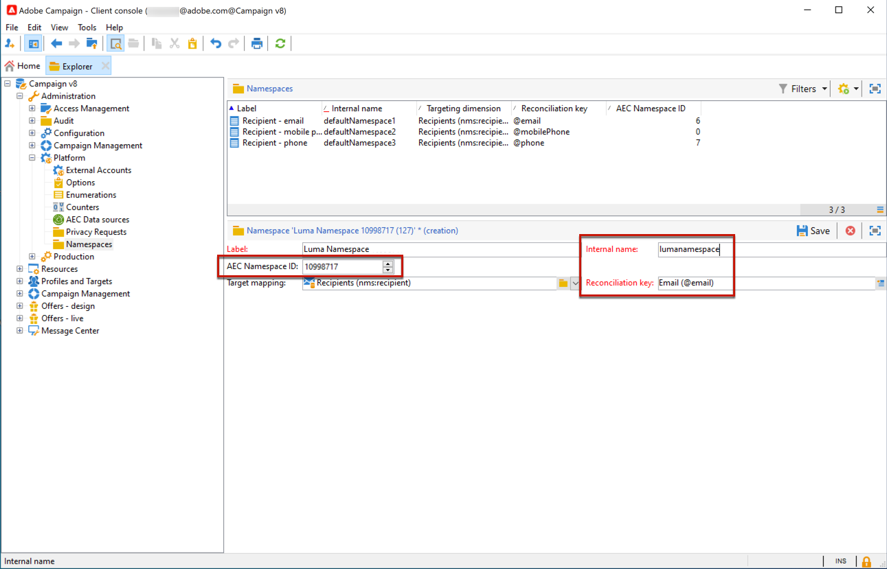

# Hantera sekretessförfrågningar i Campaign {#privacy}

Beroende på vilken typ av verksamhet ni bedriver och vilka jurisdiktioner ni bedriver under, kan det bero på att era uppgifter omfattas av lagenliga sekretessbestämmelser. Dessa bestämmelser ger ofta kunderna rätt att begära åtkomst till de uppgifter ni samlar in från dem och rätt att begära att lagrade uppgifter tas bort. Dessa kundförfrågningar om deras personuppgifter kallas i hela dokumentationen för&quot;sekretessförfrågningar&quot;.

Adobe erbjuder Data Controllers de verktyg de behöver för att skapa och bearbeta sekretessförfrågningar för data som lagras i Campaign. Det är emellertid ditt ansvar som personuppgiftsansvariga att verifiera identiteten på den registrerade som gör begäran och att bekräfta att de uppgifter som skickas tillbaka till den som gjorde begäran handlar om den registrerade. Läs mer om personuppgifter och de olika entiteter som hanterar data i [Adobe Campaign Classic v7-dokumentationen](https://experienceleague.adobe.com/docs/campaign-classic/using/getting-started/privacy/privacy-and-recommendations.html#personal-data){target="_blank"}.


Om du vill hantera sekretessbegäran i Campaign måste du först [definiera ett namnområde](#namespaces). Du kan sedan skapa och hantera förfrågningar om sekretess. Använd integreringen **Adobe Privacy Service** för att utföra sekretessförfrågningar. Sekretessförfrågningar som skickas från Privacy Service till alla Adobe Experience Cloud-lösningar hanteras automatiskt av Campaign via ett dedikerat arbetsflöde. [Läs mer](#create-privacy-request)

Lär dig mer om **rätten till åtkomst** och **rättigheten att bli glömd** (borttagningsbegäran) i [Adobe Campaign Classic v7-dokumentationen](https://experienceleague.adobe.com/docs/campaign-classic/using/getting-started/privacy/privacy-management.html#right-access-forgotten){target="_blank"}.


>[!NOTE]
>
>Den här funktionen är tillgänglig från och med Campaign v8.3. Mer information om hur du kontrollerar versionen finns i [det här avsnittet](compatibility-matrix.md#how-to-check-your-campaign-version-and-buildversion)

## Definiera ett namnutrymme {#namespaces}

Innan du skapar en sekretessförfrågan måste du **definiera namnutrymmet** för att kunna använda det. Namnutrymmet är nyckeln som används för att identifiera den registrerade i databasen.

>[!NOTE]
>
>Läs mer om identitetsnamnutrymmen i [Adobe Experience Platform-dokumentation](https://experienceleague.adobe.com/docs/experience-platform/identity/namespaces.html){target="_blank"}.

Adobe Campaign stöder för närvarande inte import av namnutrymmen från tjänsten Experience Platform Identity Namespace. När du har skapat ett namnutrymme i tjänsten Identity Namespace måste du därför skapa motsvarande namnutrymme manuellt i Adobe Campaign-gränssnittet. Följ stegen nedan för att göra detta.

<!--
v7?
Three namespaces are available out-of-the-box: email, phone and mobile phone. If you need a different namespace (a recipient custom field, for example), you can create a new one from **[!UICONTROL Administration]** > **[!UICONTROL Platform]** > **[!UICONTROL Namespaces]**.

>[!NOTE]
>
>For optimal performance, it is recommended to use out-of-the-box namespaces.
-->

1. Skapa ett namnområde i [tjänsten Identity Namespace](https://developer.adobe.com/experience-platform-apis/references/identity-service/#tag/Identity-Namespace){target="_blank"}.

1. När [visar en lista över de identitetsnamnutrymmen](https://developer.adobe.com/experience-platform-apis/references/identity-service/#operation/getIdNamespaces){target="_blank"} som är tillgängliga för din organisation, får du till exempel följande information om namnutrymmet:

   ```
   {
           "updateTime": 1632903236731,
           "code": "lumanamespace",
           "status": "ACTIVE",
           "description": "new namespace for Luma privacy requests",
           "id": 10998717,
           "createTime": 1632903236731,
           "idType": "Email",
           "namespaceType": "Custom",
           "name": "Luma Namespace",
           "custom": true
   }
   ```

1. I Adobe Campaign bläddrar du till **[!UICONTROL Administration]** > **[!UICONTROL Platform]** > **[!UICONTROL Namespaces]** och väljer **[!UICONTROL New]**.

   

1. Ange **[!UICONTROL Label]**.

1. Fyll i informationen om det nya namnutrymmet så att det matchar namnutrymmet som du skapade i tjänsten Identity Namespace:

   * **[!UICONTROL AEC Namespace ID]** måste matcha attributet &quot;id&quot;
   * **[!UICONTROL Internal name]** måste matcha attributet &quot;code&quot;
   * **[!UICONTROL Reconciliation key]** måste matcha attributet idType

   

   Fältet **[!UICONTROL Reconciliation key]** används för att identifiera den registrerade i Adobe Campaign-databasen.

1. Välj en målmappning <!--(**[!UICONTROL Recipients]**, **[!UICONTROL Real time event]** or **[!UICONTROL Subscriptions]**)--> för att ange hur namnområdet ska förenas i Adobe Campaign.

   >[!NOTE]
   >
   >Om du behöver använda flera målmappningar skapar du ett namnutrymme per målmappning.

1. Spara ändringarna.

Nu kan du skapa sekretessförfrågningar baserat på ditt nya namnutrymme. Om du använder flera namnutrymmen skapar du en sekretessbegäran per namnutrymme för samma avstämningsvärde.

## Skapa en sekretessförfrågan {#create-privacy-request}

Integreringen av **[!DNL Adobe Experience Platform Privacy Service]** gör att du kan automatisera dina sekretessförfrågningar i ett flerlösningssammanhang via ett enda JSON API-anrop. Adobe Campaign hanterar automatiskt förfrågningar som skickas från Privacy Service via ett dedikerat arbetsflöde.

Läs [Experience Platform Privacy Service](https://experienceleague.adobe.com/docs/experience-platform/privacy/home.html){target="_blank"} -dokumentationen om du vill veta mer om hur du skapar sekretessförfrågningar från sekretesskärntjänsten.

Varje **[!DNL Privacy Service]**-jobb delas upp i flera sekretessbegäranden i Adobe Campaign baserat på hur många namnutrymmen som används, en begäran som motsvarar ett namnutrymme.

Ett jobb kan också köras på flera instanser. Därför skapas flera filer för ett jobb. Om en begäran till exempel har två namnutrymmen och körs i tre instanser, skickas totalt sex filer. En fil per namnutrymme och instans.

Mönstret för ett filnamn är: `<InstanceName>-<NamespaceId>-<ReconciliationKey>.xml`

* **InstanceName**: Campaign-instansnamn
* **NamespaceId**: Identitetstjänstens namnområdes-ID för det namnområde som används
* **Avstämningsnyckel**: Kodad avstämningsnyckel

>[!CAUTION]
>
>Om du vill skicka en begäran med den anpassade namnområdestypen använder du [JSON-metoden](https://experienceleague.adobe.com/docs/experience-platform/privacy/ui/user-guide.html#json){target="_blank"} och lägger till namespaceId i begäran, eller använder [API-anropet](https://experienceleague.adobe.com/docs/experience-platform/privacy/api/privacy-jobs.html#access-delete){target="_blank"} för att göra begäran.
>
>Använd bara användargränssnittet [Sekretess](https://experienceleague.adobe.com/docs/experience-platform/privacy/ui/user-guide.html#request-builder){target="_blank"} för att skicka begäranden med standardnamnområdestypen.

### Tabeller som genomsökts vid bearbetning av begäranden {#list-of-tables}

När Adobe Campaign utför en begäran om att ta bort eller få åtkomst till sekretess söker igenom alla den registrerade personens data baserat på **[!UICONTROL Reconciliation value]** i alla tabeller som har en länk till mottagartabellen (egen typ).

Listan med inbyggda tabeller som beaktas vid sekretessförfrågningar är:

* Mottagare (mottagare)
* Mottagarens leveranslogg (wideLogRcp)
* Logg för mottagarspårning (trackingLogRcp)
* Arkiverad händelselogg (broadLogEventHistory)
* Innehåll i mottagarlista (rcpGrpRel)
* Erbjudandeförslag för besökare (propositionVisitor)
* Besökare (besök)
* Prenumerationshistorik (subHistory)
* Prenumerationer (prenumeration)
* Erbjudandeförslag för mottagare (propositionRcp)

Om du har skapat anpassade tabeller som har en länk till mottagartabellen (egen typ), kommer de också att beaktas. Om du t.ex. har ett transaktionsregister länkat till mottagarregistret och en transaktionsdetaljtabell länkad till transaktionsregistret, kommer båda att beaktas.
<!--
>[!CAUTION]
>
>If you perform Privacy batch requests using profile deletion workflows, please take into consideration the following remarks:
>* Profile deletion via workflows do not process children tables.
>* You need to handle the deletion for all the children tables.
>* Adobe recommends that you create an ETL workflow that add the lines to delete in the Privacy Access table and let the **[!UICONTROL Delete privacy requests data]** workflow perform the deletion. We suggest to limit to 200 profiles per day to delete for performance reasons.
-->

### Status för sekretessförfrågningar {#privacy-request-statuses}

Nedan finns olika statusar för sekretessförfrågningar i Adobe Campaign och hur du tolkar dem:

* **[!UICONTROL New]** / **[!UICONTROL Retry pending]**: Arbetsflödet har inte bearbetat begäran ännu.
* **[!UICONTROL Processing]** / **[!UICONTROL Retry in progress]**: arbetsflödet bearbetar begäran.
* **[!UICONTROL Delete pending]**: Arbetsflödet har identifierat alla mottagardata som ska tas bort.
* **[!UICONTROL Delete in progress]**: arbetsflödet bearbetar borttagningen.
* **[!UICONTROL Complete]**: Bearbetningen av begäran har slutförts utan fel.
* **[!UICONTROL Error]**: Ett fel uppstod i arbetsflödet. Orsaken visas i listan över sekretessbegäranden i kolumnen **[!UICONTROL Request status]**. **[!UICONTROL Error data not found]** betyder till exempel att inga mottagardata som matchar den registrerade personens **[!UICONTROL Reconciliation value]** har hittats i databasen.

**Relaterade ämnen i Campaign Classic v7-dokumentation:**

* [Sekretess och samtycke](https://experienceleague.adobe.com/docs/campaign-classic/using/getting-started/privacy/privacy-and-recommendations.html){target="_blank"}

* [Komma igång med sekretesshantering](https://experienceleague.adobe.com/docs/campaign-classic/using/getting-started/privacy/privacy-management.html){target="_blank"}

* [Regler för sekretesshantering](https://experienceleague.adobe.com/docs/campaign-classic/using/getting-started/privacy/privacy-management.html#privacy-management-regulations){target="_blank"} (GDPR, CCPA, PDPA och LGPD)

* [Avanmäl dig till försäljning av personuppgifter](https://experienceleague.adobe.com/docs/campaign-classic/using/getting-started/privacy/privacy-requests/privacy-requests-ccpa.html){target="_blank"} (gäller endast CCPA)
