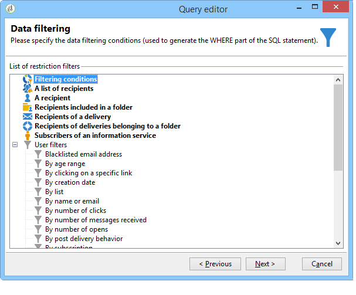
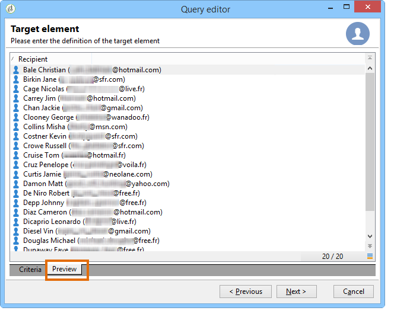

# Query Campaign-databas

Du kan hitta frågeverktyget i Adobe Campaign på flera nivåer i programmet. Du kan skapa en målgrupp, segmentera kunder, extrahera och filtrera spårningsloggar och bygga filter osv.

Med Adobe Campaign-frågeverktyget kan du fråga en databas med hjälp av en dedikerad assistent: den allmänna frågeredigeraren. Den nås via menyn **[!UICONTROL Tools > Generic query editor...]**. Den låter dig extrahera information som finns lagrad i en databas och ordna, gruppera och sortera osv. Användaren kan till exempel hämta mottagare som har klickat mer än &quot;n&quot; gånger på länken i ett nyhetsbrev under en viss period. Med det här verktyget kan du samla in, sortera och visa resultat utifrån dina behov.

Det här verktyget kombinerar alla frågemöjligheter i Adobe Campaign. Du kan till exempel skapa och spara begränsningsfilter. Det innebär att ett användarfilter som har skapats i den allmänna frågeredigeraren kan användas i frågeformuläret i ett arbetsflöde för målgrupper osv.

Frågor skapas med hjälp av fält i den valda tabellen eller med hjälp av en formel.

Så här skapar du en fråga i Adobe Campaign:

1. Markera arbetsregistret. Se [Steg 1 - Välj en tabell](#step-1---choose-a-table).
1. Markera de data som ska extraheras. Se [Steg 2 - Välj data som ska extraheras](#step-2---choose-data-to-extract).
1. Definiera datasorteringssekvensen. Se [Steg 3 - Sortera data](#step-3---sort-data).
1. Filtrera data. Se [Steg 4 - Filtrera data](#step-4---filter-data).
1. Formatera data. Se [Steg 5 - Formatera data](#step-5---format-data).
1. Visa resultatet. Se [Steg 6 - Förhandsgranska data](#step-6---preview-data).

>[!NOTE]
>
>* Alla dessa steg är tillgängliga i den allmänna frågeredigeraren. När en fråga skapas i en annan kontext kan vissa steg utelämnas.
>
>* Mer information om frågor och hur du skapar dem finns i [dokumentationen för kampanjarbetsflödet](../../automation/workflow/query.md).

Om du vill fråga Campaign-databasen öppnar du den **allmänna frågeredigeraren** och följer dessa steg:

## Steg 1 - Välj en tabell {#step-1---choose-a-table}

Markera tabellen som innehåller de data som du vill fråga i fönstret **[!UICONTROL Document type]**. Om det behövs kan du filtrera data med filterfältet eller knappen **[!UICONTROL Filters]**.

## Steg 2 - Välj data att extrahera {#step-2---choose-data-to-extract}

I fönstret **[!UICONTROL Data to extract]** väljer du de data som ska visas: dessa fält utgör utdatakolumnerna.

Välj till exempel **[!UICONTROL Age]**, **[!UICONTROL Primary key]**, **[!UICONTROL Email domain]** och **[!UICONTROL City]**. Resultatet ordnas utifrån det här valet. Använd de blå pilarna till höger om fönstret för att ändra kolumnordningen.

Du kan redigera ett uttryck genom att infoga en formel i det eller köra en process på en sammanställningsfunktion. Det gör du genom att klicka på kolumnfältet **[!UICONTROL Expression]** och sedan välja **[!UICONTROL Edit expression]**.

Du kan gruppera utdatakolumndata: om du vill göra det kontrollerar du **[!UICONTROL Yes]** i kolumnen **[!UICONTROL Group]** i fönstret **[!UICONTROL Data to extract]**. Den här funktionen genererar ett resultat runt den markerade grupperingsaxeln. Ett exempel på en fråga med gruppering finns i [det här avsnittet](../../automation/workflow/query-delivery-info.md).

* Med funktionen **[!UICONTROL Handle groupings (GROUP BY + HAVING)]** kan du gruppera efter och välja vad som har grupperats (&quot;HAVING&quot;). Den här funktionen gäller för alla fält i utdatakolumnen. Med det här alternativet kan du till exempel gruppera alla val för en utdatakolumn och återställa en viss typ av information, till exempel mottagare mellan 35 och 50.

  Mer information om detta finns i [det här avsnittet](../../automation/workflow/query-grouping-management.md).

* Med funktionen **[!UICONTROL Remove duplicate rows (DISTINCT)]** kan du duplicera identiska resultat som hämtats i utdatakolumnen. Om du till exempel gör en inventering genom att markera fälten Efternamn, Förnamn och E-post i utdatakolumnen, kommer de som har identiska data att tas bort, eftersom det innebär att samma kontakt har angetts flera gånger i databasen: endast ett resultat kommer att tas med i beräkningen.

## Steg 3 - Sortera data {#step-3---sort-data}

I fönstret **[!UICONTROL Sorting]** kan du sortera kolumninnehåll. Använd pilarna för att ändra kolumnordningen:

* I kolumnen **[!UICONTROL Sorting]** kan du sortera och ordna kolumninnehåll från A till Z eller i stigande ordning.
* **[!UICONTROL Descending sort]** ordnar innehållet från Z till A och i fallande ordning. Det här är användbart för att visa postförsäljning, till exempel: de högsta siffrorna visas högst upp i listan.

I det här exemplet sorteras data i stigande ordning baserat på mottagarens ålder.

## Steg 4 - Filtrera data {#step-4---filter-data}

Med frågeredigeraren kan du filtrera data för att förfina sökningen.

Vilka filter som visas beror på vilken tabell frågan gäller.

När du har valt **[!UICONTROL Filtering conditions]** får du tillgång till avsnittet **[!UICONTROL Target elements]**. På så sätt kan du definiera hur data som ska samlas in ska filtreras.

* Om du vill skapa ett nytt filter markerar du de fält, operatorer och värden som krävs för att skapa formeln som ska verifieras för att data ska kunna väljas. Du kan också kombinera flera villkor som [på den här sidan](filter-conditions.md).
* Om du vill använda tidigare sparade filter öppnar du listrutan genom att klicka på knappen **[!UICONTROL Add]**, klickar på **[!UICONTROL Predefined filter]** och väljer det du vill använda.

  

* De filter som skapas i **[!UICONTROL Generic query editor]** är tillgängliga i andra frågeprogram och vice versa. Klicka på ikonen **[!UICONTROL Save]** om du vill spara ett filter.

  >[!NOTE]
  >
  >Mer information om hur du skapar och använder filter finns i [Filtreringsalternativ](filter-conditions.md).

Om du vill återställa alla mottagare med engelskspråkighet, som visas i följande exempel, väljer du: &quot;mottagarspråk **lika med** EN&quot;.

>[!NOTE]
>
>Du kan komma åt ett alternativ direkt genom att skriva följande formel i fältet **Värde**: **$(options:OPTION_NAME)**.

Klicka på fliken **[!UICONTROL Preview]** för att visa resultatet av filtreringsvillkoret. I det här fallet visas alla mottagare på engelska med namn, förnamn och e-postadress.

Användare som är bekanta med SQL-språk kan klicka på **[!UICONTROL Generate SQL query]** för att visa frågan i SQL.

## Steg 5 - Formatera data {#step-5---format-data}

När du har konfigurerat begränsningsfiltren kommer du åt fönstret **[!UICONTROL Data formatting]**. I det här fönstret kan du ordna om utdatakolumner, omforma data och ändra kolumnrubrikernas övre/nedre gemener. Du kan också använda en formel för slutresultatet med hjälp av ett beräkningsfält.

>[!NOTE]
>
>Mer information om typerna av beräkningsfält finns i [Skapa beräknade fält](filter-conditions.md#creating-calculated-fields).

Omarkerade kolumner visas inte i dataförhandsgranskningsfönstret.

I kolumnen **[!UICONTROL Transformation]** kan du ändra en kolumnetikett till versaler eller gemener. Markera kolumnen och klicka i kolumnen **[!UICONTROL Transformation]**. Du kan välja:

* **[!UICONTROL Switch to lower case]**,
* **[!UICONTROL Switch to upper case]**,
* **[!UICONTROL First letter in upper case]**.

## Steg 6 - Förhandsgranska data {#step-6---preview-data}

Fönstret **[!UICONTROL Data preview]** är det sista steget. Klicka på **[!UICONTROL Start the preview of the data]** för att hämta frågeresultatet. Den är tillgänglig i kolumner eller i XML-format. Klicka på fliken **[!UICONTROL Generated SQL queries]** för att visa frågan i SQL-format.

I det här exemplet sorteras data i stigande ordning baserat på mottagarens ålder.

>[!NOTE]
>
>Som standard visas endast de första 200 raderna i fönstret **[!UICONTROL Data preview]**. Om du vill ändra det här anger du ett nummer i rutan **[!UICONTROL Lines to display]** och klickar på **[!UICONTROL Start the preview of the data]**.

**Relaterade ämnen**

* [Aktivitet för arbetsflödesfråga](../../automation/workflow/query.md)
* [Fråga mottagartabellen](../../automation/workflow/querying-recipient-table.md)
* [Filtreringsvillkor](filter-conditions.md)