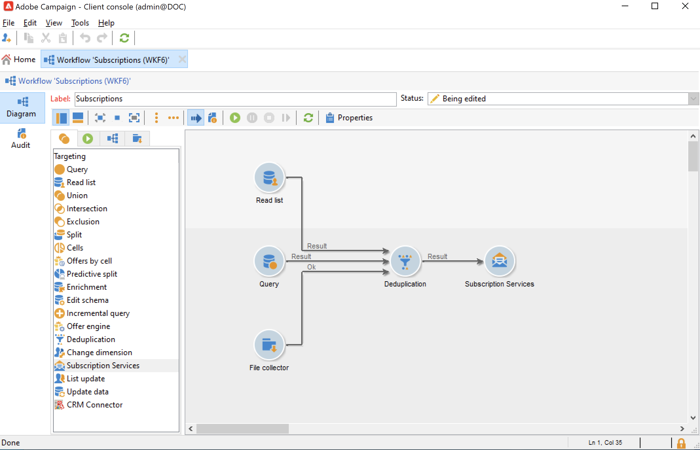

# Hantera prenumerationer och avbeställningar{#optin-optout}

Använd Adobe Campaign för att skapa och övervaka informationstjänster som nyhetsbrev och för att hantera prenumerationer/avbeställningar av dessa tjänster. Flera tjänster kan definieras parallellt, till exempel: särskilda nyhetsbrev för vissa produktkategorier, teman eller områden på en webbplats, prenumerationer på olika typer av varningsmeddelanden och meddelanden i realtid. Se Hantera prenumerationer.

 Lär dig hur du skapar en informationstjänst, skickar nyhetsbrev och hanterar anmälan och avanmälan [Campaign Classic v7-dokumentation](https://experienceleague.adobe.com/docs/campaign-classic/using/sending-messages/subscriptions-and-referrals/managing-subscriptions.html){target=&quot;_blank&quot;}

Så här prenumererar du (anmäler dig) en profil för en tjänst:

* Lägg till tjänsten manuellt i mottagarprofilen: för att göra detta, från **[!UICONTROL Subscriptions]** flik i deras profil, klicka på **[!UICONTROL Add]** och välja ut den berörda informationstjänsten.

   

    Läs mer i [Campaign Classic v7-dokumentation](https://experienceleague.adobe.com/docs/campaign-classic/using/getting-started/profile-management/editing-a-profile.html?lang=en#deliveries-tab){target=&quot;_blank&quot;}

* Prenumerera automatiskt på en uppsättning mottagare till tjänsten. Listan med mottagare kan komma från en filtreringsåtgärd, en grupp, en mapp, en import eller ett manuellt val. Om du vill prenumerera på dessa mottagare markerar du profilerna och högerklickar. Välj **[!UICONTROL Actions > Subscribe selection to a service...]**.

   

   Välj den berörda tjänsten och starta åtgärden.

   

    Läs mer i [Campaign Classic v7-dokumentation](https://experienceleague.adobe.com/docs/campaign-classic/using/getting-started/profile-management/editing-a-profile.html?lang=en#deliveries-tab){target=&quot;_blank&quot;}

* Importera mottagare och prenumerera automatiskt på en informationstjänst. Det gör du genom att välja den berörda tjänsten i det sista steget i importguiden.

    Läs mer i [Campaign Classic v7-dokumentation](https://experienceleague.adobe.com/docs/campaign-classic/using/getting-started/importing-and-exporting-data/generic-imports-exports/executing-import-jobs.html?lang=en#step-5---additional-step-when-importing-recipients){target=&quot;_blank&quot;}

* Använd ett webbformulär så att mottagarna kan prenumerera på en tjänst.

   

   Campaign innehåller ett standardwebbformulär som hanterar anmälan. Du kan anpassa den och mappa profildata.

   

    Läs mer i [Campaign Classic v7-dokumentation](https://experienceleague.adobe.com/docs/campaign-classic/using/designing-content/web-forms/use-cases--web-forms.html?lang=en#create-a-subscription--form-with-double-opt-in){target=&quot;_blank&quot;}

* Skapa ett målarbetsflöde och använda en **[!UICONTROL Subscription service]** aktivitet.

   

    Läs mer i [Campaign Classic v7-dokumentation](https://experienceleague.adobe.com/docs/campaign-classic/using/automating-with-workflows/targeting-activities/subscription-services.html?lang=en#example--subscribe-a-list-of-recipients-to-a-newsletter){target=&quot;_blank&quot;}

Så här avanmäler du en profil från en tjänst:

**Manuell avprenumeration**

* Personligt anpassad länk för att avbeställa prenumerationer eller webbformulär
* Manuell borttagning av en informationstjänst
* Manuell borttagning av mottagare från en viss prenumerationstjänst

**Automatisk avprenumeration**

* Ange en tidsgräns för informationstjänsten: när giltighetsperioden har löpt ut kommer mottagarna att avbeställa prenumerationen automatiskt. Den här perioden anges på fliken Redigera i tjänstens egenskaper. Den uttrycks i dagar.
* Ställ in ett avabonnemangsarbetsflöde för en population.

 Läs mer i [Campaign Classic v7-dokumentation](https://experienceleague.adobe.com/docs/campaign-classic/using/sending-messages/subscriptions-and-referrals/managing-subscriptions.html?lang=en#unsubscribing-a-recipient-from-a-service){target=&quot;_blank&quot;}

>[!CAUTION]
>
>Prenumerationer och avbeställningar är **asynkron** -processer. Begäranden om anmälan och avanmälan behandlas varje timme. [Läs mer](../dev/new-apis.md#sub-apis)

Du kan också göra det möjligt för leveransmottagarna att vidarebefordra meddelanden till en vän. Om du vill göra det infogar du länkarna i leveransen. Du kan sedan följa upp denna delningsprocess samt antalet besök på de berörda sidorna.

 Mer information om den här funktionen finns i [Campaign Classic v7-dokumentation](https://experienceleague.adobe.com/docs/campaign-classic/using/sending-messages/subscriptions-and-referrals/viral-and-social-marketing.html?lang=en#viral-marketing--forward-to-a-friend){target=&quot;_blank&quot;}
